# CourseLLM

An agentic RAG tutoring platform: a student uploads their own course material,
states a goal, and gets answers grounded in those documents, a prerequisite-aware
roadmap, curated resource recommendations, quizzes, and progress-adaptive
planning — over hybrid retrieval, a knowledge graph, and an evaluated AI pipeline.

> **Status: complete against the rebuild's capability list, not deployed.** Every
> capability listed in [`docs/PROJECT_AUDIT.md`](docs/PROJECT_AUDIT.md) §6 now has
> an implementation and a test, except the two it deliberately did not build (see
> [What this project does not do](#what-this-project-does-not-do)). Nothing in
> `infra/terraform/` has been applied and there is no live deployment.

**There are no status badges.** The workflows in `.github/workflows/` exist and are
described in [CI/CD](#cicd), but they have never run on GitHub, so a badge would
assert a build status that nobody has observed. The numbers in this README are the
ones a reader can reproduce locally, and each one names the command or committed
artefact it came from.

**Screenshots are pending.** No browser was available in the environment this
README was written in, so no image is embedded. See
[Screenshots](#screenshots) for the exact commands that produce them; a placeholder
or mock-up would overstate what has been verified.

Twelve Mermaid diagrams appear inline below. Each is also committed as a source
file under [`docs/images/`](docs/images/) and was machine-validated with
`@mermaid-js/mermaid-cli` 12.0.0 (see [Testing](#testing)).

---

## How to read this repository

The order that makes the engineering legible is:

1. [`docs/FINAL_AUDIT.md`](docs/FINAL_AUDIT.md) — the requirement-by-requirement
   walk, the architectural claims checked against the code, and the ranked gaps.
   It names the file that implements each requirement.
2. [`docs/architecture/system.md`](docs/architecture/system.md), then
   [`rag.md`](docs/architecture/rag.md),
   [`agent-architecture.md`](docs/architecture/agent-architecture.md),
   [`knowledge-graph.md`](docs/architecture/knowledge-graph.md),
   [`security.md`](docs/architecture/security.md),
   [`observability.md`](docs/architecture/observability.md) and
   [`deployment.md`](docs/architecture/deployment.md) — the design, including the
   trade-offs that were rejected.
3. [`evals/reports/README.md`](evals/reports/README.md) and
   [`evals/reports/baseline.json`](evals/reports/baseline.json) — the measured
   baseline, and the explicit statement of what it does *not* measure.

[`docs/PROJECT_AUDIT.md`](docs/PROJECT_AUDIT.md) is the audit of the prototype this
replaced, and it is the "before" that the rebuild answers. The ten decisions that
were expensive to reverse are in [`docs/decisions/`](docs/decisions/).

---

## Why CourseLLM?

Most "chat with your notes" systems answer from the model's parametric memory and
present the result with the same confidence whether or not the source material
supported it. In a course setting that is the wrong failure: a student cannot tell
a correct answer from a plausible one, and the system cannot tell either, because
nothing measured whether the retrieved evidence actually contained the answer.

CourseLLM is built the other way round. Retrieval happens before generation and
every tutor answer either cites retrieved passages or states that the evidence was
insufficient. Deterministic work — SQL, BM25, graph traversal, scoring — lives in
typed, permission-checked tools rather than in prompts, and tenancy is a property
of the query rather than a filter applied afterwards. Quality is treated as a
testable property: a versioned golden dataset, a committed baseline, and a
regression gate in CI.

The rebuild started from a working but unhardened prototype (documented in
[`docs/PROJECT_AUDIT.md`](docs/PROJECT_AUDIT.md)) and replaced the parts that could
not survive production or review: no real tenancy boundary, `ts_rank` instead of
BM25, a weighted score sum instead of RRF, no knowledge graph, no evaluation, no
cost accounting, and committed credentials.

---

## Features

Each row names the file that implements it.

| Feature | Implemented by |
|---------|----------------|
| Multi-tenant isolation (three layers) | `apps/api/src/coursellm/db/tenancy.py`, `repositories/base.py`, RLS policies in `apps/api/alembic/versions/` |
| Hybrid retrieval: dense ANN ∪ BM25 | `apps/api/src/coursellm/rag/retrieval/{semantic,lexical,hybrid}.py` |
| Reciprocal Rank Fusion (k=60) | `apps/api/src/coursellm/rag/fusion/rrf.py` |
| Reranking with a declared fallback | `apps/api/src/coursellm/rag/rerank/{pipeline,rerankers}.py` |
| Grounded generation with citations and refusal | `apps/api/src/coursellm/rag/generation/{context,generator,citations}.py` |
| Document ingestion (PDF, DOCX, Markdown, text) | `apps/api/src/coursellm/rag/ingestion/{parsers,chunker,pipeline}.py`, `services/ingestion.py` |
| LangGraph agent graph (5 intents) | `apps/api/src/coursellm/agents/{graph,routing,state}.py`, `agents/nodes/` |
| Typed, permission-checked tools | `apps/api/src/coursellm/tools/{registry,permissions}.py`, `tools/*.py` |
| Knowledge graph extraction and traversal | `apps/api/src/coursellm/graph/{extraction,confidence,repository,schemas}.py` |
| Knowledge-gap detection | `apps/api/src/coursellm/graph/repository.py` (`knowledge_gap`), `learning/progress.py` |
| Personalised roadmaps and adaptation | `apps/api/src/coursellm/learning/{planner,adaptation,progress}.py`, `services/roadmap.py` |
| Curated recommendations (no fabrication) | `apps/api/src/coursellm/recommend/{catalogue,ranking,explanation,service}.py` |
| Quizzes and answer assessment | `apps/api/src/coursellm/assessment/`, `api/routers/assessments.py` |
| Prompt-injection defence | `apps/api/src/coursellm/security/{injection,sanitize,output}.py` |
| Rate limiting (denial-of-wallet) | `apps/api/src/coursellm/security/ratelimit.py`, `api/deps.py` |
| JWT auth with refresh | `apps/api/src/coursellm/security/{tokens,passwords}.py`, `services/auth.py` |
| LLM gateway: routing, retries, fallback, cost | `apps/api/src/coursellm/llm/{gateway,routing,cost}.py`, `db/models/usage.py` |
| SSE streaming chat | `apps/api/src/coursellm/api/routers/chat.py`, `apps/web/src/features/chat/useChatStream.ts` |
| Structured logging with recursive redaction | `apps/api/src/coursellm/core/logging.py` |
| Tracing and metrics | `apps/api/src/coursellm/observability/`, `middleware.py` |
| Evaluation harness and regression gate | `evals/runners/`, `evals/metrics/`, `evals/judges/llm_judge.py` |
| Migrations (8 revisions) | `apps/api/alembic/versions/` |
| React client (14 routes) | `apps/web/src/pages/` |
| Infrastructure as code | `infra/terraform/` |
| Containers and compose stack | `docker/`, `docker-compose.yml` |
| CI workflows | `.github/workflows/` |

---

## Architecture

FastAPI is a stateless async service; conversation state lives in PostgreSQL and is
keyed by tenant. LiteLLM is an in-process library by default and can also run as a
standalone gateway. Redis holds only provably-repeatable data (retrieval results for
identical queries, embeddings, rate-limit counters), never personalised answers.

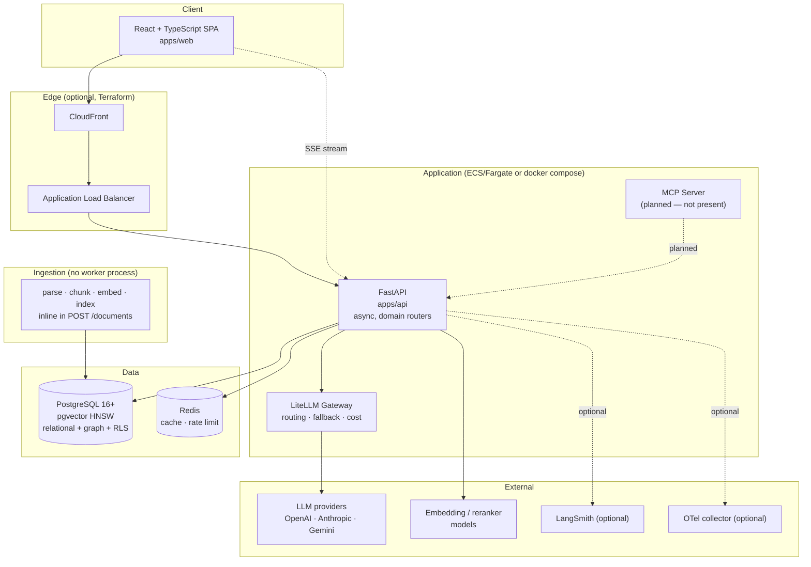

Full component justification and the failure model are in
[`docs/architecture/system.md`](docs/architecture/system.md). Two labels above are
deliberately narrower than the design document: the MCP server is planned and the
directory is empty, and ingestion runs inline in the request because there is no
background worker yet (the `make worker` target was removed because
[What this project does not do](#what-this-project-does-not-do)).

### Data model

Twelve tenant-scoped tables plus two global catalogues; `tenant_id` is on every
tenant-scoped row and in every index that matters. `RESOURCE` is the curated
recommendation catalogue (never LLM-generated at request time) and `LLM_USAGE`
records provider, model, tokens, latency and computed cost per call.

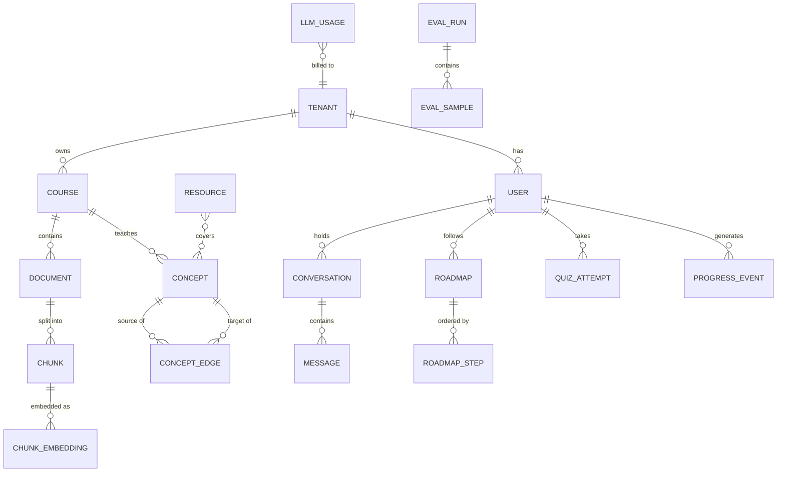

---

## Agentic tutor

The graph is bounded: typed state, conditional edges, and hard limits on steps,
retrieval passes, tool calls, tokens, cost and wall-clock time. A breach of any
limit routes to `answer_composer`, so a bounded turn always ends in an answer or an
explicit refusal, never a blank screen.

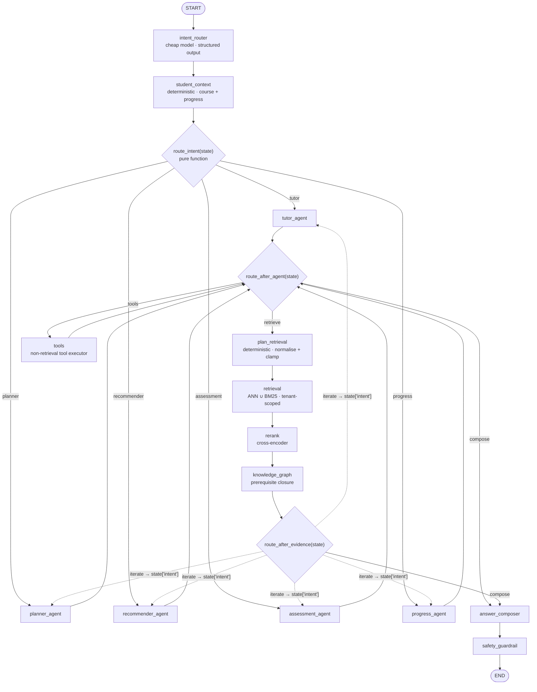

### Tool permission matrix

✓ = the agent may call the tool; ✗ = the registry rejects the call before the
handler runs. `AGENT_WEB_SEARCH_ENABLED` defaults to `false`; `search_web_sources`
makes no outbound HTTP today, so it returns `degraded: ["outbound_fetch_deferred"]`.

| Agent | `search_documents` | `search_course` | `search_knowledge_graph` | `search_books` | `search_web_sources` | `get_student_progress` | `create_quiz` | `evaluate_answer` | `update_learning_plan` | `get_recommendations` | `send_email` | `delete_document` | `run_sql` |
|-------|:--:|:--:|:--:|:--:|:--:|:--:|:--:|:--:|:--:|:--:|:--:|:--:|:--:|
| Tutor | ✓ | ✓ | ✓ | ✓ | ✓* | ✓ | ✗ | ✗ | ✗ | ✗ | ✗ | ✗ | ✗ |
| Learning Planner | ✗ | ✓ | ✓ | ✗ | ✗ | ✓ | ✗ | ✗ | ✓ | ✗ | ✗ | ✗ | ✗ |
| Recommendation | ✗ | ✗ | ✓ | ✗ | ✓* | ✓ | ✗ | ✗ | ✗ | ✓ | ✗ | ✗ | ✗ |
| Assessment | ✓ | ✓ | ✓ | ✗ | ✗ | ✓ | ✓ | ✓ | ✗ | ✗ | ✗ | ✗ | ✗ |
| Progress | ✗ | ✓ | ✓ | ✗ | ✗ | ✓ | ✗ | ✗ | ✗ | ✗ | ✗ | ✗ | ✗ |

`send_email`, `delete_document` and `run_sql` are declared in the `Permission` enum
and deliberately unregistered, so a model that emits their names gets
`UnknownToolError` rather than an opportunity to be persuaded. The full registry,
timeouts and side-effect classes are in
[`docs/architecture/agent-architecture.md`](docs/architecture/agent-architecture.md) §7–§8.

---

## Advanced RAG

Every stage is independently testable and independently degradable. Filters are
pushed into both retrievers rather than applied after fusion, so both rank lists
are drawn from the same eligible set.

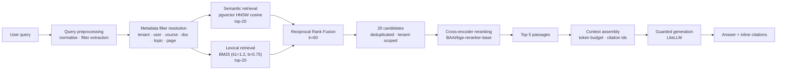

In the default install the reranker is unavailable (`torch` is an extra), so the
pipeline falls back to the deterministic `LexicalReranker` and the run reports
`degraded: ["reranker_unavailable"]`; the measured baseline below was produced
with that fallback. The dense path is a real `pgvector` HNSW scan; whether the
planner uses the ANN index or the exact `(tenant_id, embedding_model)` index is
measured and documented in [`docs/architecture/rag.md`](docs/architecture/rag.md) §3.

### Document ingestion

Ingestion runs inline in the request, before the `documents` row is committed.
Bytes are stored first under a server-generated key; a failure removes the object
and, for a newly created document, the row, so a failed upload leaves no orphan.
Re-ingesting the same bytes replaces the document's chunks rather than appending
to them. There is no OCR for scanned PDFs and no `.pptx` parser.

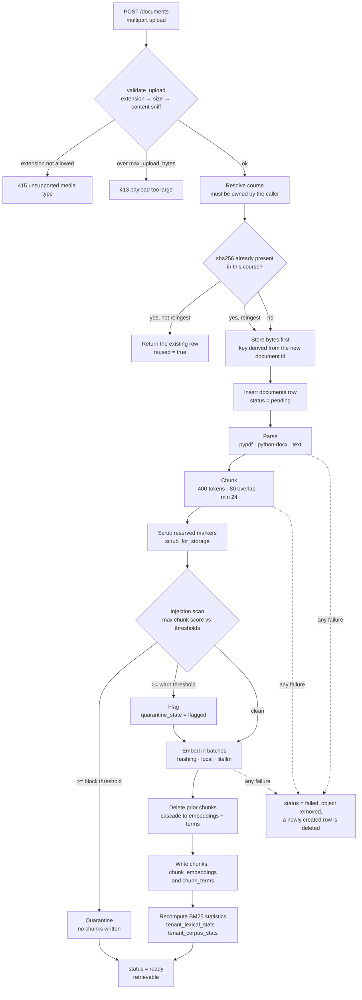

### Retrieval parameters

From [`evals/reports/baseline.json`](evals/reports/baseline.json) `config` — the
same values are validated at startup from
[`.env.example`](.env.example).

| Parameter | Value |
|-----------|-------|
| `retrieval_top_k_per_retriever` | 20 |
| `rrf_k` | 60 |
| `bm25_k1` / `bm25_b` | 1.2 / 0.75 |
| `rerank_top_k` | 5 |
| `context_token_budget` | 3000 |
| `hnsw_ef_search` | 100 |
| `chunk_size_tokens` / `chunk_overlap_tokens` / `min_chunk_tokens` | 400 / 80 / 24 |
| `embedding_provider` / `embedding_model` / `embedding_dim` | `hashing` / `hashing-v1` / 384 |
| `reranker` | `lexical-fallback` |
| `retrieval_config_version` | `8f3641b0eafb` |

`retrieval_config_version` is a hash of the retrieval-affecting settings and forms
part of the cache key, so a cache hit cannot cross a configuration change. It is a
hash of *your* settings: the value above is the baseline's, and a running API reads
`.env`, so `/healthz` will report a different hash if your `.env` differs.

---

## Knowledge graph

Concepts, aliases, typed edges and an extraction-run ledger live in PostgreSQL;
traversal is a recursive CTE. `related_to` is deliberately excluded from closures
because it is non-transitive and is the relation an LLM reaches for when unsure.
An LLM-asserted edge is treated as evidence to be corroborated, never as a fact.

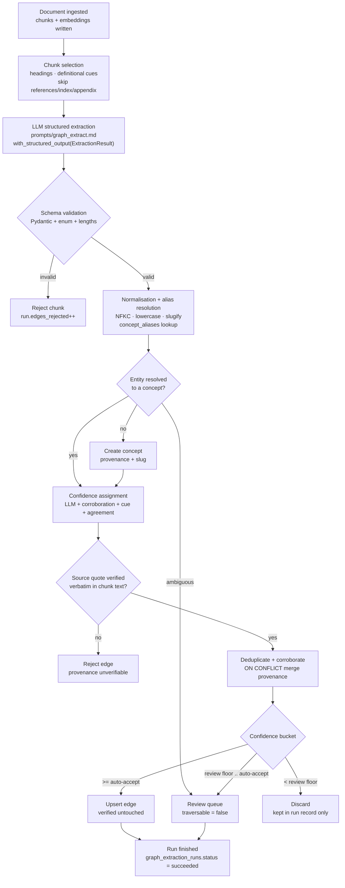

**Confidence model.** Four signals combine by a weighted sum with weights validated
at startup: base `0.15` + LLM `0.25` (self-report capped at `0.80`) + corroboration
`0.30` + cue `0.20` + agreement `0.10`. The base term guarantees that no single
signal reaches the auto-accept threshold alone: a maximally self-confident LLM,
uncorroborated, yields `0.15 + 0.20 = 0.35` — a review-queue edge, not an accepted
one. `verified` is a separate, human-only axis and the upsert never overwrites a
verified edge.

The thresholds (`auto-accept 0.75`, `review floor 0.50`) are documented defaults,
**not calibrated values**: the calibration runner and its golden set
(`evals/datasets/golden_graph.jsonl`) are not implemented, and
[`docs/architecture/knowledge-graph.md`](docs/architecture/knowledge-graph.md) §6.4
says so rather than quoting a precision it cannot produce. Schema, cycle
prevention and the five recursive CTEs are in §3–§4.

---

## Personalised roadmaps

The ordering is computed, never narrated. The planner traverses the prerequisite
closure in PostgreSQL, subtracts concepts the student has mastery evidence for, and
topologically sorts the remainder in Python with a deterministic tie-break.
Topological sort is deliberately not a recursive CTE: if the graph contains a
cycle, the sort leaves the unreachable nodes visible instead of returning a
plausible but wrong order.

Effort is sourced, not invented: every hour estimate is
`clip(BASE_HOURS[difficulty] + PREREQUISITE_EDGE_HOURS * fan_in, MIN, MAX)`. A model
may write the narrative description of a step and never supplies an hour count.

Mastery is derived, never stored. It is a documented weighted projection of the
append-only `progress_events` and `quiz_attempts` logs —
`0.5 * decay_weighted_mean + 0.3 * best + 0.2 * latest`, with a 30-day half-life —
so absence of evidence is an empty map, not mastery zero. Adaptation preserves
completed steps, drops newly mastered ones, re-orders satisfied prerequisites,
inserts newly surfaced ones and is a no-op when nothing changed, so a poll cannot
manufacture history. See
[`docs/architecture/knowledge-graph.md`](docs/architecture/knowledge-graph.md) §8
and `learning/{planner,adaptation,progress}.py`.

---

## Recommendations

The catalogue is curated and committed; it is never generated at request time. A
gap the catalogue cannot cover is reported in `degraded` and left empty — it is
never filled with a plausible-looking unrelated resource. That is the property the
module exists to guarantee.

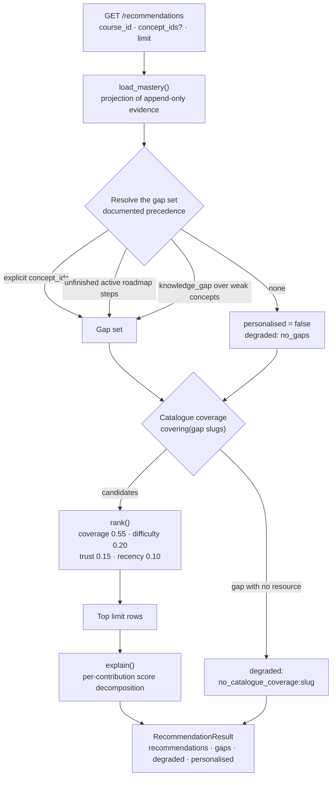

The four ranking weights sum to 1.0 and are validated at startup
(`RECOMMEND_WEIGHT_*` in [`.env.example`](.env.example)). Every returned
recommendation carries an explanation built from its own score decomposition, so
"why this resource" is answerable from the response. Catalogue seeding is
idempotent on URL (`make seed-catalogue`,
`recommend/seed.py`, `recommend/catalogue.py`).

---

## Evaluation

The harness ingests the corpus through the **production** ingestion pipeline and
runs every golden question through the production `hybrid_search` and `rank`
functions. Nothing is stubbed. A report records the dataset hash, the corpus hash,
the retrieval configuration version and its full snapshot, the embedder, the
reranker, the git commit when readable, a timestamp, the machine, every per-question
result, the aggregate metrics, and a `not_measured` map. A metric is either a number
the run computed or an entry in `not_measured` with a stable reason code; there is
no third state.

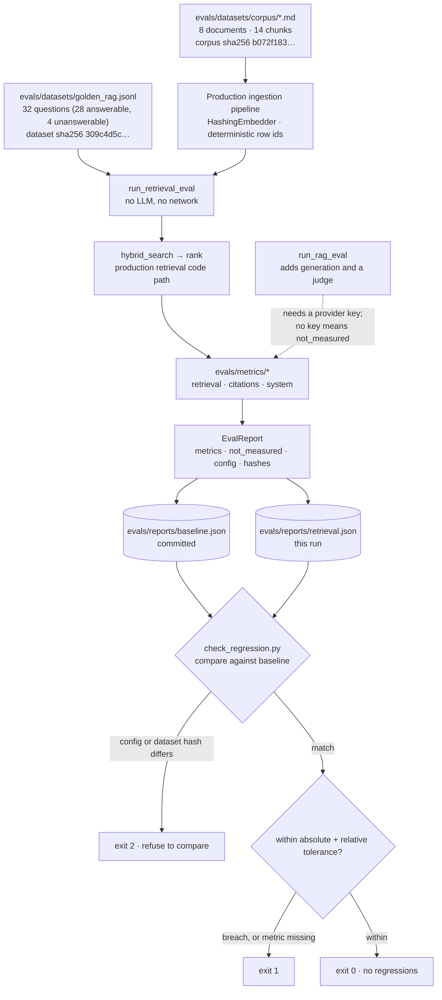

### The measured baseline

Every number below is copied from the committed
[`evals/reports/baseline.json`](evals/reports/baseline.json). Reproduce with:

```bash
make eval-retrieval && make eval-gate
```

**Read the scope qualification beside each row before reading the value.** It is
repeated from [`evals/reports/README.md`](evals/reports/README.md) §"What these
numbers do not mean": the embedder is **`hashing` (`hashing-v1`), a deterministic
feature-hash, not a semantic model**; the reranker is **`lexical-fallback`, not a
cross-encoder**; the corpus is **8 documents / 14 chunks**; the dataset is **32
questions (28 answerable, 4 unanswerable)**. These numbers measure pipeline
correctness, not model quality.

| Metric | Value | Scope: what this number does and does not mean |
|--------|------:|------------------------------------------------|
| `retrieval.semantic_recall_at_20` | 1.000000 | `hashing-v1` on 14 chunks. A hashed bag-of-words trivially recalls passages that share vocabulary with the question. **Not evidence about embedding quality.** |
| `retrieval.lexical_recall_at_20` | 0.958333 | Real Okapi BM25 over the same 14 chunks. This one *is* a genuine statement about the BM25 implementation, because it depends on term statistics rather than embeddings. |
| `retrieval.fused_recall_at_10` | 0.988095 | RRF plumbing (`k=60`) on the same 14-chunk corpus; not a claim at scale. |
| `retrieval.fused_mrr` | 0.946429 | Same corpus and embedder; measures fusion wiring only. |
| `retrieval.context_recall` | 0.922619 | Measured with the `hashing-v1` embedder **and** the `lexical-fallback` reranker; says nothing about a cross-encoder. |
| `retrieval.context_precision` | 0.950000 | Same scope; `context_token_budget=3000`, `rerank_top_k=5`. |
| `retrieval.precision_at_5` | 0.364286 | Same scope; a small corpus makes this sensitive to a single passage moving. |
| `retrieval.recall_at_5` | 0.922619 | Same scope. |
| `retrieval.mrr_at_5` | 1.000000 | Same scope; a perfect score on 32 questions is not a general result. |
| `retrieval.ndcg_at_5` | 0.914961 | Same scope. |
| `system.degradation_rate` | 0.000000 | No stage degraded in this run; the fallback reranker is a configured mode, not a degradation event. |
| `system.error_rate` | 0.000000 | Same run. |

Generation, citation and cost metrics are **`not_measured`** in
this artefact, with the reason code recorded rather than a zero substituted:
`generation.faithfulness`, `generation.answer_relevance`,
`generation.answer_correctness` (`no_llm`), `citations.precision`,
`citations.recall`, `citations.hallucination_rate` (`no_generation`), and
`system.{prompt,completion,total}_tokens`, `system.cost_usd`,
`system.priced_fraction`, `system.llm_fallback_rate` (`no_llm`). They require a
provider key, which CI does not have. `make eval` measures them for real when a key
is present.

### The gate

`check_regression.py` holds the single tolerance table. A metric moves within
`absolute + relative * |baseline|`; a `not_measured` metric is skipped and printed
with its reason; a metric present in the baseline but absent from the current
report fails; and a report whose config version or dataset hash differs is refused
(exit 2) unless `--allow-config-change` is passed. Exit codes: `0` clean, `1`
breach or missing metric, `2` refused comparison. Tolerances and their
justification are in [`evals/reports/README.md`](evals/reports/README.md).

---

## Observability

Every arrow in the request path is an OpenTelemetry span. The span hierarchy is:

```text
HTTP server span
├── authentication (JWT → TenantContext)
├── query safety scan
└── agent graph run
    ├── node: intent_router → LLM call span
    ├── node: context_assembly
    │   ├── retrieval: semantic → DB query span
    │   ├── retrieval: lexical  → DB query span
    │   ├── retrieval: fusion (RRF k=60)
    │   └── retrieval: rerank
    ├── tool: search_knowledge_graph → DB query span
    └── node: tutor → LLM call span → output validation
```

| What | Where |
|------|-------|
| Span attributes (HTTP, auth, graph, node, retrieval, DB, LLM) | [`docs/architecture/observability.md`](docs/architecture/observability.md) §2.2 |
| Metrics (request, retrieval, rerank, LLM, cost, degradation, injection, ingestion) | same §5 |
| Sampling (head-based, per-route ratios, always-sample-errors) | same §3 |
| Structured logging chain | `apps/api/src/coursellm/core/logging.py` |

**Redacted by default, never exported as span attributes:** raw prompt text,
document/passage contents, model completions, PII, tool argument *values* (names are
retained) and credentials. Prompt capture is opt-in
(`CAPTURE_PROMPTS_IN_TRACES=false` by default) because it changes the
data-processing posture of the trace store. No metric label may be an unbounded
value: `user_id`, `tenant_id`, `request_id`, `query_text` and similar are forbidden
as labels and are available on spans and in logs instead. `llm_usage` is
authoritative for cost; the span is authoritative for where in the request it was
incurred.

Known gap: tool, ingestion and authentication spans are declared but not wired, and
the server span lacks request/tenant/user/stream attributes — see
[What this project does not do](#what-this-project-does-not-do).

---

## AI security

The threat model's core claim is structural, not prompt-level: **untrusted text is
data, never instruction**. Document content, web content, tool results and raw model
output are delimitated and sanitised, never concatenated into the instruction
region of a prompt. Identity is never a model-supplied argument; `tenant_id` and
`user_id` are injected from the authenticated request context and a tool schema
that would accept them rejects the call.

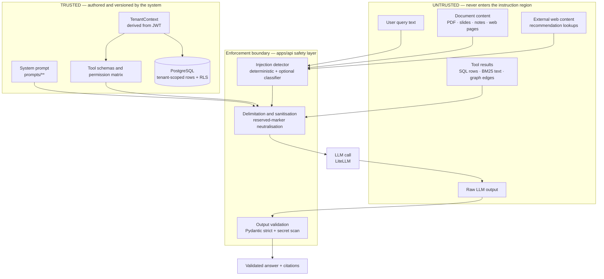

Tenancy is enforced three times: JWT-derived `TenantContext`, a repository layer
that requires an explicit tenant scope, and PostgreSQL Row-Level Security with
`FORCE ROW LEVEL SECURITY` and a per-transaction `SET LOCAL app.tenant_id`. RLS is
ignored for a superuser or a `BYPASSRLS` role, so the application connects as
`coursellm_app` (`NOSUPERUSER NOBYPASSRLS`) and `make db-inspect` asserts that
isolation is actually enforced.

### Security test matrix

`make test-security` collected **144** tests across ten modules
(`apps/api/tests/security/`); each module names the control it pins:

| Control | Test file | Tests |
|---------|-----------|------:|
| Deterministic injection detector: one signal class per test plus benign near-misses that must stay `allow` | `test_injection_detector.py` | 42 |
| Excessive agency: capabilities the system *lacks*, asserted as architecture fitness tests | `test_excessive_agency.py` | 27 |
| Hardening claims from `security.md` (oversized input, error envelope, no traceback) | `test_hardening.py` | 15 |
| Output validation and secret redaction | `test_output_validation.py` | 13 |
| Upload safety: traversal-shaped names, auth-before-work, cross-tenant course 404 | `test_upload_safety.py` | 11 |
| Tenancy boundary shape: the boundary cannot be removed by an ordinary commit | `test_tenancy_boundary.py` | 9 |
| Indirect injection from documents: fence escape, tool coercion, output guardrail | `test_indirect_injection.py` | 7 |
| Rate limiting: enforcement, reset, fail-open when Redis is down | `test_rate_limit.py` | 8 |
| Graph-extraction prompt injection | `test_graph_prompt_injection.py` | 8 |
| Data leakage: unauthenticated `/metrics`, error bodies, deactivated users | `test_data_leakage.py` | 4 |

The residual risk register is in
[`docs/architecture/security.md`](docs/architecture/security.md) §13. It states
plainly what the controls do not cover: novel indirect injection that reads as
legitimate prose, detector false positives on academic text, an injectable
classifier layer (off by default), extraction gaps across formats, and the absence
of any external penetration test or compliance certification.

---

## Tech stack

| Technology | Used for | Why it is here |
|------------|----------|----------------|
| FastAPI + Uvicorn | Async HTTP, validation, streaming, OpenAPI | Native async matches async DB/LLM I/O; Pydantic is the same schema layer used for LLM structured outputs |
| SQLAlchemy 2.0 async + asyncpg + Alembic | Persistence and migrations | Async engine; reviewable migration history instead of `create_all` |
| PostgreSQL + pgvector | Vectors, full-text, relational, graph, RLS | One datastore for four access patterns avoids a distributed-transaction problem for metadata + vectors |
| Redis | Retrieval/embedding cache, rate-limit counters | Cache keys embed tenant, model and config version, so a hit cannot cross a boundary |
| LiteLLM | Single model interface: routing, retries, fallbacks, spend | Removes provider SDKs from application code and makes degradation a configuration question |
| LangGraph | Stateful agent orchestration | Explicit typed state and conditional edges make control flow auditable and testable |
| Pydantic v2 + pydantic-settings | Validation, configuration, structured output | One schema for API, tools and LLM output; startup validates weights and hashes |
| structlog + OpenTelemetry | Structured logs with recursive redaction; traces and metrics | Metadata-only tracing by default, with cost accounting in `llm_usage` |
| React 19 + TypeScript + Vite | Web client | Typed against the generated OpenAPI schema; `strict`, `noUncheckedIndexedAccess`, `exactOptionalPropertyTypes` |
| TanStack Query | Server state | One typed query-key registry; no `useEffect`-plus-`useState` fetching |
| Vitest + Testing Library + MSW | Frontend tests | Every request goes through MSW with `onUnhandledRequest: 'error'` |
| Ruff + mypy (strict) + pytest | Lint, types, tests | Backend and `evals/` are linted and type-checked to the same standard |
| Terraform (AWS provider) | Target infrastructure | Modules + dev/prod roots; validated, never applied |
| Docker + compose | Local stack and images | Pinned base images by tag and digest; migration is a one-shot task that gates the API |
| GitHub Actions | CI | Thin wrappers around the `Makefile` so a green pipeline means the same thing locally |

Versions declared: `coursellm` 0.1.0, Python `>=3.12` (`apps/api/pyproject.toml`;
3.13.7 in the environment measured here), Node `>=20.19.0`. The Python dependency
set has no lockfile yet, which is noted in
[`.github/workflows/README.md`](.github/workflows/README.md) under Conventions.

---

## Local development

Prerequisites: Python 3.12+, PostgreSQL with `pgvector`, Node 20.19+. Then, in
order:

```bash
make install        # create .venv and install core + dev dependencies
make db-setup       # dev + test databases, migrations, restricted app role
make test-unit      # fast, no external services
make test-security  # adversarial regression tests
make test-integration   # needs PostgreSQL; ~4 minutes, run it serially
make eval-retrieval # write evals/reports/retrieval.json; no LLM required
make eval-gate      # compare against the committed baseline
make api            # http://localhost:8000/docs
```

`make install-web` then `make web` runs the client on
<http://localhost:5173> (the dev server proxies `/api` to :8000).

`make db-setup` provisions two roles: the schema owner that runs migrations, and
`coursellm_app`, which runs the application and **cannot bypass Row-Level
Security**. PostgreSQL ignores every RLS policy for a superuser, so developing as
one hides the failure until production. `make db-inspect` reports which role you
are connected as and whether tenant isolation is enforced; it must print
`ENFORCED by Row-Level Security`.

Run the integration tier serially: concurrent runs share `coursellm_test` and the
`clean_db` fixture truncates every table between tests, so a parallel run reports
failures that do not exist. There is no worker to run: ingestion is inline, and the
`make worker` target was removed rather than left pointing at a module that does
not exist. `.env.example` is the full configuration
surface; `.env` is gitignored and must never change a test outcome, which is why
tests construct `Settings(_env_file=None, ...)` explicitly.

---

## Docker

```bash
cp .env.example .env     # then set a real SECRET_KEY
make up                  # API :8000, web :5173, Postgres :5432, Redis :6379
make ps                  # every service healthy; migrate should read "exited (0)"
make down                # keeps volumes; `docker compose down -v` drops them
```

Startup order is load-bearing:
`postgres + redis → migrate (owner, one-shot, must exit 0) → api → web`. The
`migrate` task installs and asserts the `vector` extension, runs
`alembic upgrade head`, then runs `scripts/bootstrap_db.sql` to create
`coursellm_app`. A one-shot task makes the ordering explicit; if each API replica
ran migrations at boot they would race, because Alembic's version table is not a
distributed lock. The default API image installs core + `docx` only, so set
`EMBEDDING_PROVIDER=hashing` or build with `INSTALL_EXTRAS=embeddings,rerank`.
Base images are pinned by tag and manifest digest. Full detail and the acceptance
list are in [`docker/README.md`](docker/README.md).

**Docker was not exercised here:** the Docker CLI is installed but the daemon is
not running in this environment, so only the offline compose parse is verifiable.
The commands above are the documented acceptance path, not an observed result.

---

## Terraform / AWS

> **NOT APPLIED — nothing in `infra/terraform/` has ever been applied.** There is
> no live AWS deployment, no account referenced, and no AWS bill. `terraform
> apply` must not be run from a review of this repository.

The target architecture is CloudFront → ALB → ECS/Fargate (api + web), a private
data tier (RDS PostgreSQL 16 + pgvector, ElastiCache Redis), S3, Secrets Manager /
SSM Parameter Store and CloudWatch with an ADOT sidecar.

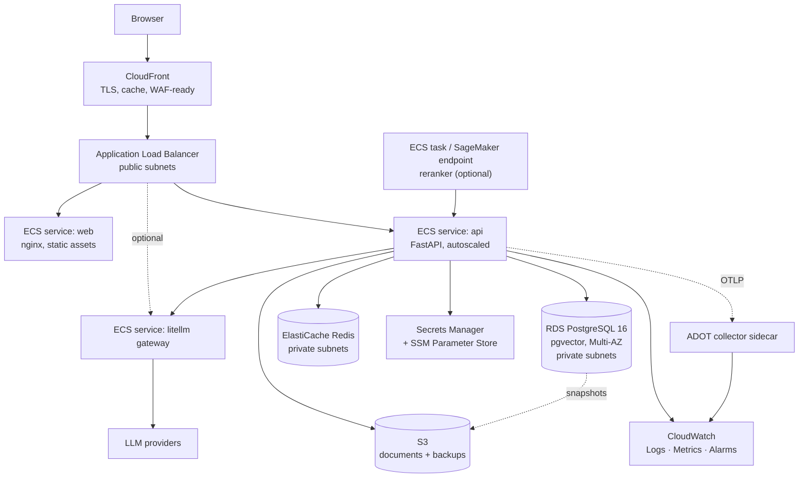

`terraform fmt -check`, `init -backend=false` and `validate` passed in both
environments when the configuration was authored; `terraform plan` could not
complete because no AWS credentials exist in this environment (it planned the
provider-independent resources and stopped at the provider). **I did not re-run
those commands here** — `terraform` is not installed on this machine. The
estimated cost is roughly **$145/month for dev and $460/month for prod, before
excluded lines**; every figure is arithmetic from list prices read from the AWS
Price List API on 2025-09-25, not an observed bill. See
[`infra/terraform/README.md`](infra/terraform/README.md) §13–§16 for the unit
prices, the assumptions, the deliberately absent hardening (no WAF, no RDS Proxy,
no CMK, no flow logs) and the exact commands.

---

## Testing

Tests are organised by *what a test is allowed to depend on*, not by module. Each
test carries exactly one marker and `--strict-markers` is on.

| Tier | Marker | Command | Measured on this checkout |
|------|--------|---------|--------------------------:|
| Unit | `unit` | `make test-unit` | **1277 passed**, 308 deselected, 7.74 s |
| Security | `security` | `make test-security` | **144 passed**, 1441 deselected, 4.72 s |
| Integration | `integration` | `make test-integration` | **164 passed**, 1421 deselected, 247.98 s (4:08) |
| Unit + security + integration | — | `make test-coverage` | **1585 collected** (1277 + 144 + 164); the coverage gate (`fail_under = 82`) runs here |
| Frontend | — | `make test-web` | **58 passed** in 8 files, 3.35 s |

The frontend run used `NPM_CONFIG_CACHE=/tmp/npm-cache-npm` because the default
npm cache is not writable in this environment; a reader with a normal cache can
run `make test-web` directly. `make test-coverage` itself was not re-run here: the
1585 figure is the collection count common to the three tier runs above
(`1277+308`, `144+1441` and `164+1421` all equal 1585).

Reproduction: run the commands in the table from the repository root on branch
`feat/22-readme`, on 2026-09-25, on `Ishus-MacBook-Air.local` (macOS 26.5.1 arm64,
Python 3.13.7, PostgreSQL 18.4, Node 26.7.0). Counts match
[`docs/testing.md`](docs/testing.md) §7. `make test-integration` is
**serial-only**. Unit and security tests may make no provider connection and no
test in those tiers opens one; `LLM_ENABLED=false` resolves to the deterministic
`EchoGateway`. Integration tests run as `coursellm_app`, not the owner, because a
superuser makes every isolation assertion pass for the wrong reason.

`make verify` chains format check, lint, typecheck, secret scan, unit, security,
integration and the eval gate in that order, cheapest first. It was **not** run
as one uninterrupted `make verify` here; the tiers were run individually and
serially, and the results are the ones in the table.

### Diagram validation

All twelve diagrams were rendered with `@mermaid-js/mermaid-cli` 12.0.0
(`npx -y @mermaid-js/mermaid-cli`) against a real headless Chromium. All twelve
parsed and rendered without error. The sources are committed under
[`docs/images/`](docs/images/) and the same blocks are inline above.

---

## CI/CD

Every workflow is a thin wrapper around the `Makefile`, so a green pipeline means
the same thing as a green local run.

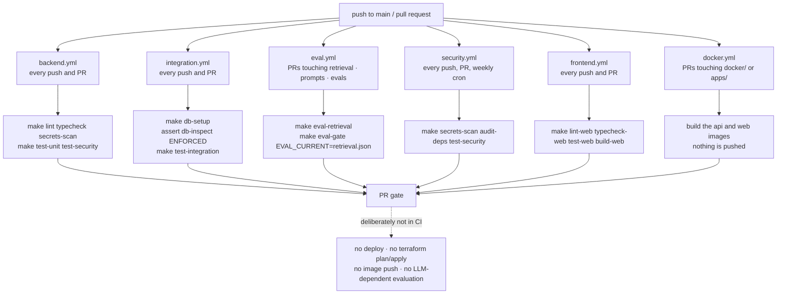

| Workflow | Triggers | Gates |
|----------|----------|-------|
| `backend.yml` | push to `main`, every PR | `ruff check` + `ruff format --check`, `mypy`, secret scan, unit, security |
| `integration.yml` | push to `main`, every PR | migrations + `bootstrap_db.sql` against `pgvector/pgvector:pg17`, assert `db-inspect` ENFORCED, then `pytest -m integration` as `coursellm_app` |
| `eval.yml` | push to `main`, PRs touching retrieval/prompts/evals | `run_retrieval_eval` then the gate against the committed baseline; report uploaded as an artefact (30-day retention) |
| `security.yml` | push to `main`, every PR, weekly cron | secret scan, `pip-audit`, `pytest -m security` |
| `frontend.yml` | push to `main`, every PR | `apps/web`: lint, typecheck, test, build |
| `docker.yml` | push to `main`, PRs touching `docker/` or `apps/` | builds both images tagged by git SHA; **nothing is pushed** |

Deliberately *not* in CI: deployment of any kind, `terraform plan` or `apply`, image
publishing, and the LLM-dependent evaluation half (it costs money and needs a
provider key, so it is run deliberately by a person). **These workflows have never
run on GitHub** — they exist in the repository, which is why there is no badge at
the top of this README. Details and conventions are in
[`.github/workflows/README.md`](.github/workflows/README.md).

---

## Project structure

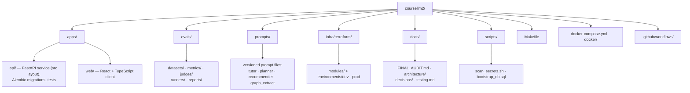

| Path | Purpose |
|------|---------|
| `apps/api/` | FastAPI service in a `src/` layout, with `tests/{unit,security,integration}` and `alembic/` |
| `apps/web/` | React + TypeScript client; one typed API layer, TanStack Query, SSE chat |
| `evals/` | Golden dataset, corpus, metrics, judge, runners and committed reports |
| `prompts/` | Versioned prompt files: tutor, planner, recommender, assessor, evaluator, safety, graph extraction |
| `infra/terraform/` | AWS modules and the dev/prod environment roots (never applied) |
| `docs/` | Final audit, architecture, ADRs, testing guide |
| `scripts/` | `scan_secrets.sh`, `bootstrap_db.sql` |
| `docker/` | API and web images, nginx config, optional OTel collector |
| `Makefile` | The single entry point for every workflow, local and CI |
| `.github/workflows/` | The six CI workflows |

An MCP server exposing selected read-only tools is planned but not present; the
directory is empty and is not listed above.

---

## Engineering decisions

| ADR | Decision | Status |
|-----|----------|--------|
| [ADR-0001](docs/decisions/ADR-0001-fastapi-async-sqlalchemy.md) | FastAPI with async SQLAlchemy 2.0 and asyncpg | Accepted |
| [ADR-0002](docs/decisions/ADR-0002-postgres-pgvector-single-datastore.md) | One PostgreSQL + pgvector datastore; no dedicated vector database | Accepted |
| [ADR-0003](docs/decisions/ADR-0003-hybrid-retrieval-bm25-plus-vectors.md) | Hybrid retrieval: dense HNSW vectors plus explicit Okapi BM25 | Accepted |
| [ADR-0004](docs/decisions/ADR-0004-knowledge-graph-in-postgres.md) | Knowledge graph in PostgreSQL via recursive CTEs; deliberately no graph database | Accepted |
| [ADR-0005](docs/decisions/ADR-0005-reciprocal-rank-fusion.md) | Reciprocal Rank Fusion instead of a normalised weighted score sum | Accepted |
| [ADR-0006](docs/decisions/ADR-0006-embedding-model-versioning.md) | Embeddings keyed by `(chunk_id, embedding_model, dim)` in a separate table | Accepted |
| [ADR-0007](docs/decisions/ADR-0007-litellm-as-model-gateway.md) | LiteLLM as the single model gateway, with a declared degradation ladder | Accepted |
| [ADR-0008](docs/decisions/ADR-0008-langgraph-for-agent-orchestration.md) | LangGraph: a bounded graph with agentic nodes, not an autonomous swarm | Accepted |
| [ADR-0009](docs/decisions/ADR-0009-row-level-security-for-tenancy.md) | Three-layer tenancy including PostgreSQL Row-Level Security | Accepted |
| [ADR-0010](docs/decisions/ADR-0010-prompt-versioning-and-config-hashing.md) | Versioned prompt files and a hashed retrieval-config version | Accepted |

Each ADR records the context, the decision, the positive *and negative*
consequences, the alternatives rejected, and how the decision is verified.

---

## Performance

Measured per-stage retrieval latency from the committed
[`evals/reports/baseline.json`](evals/reports/baseline.json), over 32 questions:

| Stage | p50 (ms) | p95 (ms) | p99 (ms) |
|-------|---------:|---------:|---------:|
| Semantic (pgvector HNSW, top-20) | 2.092583 | 2.773375 | 5.831375 |
| Lexical (BM25, top-20) | 7.963125 | 13.266208 | 14.237167 |
| Fusion (RRF k=60) | 0.091500 | 0.119500 | 0.130333 |
| Rerank (lexical fallback) | 1.773250 | 2.054875 | 2.090917 |

**Environment:** `Ishus-MacBook-Air.local`, macOS 26.5.1 arm64, Python 3.13.7,
PostgreSQL 18.4, single process, `hashing-v1` embedder and the lexical fallback
reranker. This is a correctness run over 8 documents, not a load test: it says
nothing about throughput, concurrency, or latency with a real embedding model or a
cross-encoder. The gate tolerates latency drift deliberately (`100 ms` absolute
plus `100%` of the baseline) because wall-clock time is not reproducible on shared
hardware; the largest observed three-run spread was `87.162208 ms` on
`system.lexical_p99_ms`. Non-latency retrieval metrics reproduced byte-for-byte.

Frontend bundle, measured with `make build-web` (which runs `tsc --noEmit` first):
`dist/assets/index-*.js` **712.01 kB raw / 214.86 kB gzip**, one chunk. There is no
route-level code splitting; that is a stated gap, not a target.

---

## What this project does not do

Ranked from [`docs/FINAL_AUDIT.md`](docs/FINAL_AUDIT.md) §6. Being explicit about
limits is the point: the prototype's overclaiming is what made it untrustworthy.

1. **No OCR for scanned PDFs and no `.pptx` parser.** An image-only page is a
   warning, not content.
2. **The evaluation is retrieval-only.** Faithfulness, answer relevance, answer
   correctness, citation precision/recall/hallucination and token/cost are defined
   but `not_measured` in CI, because CI has no provider key.
3. **The eval corpus is tiny (8 documents / 14 chunks) and the embedder is a
   hash.** The gate has little power and says nothing about semantic quality.
4. **Graph neighbours are not a third fused retrieval list.** Unmeasured signals
   are not added.
5. **Several observability spans are missing.** No tool, ingestion or
   authentication span, and the server span lacks request/tenant/user/stream
   attributes; some span constants are declared but unused.
6. **No route-level code splitting**: one ~712 kB JS chunk (~215 kB gzip).
7. **`search_web_sources` makes no outbound HTTP.** It returns
   `degraded: ["outbound_fetch_deferred"]`.
8. **`search_course` returns documents, not lecture/topic structure.**
9. **Terraform has never been applied.** No live deployment and no operational
   evidence.
10. **No background worker.** `apps/api/src/coursellm/workers/` does not
    exist; ingestion runs inline in the request, so there is no durable background
    queue. Longer uploads hold a request instead of being queued.
11. **Unused dependency declarations** (`tenacity`, `ragas`, `mcp`) and one stale
    `TODO` in `rag/ingestion/embedders.py`.
12. **No per-tenant spend cap** (only per-turn cost and per-hour request ceilings),
    and no partitioning or archival for the growing ledger tables.
13. **No external penetration test and no compliance certification.** No SOC 2,
    ISO 27001, HIPAA or GDPR conformance is claimed.

Also deliberately absent by design: the prototype's email/calendar tool surface,
the Langfuse-specific observability path (replaced by OpenTelemetry), and any live
AWS resource.

---

## Future improvements

Specific and ordered, matching the ranked gaps above:

1. Add an opt-in OCR extractor behind the existing parser interface, plus a
   `.pptx` parser; keep both off by default.
2. Add a budgeted, cached LLM-judge run on a schedule, reported separately from the
   gate, and regenerate the baseline under a real embedding provider in a nightly
   eval.
3. Wire graph neighbours into fusion behind a flag, then measure with (2) before
   enabling it.
4. Wire the missing spans in `tools/registry.py`, `rag/ingestion/*`, `api/deps.py`
   and `middleware.py`, or delete the unused constants.
5. Add `React.lazy` per route, then a dynamically imported syntax highlighter.
6. Implement `search_web_sources` with a domain allowlist, the same evidence fence
   and output validation.
7. Implement a durable ingestion worker and point `make worker` at it, or delete
   the target.
8. Apply the Terraform to a sandbox account, record a plan/apply in CI behind a
   required-reviewer environment, and replace the cost estimates with an observed
   bill.
9. Add a per-tenant spend cap and retention/partitioning for `llm_usage` and
   `progress_events`.
10. Remove or action the unused dependency declarations and the stale `TODO`.

---

## Screenshots

**Pending — no screenshot is embedded, and none was fabricated.** The client is a
real React application (`apps/web/src/pages/`, 14 routes) and its behaviour is
covered by 58 jsdom tests, but no browser was available in the environment this
README was written in, so the UI was not captured from a running app.

To produce screenshots on a machine with a browser:

```bash
make install-web
make api            # terminal 1: http://localhost:8000/docs
make web            # terminal 2: http://localhost:5173

# register a user through the UI, upload a document, then capture:
npx -y playwright@latest install chromium
npx -y playwright@latest screenshot --viewport-size=1440,900 \
    http://localhost:5173/ docs/images/dashboard.png
npx -y playwright@latest screenshot --viewport-size=1440,900 \
    http://localhost:5173/chat docs/images/chat.png
npx -y playwright@latest screenshot --viewport-size=1440,900 \
    http://localhost:5173/roadmap docs/images/roadmap.png
```

These commands are the ones that would produce the images; they were **not run
here**. Until they are run and committed, this section stays honestly empty rather
than showing a mock-up.

---

## Licence

MIT. See [`apps/api/pyproject.toml`](apps/api/pyproject.toml).

Local interview preparation notes exist in `interview_prep/` outside version
control; they are not part of this repository and are not referenced by it.
