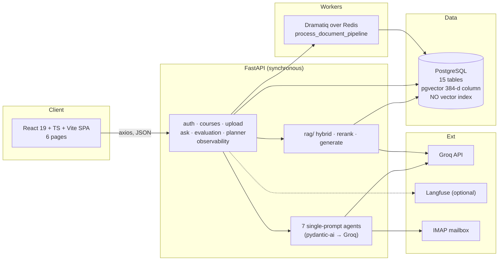
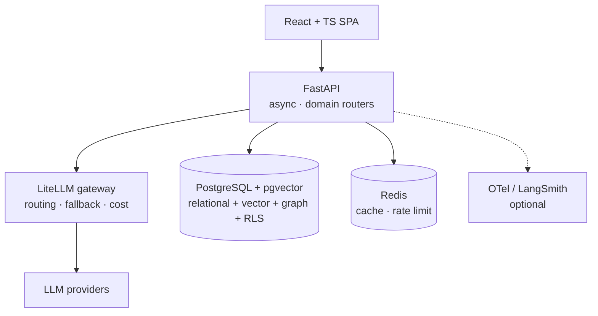

# Project Audit — CourseLLM

**Audit date:** 2026-01-01
**Audited revision:** `b3b7cba` (branch `main`), 17 commits, 160 tracked files
**Scope:** the complete repository as found — `coursellm/` (Python backend, 5,871 LOC),
`coursellm-frontend/` (React + TypeScript SPA), Alembic migrations, dependency
manifests, and Git history.

> **Purpose.** This document records what existed before the rebuild, what was worth
> keeping, and why each replacement decision was made. It was written *before* any
> destructive change, as required.

---

## 0. Executive summary

The prototype is a genuinely working end-to-end system: a student can register, upload
a PDF, ask a question, and get an answer grounded in vector search, with LLM-generated
notes, quizzes, a study planner, and an email integration. The engineering instincts in
it — tenant-scoped embeddings, a cross-encoder reranker, background workers,
observability hooks — are sound.

It is not, however, production software or defensible in an interview, for four
structural reasons:

1. **The schema is not reproducible.** The migrations create a `vector(1536)` column
   while the model and embedder use 384 dimensions. No migration reconciles them; the
   project documentation admits the column was altered manually via `psql`. A fresh
   `alembic upgrade head` produces a database that cannot accept the application's own
   embeddings.
2. **There is no vector index of any kind.** Every semantic query is a full sequential
   scan. The migration whose name claims to handle vectors
   (`9fc059ca10c7_add_chunk_index_and_update_vector_size`) only adds an integer column.
3. **Three load-bearing claims are false.** There is no BM25 (it is `ts_rank`), there is
   no Reciprocal Rank Fusion (it is a min–max-normalised weighted sum), and there is no
   reproducible measurement (the only numbers in the repository are internally
   inconsistent and cannot be regenerated).
4. **A live database credential is committed to Git**, and the API returns password
   hashes in its responses.

The rebuild therefore keeps the *shape* and discards the parts that cannot be defended.
The remainder of this document substantiates each claim.

---

## 1. Existing architecture

### 1.1 Runtime topology as found



### 1.2 Backend inventory

A flat package layout rooted at `coursellm/`, with imports resolved relative to the
working directory (`from database import engine`), not an installed package. Seven of
ten subpackages have no `__init__.py`, so they are implicit namespace packages.

| Area | Modules | Notes |
|------|---------|-------|
| API | 7 routers, 23 routes | `auth`, `courses`, `upload`, `ask`, `evaluation`, `planner`, `observability` |
| Models | 15 SQLModel tables | 8 int-keyed, 5 UUID-keyed; inconsistent identity types |
| Schemas | Pydantic | `User` schema extends `UserInDB` → leaks `hashed_password` |
| Repositories | 1 base class | Most routes query the session directly |
| Services | 4 | Grading, evaluation/planner context resolution, dead `llm.py` |
| Agents | 7 | All single-prompt `pydantic_ai.Agent` calls; no tools, no loops |
| RAG | 18 files, 987 LOC | See §3 |
| MCP | 4 files | **Not MCP.** An in-process IMAP/SMTP service layer with a misleading name |
| Observability | 6 files | Langfuse spans for `/ask` only; in-process ring buffer for debug |
| Workers | 3 files | Dramatiq; two of three actors are never registered |
| Migrations | 7 revisions | Linear, single head, but unreproducible (§0) |

### 1.3 Frontend inventory

React 19 + TypeScript + Vite + Tailwind 3, `react-router-dom`, `axios`,
`react-markdown`, `lucide-react`. Six pages: Login, Dashboard, Chat, Upload, Planner,
Evaluation.

- **No server-state library.** The `GET /courses` + "select the first course" effect is
  copy-pasted into four components, each swallowing errors into `console.error`.
- **No typed API layer.** `Course`, `Submission`, and `EvaluationProgress` are
  redeclared per page with *mutually incompatible* shapes, and `response.data` is
  trusted to be the right shape.
- **The build fails.** `npm run build` is `tsc -b && vite build`; the source contains a
  definite `TS2339` (`user.username`), a definite unused-import error under
  `noUnusedLocals`, and a missing `React` import. `strict` is not enabled.
- **No tests, no CI, no error boundary, no dark mode, no responsive sidebar.**
- Mock data is rendered as if real: "Questions Asked 142", "Avg Evaluation Score 94%",
  "Submit ML Assignment — Tomorrow at 11:59 PM" are hardcoded strings.
- The backend returns `sources` from `/ask/`; the frontend reads only `answer` and
  **throws the citations away**. There is no sources UI at all.

### 1.4 Git history

17 commits, the last several of which are deployment plumbing for Hugging Face Spaces,
Render, and Vercel — three different hosting targets, none currently working. Message
quality is inconsistent (`stage 1`, `stage B`, `stage 2: pushed on below commit 3`).
There is no branch strategy, no PR that was not self-authored, and no CI.

---

## 2. Existing capabilities

Things the prototype does correctly and that the rebuild preserves as *ideas*:

| Capability | Assessment |
|-----------|------------|
| Async-capable FastAPI with OAuth2 password flow and bcrypt | Right shape; rewrite for async correctness and safe responses |
| Tenant-scoped chunk storage (`user_id` + `course_id` on every chunk) | Correct instinct; strengthen to a real tenant boundary with RLS |
| pgvector cosine similarity with the `<=>` operator | Correct operator; add the missing index and pre-filter strategy |
| A **genuine cross-encoder** reranker (`BAAI/bge-reranker-base` via `transformers`) | The single best technical decision in the codebase; keep the model, fix the batching and failure handling |
| 20 → 5 candidate funnel before generation | Correct shape; keep with explicit rationale |
| Implicit-namespace-free RAG module structure with per-stage files | Good decomposition; migrate to an installed package |
| FastAPI dependency injection for auth and sessions | Keep and extend to tenant context |
| Structured LLM outputs via Pydantic | Keep; this becomes the foundation of the tool schema layer |
| Dramatiq + Redis for background document processing | Keep the queue concept; make it idempotent |
| Langfuse tracing behind an env flag with a no-op fallback | Keep the pattern; generalise to OpenTelemetry |
| pyproject + lockfile + a multi-stage Dockerfile with a non-root user | Keep the intent; the image pins nothing and installs build tools into runtime |

---

## 3. The RAG implementation, examined

This is the section the rebuild is judged on, so it is examined in detail.

### 3.1 Ingestion

- **Parsers:** PyMuPDF for PDF, `python-pptx` for slides, plain text, and a Groq vision
  call for images using `llama-3.2-90b-vision-preview` — a retired preview model id.
  Scanned PDFs have no OCR fallback: PyMuPDF returns empty text and the page is
  **silently dropped**.
- **Every parser error is swallowed** by `except Exception: print(...)` returning `[]`,
  and the API then reports HTTP 200 with `chunks_processed: 0`.
- **Chunking:** despite the class name `SemanticChunker`, it is paragraph-greedy
  character accumulation at 1000 characters. The 100-character overlap applies **only**
  in the hard-split branch for over-long paragraphs, not between accumulated chunks.
  Chunks never span a page boundary. `overlap >= max_chunk_size` is unguarded, which
  would produce a non-positive slice step. Sizing is in characters, not tokens.
- **Embedding:** `BAAI/bge-small-en-v1.5`, 384-d, CLS-pooled and L2-normalised — correct
  and consistent with cosine distance. But the **entire document is embedded in a single
  unbounded forward pass** (no batching → OOM cliff), the model loads lazily inside the
  first user request, and no query instruction prefix is used even though BGE-v1.5
  recommends one, which degrades query/document asymmetry.
- **Transactions:** the `Document` row is committed *before* embedding, so an embedder
  failure leaves an orphan document and a stray file. There is no content hash, no
  upsert, and no re-ingest path.
- **Path safety:** the upload path is `f"uploads/{file.filename}"` — unsanitised user
  input interpolated into a filesystem path (traversal), in a **global** namespace, so
  two users uploading `notes.pdf` overwrite each other's file on disk.

### 3.2 Semantic retrieval

```python
stmt = select(Chunk, Chunk.embedding.cosine_distance(query_embedding).label("distance")) \
         .where(Chunk.user_id == user_id)
stmt = stmt.order_by("distance").limit(top_k)
```

- **Index: none.** Grep for `hnsw|ivfflat|vector_cosine_ops` across the whole repository
  returns nothing. This is an exact brute-force scan of every chunk owned by the user.
- **Dimension drift.** `models/chunk.py` declares `Vector(384)`; the initial migration
  creates `VECTOR(dim=1536)`; migration `9fc059ca10c7`, named
  *"add chunk index and update vector size"*, only adds a `chunk_index` integer column
  and an index on it. The project's own documentation states the column "was manually
  altered via `psql`". Therefore **a database built from migrations cannot store the
  application's embeddings** — every insert fails with `expected 1536 dimensions, not 384`.
- **Score semantics are overloaded.** `SearchResult.score` means a *distance* here, a
  *rank-like score* in keyword search, and a *normalised similarity* after fusion. This
  ambiguity is the direct cause of the fusion bug in §3.4.
- The embedding column is nullable, and `NULL` sorts last under ascending order, so
  chunks without embeddings silently vanish from results.

### 3.3 "BM25" is not BM25

```sql
SELECT *, ts_rank(to_tsvector('english', content), plainto_tsquery('english', :question)) AS keyword_score
FROM chunks WHERE user_id = :user_id AND to_tsvector('english', content) @@ plainto_tsquery('english', :question)
ORDER BY keyword_score DESC LIMIT :top_k
```

PostgreSQL's `ts_rank` scores a document from its own lexeme frequencies. It has **no
inverse document frequency, no term-frequency saturation, and no document-length
normalisation** (the `normalization` argument is omitted, which defaults to none). It is
therefore not a probabilistic retrieval function.

**This was verified, not asserted.** In a 100-document corpus where one term appears in
90 documents and another in exactly 1, with identical term frequency and identical
document length:

| Signal | Rare term | Common term |
|--------|-----------|-------------|
| `ts_rank` (as implemented) | 0.06079271 | 0.06079271 |
| BM25 IDF | 5.3083 | 0.0050 |
| **Ratio** | **1069× more weight for the rare term under BM25** | |

`ts_rank` returns *the same score* regardless of how rare the term is. This is the
difference between a lexical retriever that helps and one that mostly returns long
documents that repeat query words. The prototype's documentation claims "BM25" in four
separate places.

Additional defects: `plainto_tsquery` ANDs every lexeme, so a stopword-only query
produces an empty tsquery and returns **zero rows**; `SELECT *` ships the full embedding
vector over the wire and reconstructs a `Chunk` by mutating a dict, which breaks on any
schema change; there is no fuzzy, prefix, or phrase matching.

### 3.4 Fusion is not RRF

The implementation min–max normalises each result list, inverts the semantic list, and
takes a hardcoded weighted sum of `0.7 * semantic + 0.3 * keyword`. Three defects:

1. **Min–max normalisation is relative to the candidate set.** The best item in each list
   is forced to `1.0` and the worst to `0.0` *regardless of absolute relevance*. A single
   outlier changes every other document's contribution. A single-result list normalises
   to `1.0`. Rankings are therefore unstable and not comparable across queries.
2. **Cosine distance and `ts_rank` are not on comparable scales**, so any fixed weight
   between them is arbitrary and cannot transfer across queries, corpora, or models.
3. **The implementation is internally inconsistent.** Semantic distances are inverted
   *after* normalisation while keyword scores are not; a chunk present in both lists has
   its `semantic_score` field overwritten while its `final_score` accumulates — and the
   documentation claims it "keeps the max score on collisions", which the code does not do.

The prototype's `hybrid_retrieval` latency measurement also starts at the top of
`HybridRetriever.search`, so it *includes* the semantic and keyword stages that are
already logged separately. Any latency breakdown built on these events double-counts by
construction.

### 3.5 Reranking

The reranker is the strongest component: `BAAI/bge-reranker-base` tokenised as
`[query, passage]` pairs, which is a true cross-encoder. Defects are operational rather
than conceptual — **all candidates go through one unbounded forward pass** (no
`batch_size`), scores are raw logits with no sigmoid or threshold, input objects are
mutated in place so the pre-rerank order is lost, and **any failure propagates as a
route-level 500**. There is no fallback to fused order and no timeout.

### 3.6 Generation and citations

- Model and provider are hardcoded (`groq:llama-3.3-70b-versatile`) in eight agent files
  and in the generator. No temperature, no `max_tokens`, no seed, no timeout, no retry,
  no fallback provider.
- Context is assembled by string concatenation with `--- Chunk N (Source: Document ID X,
  Page Y) ---` headers and **no delimiter hardening**, so document text is concatenated
  directly into the same region as the instructions — a textbook indirect prompt
  injection surface.
- The model is **never asked to cite inline**. `sources` is reconstructed by the route as
  `"Document ID 4, Page 7"` strings. There is no filename, no chunk id, no quoted span,
  and no verification that the answer is supported by the cited chunk. The documentation
  claims sources look like `"filename.pdf page 3"` and that the system "cites the source
  documents exactly". Neither is true.
- A full prompt-injection surface exists via the email integration: entire email bodies
  (truncated to 4000 characters) are sent to a third-party LLM, and the model's output is
  then written into calendar rows.

### 3.7 Grounding contradiction

`rag/agents/notes_generator.py` instructs the model:

> *"If the source content has NO formulas … USE YOUR KNOWLEDGE to generate 2-3 relevant
> formulas, syntax patterns, or code snippets"*

This directly contradicts the `/ask` system prompt's strict grounding rule and
deliberately instructs the model to fabricate content that is then persisted as course
notes. It is a hallucination vector designed into the product.

### 3.8 Grouping of retrieval quality, and why the published numbers are unusable

There is **no evaluation infrastructure**: no Ragas, no golden dataset, no metric
computation, no `/metrics`, no assertions. The Langfuse event store that the numbers
were drawn from is an **in-memory ring buffer** cleared on restart, capped at 200
requests, and never persisted.

All published numbers live only in `combined_stages_documentation.md`, introduced as
*"the real event payload you captured"*. The latency table is arithmetically
impossible: the listed shares sum to **115.5 %** while being labelled 100 %, and none of
the individual shares match their own values divided by the stated total. The
`hybrid_retrieval` figure double-counts the two stages beneath it. No script, dataset,
or log file is committed that could regenerate any of it.

**Conclusion: every number in the existing documentation must be treated as
unreproducible and removed.** The rebuild publishes nothing that `make eval` cannot
regenerate into a committed artefact.

---

## 4. Security findings

| # | Severity | Finding | Location |
|---|----------|---------|----------|
| S1 | **Critical** | Live Supabase PostgreSQL password and connection string committed to Git | `credentials:3,5` |
| S2 | **Critical** | `User` schema extends `UserInDB`, so `POST /auth/register` and `GET /auth/me` return the bcrypt password hash | `schemas/user_schema.py` |
| S3 | **High** | Path traversal: user-controlled filename interpolated into a filesystem path; global namespace allows cross-user file overwrite | `api/routes/upload.py` |
| S4 | **High** | `CORS(allow_origins=["*"], allow_credentials=True)` — an invalid and unsafe combination | `main.py` |
| S5 | **High** | Indirect prompt injection: raw document and email content concatenated into the instruction region | `rag/generation/generator.py`, `mcp/email_service.py` |
| S6 | **High** | Agents scope retrieval by `document_id` only, with no tenant or ownership check | `rag/agents/topic_extractor.py`, `notes_generator.py` |
| S7 | **Medium** | `get_current_user` never checks `is_active`, so deactivated accounts retain access | `api/routes/auth.py` |
| S8 | **Medium** | No rate limiting on any endpoint, including `/auth/token` and every LLM-backed route (denial-of-wallet) | everywhere |
| S9 | **Medium** | Internal exceptions returned to clients via `str(e)` in 500 responses | `upload.py`, `ask.py` |
| S10 | **Medium** | No file type or size validation on upload | `api/routes/upload.py` |
| S11 | **Medium** | Debug API enabled by default; observability events readable when no owner is recorded | `core/config.py`, `observability.py` |
| S12 | **Low** | `DATABASE_URL` default commits a developer-local DSN; `SECRET_KEY` is static with no rotation | `core/config.py` |
| S13 | **Low** | Client-supplied `X-Request-ID` trusted verbatim | `observability/middleware.py` |

S1 is unrecoverable by deletion alone: the credential exists in Git history and **must be
rotated at the provider**. The rebuild removes the file, adds secret scanning to CI, and
this document records the rotation requirement explicitly rather than implying that
deleting the file is sufficient.

---

## 5. Technical debt register

### 5.1 Duplicated functionality

| Duplication | Locations |
|-------------|-----------|
| Two unrelated classes both named `EmailService` (SMTP vs IMAP) | `services/llm.py`, `mcp/email_service.py` |
| Near-identical course/document resolver | `services/evaluation_context.py`, `services/planner_context.py` |
| Date parsing and normalisation | `agents/email_extractor.py`, `mcp/email_service.py` |
| `MisconceptionType` enum defined twice | `models/evaluation.py`, `schemas/evaluation.py` |
| The model string `groq:llama-3.3-70b-versatile` | 8 files |
| `GET /courses` + select-first effect | 4 frontend pages |
| `Course` interface with different shapes | 4 frontend pages |
| `check_chunks.py` | repo root and `coursellm/` |

### 5.2 Dead code

`services/llm.py` in full (including a hardcoded astronaut system prompt); `models/chat.py`
and `schemas/schemas.py` with no chat route; `models/planner.Reminder`; the
`batch_grade_task` and `grade_submission_task` actors (never imported, therefore never
registered); `orchestrator.embed_texts`; `generate_weekly_summary`;
`generate_remediation_plan`; `_extract_common_issues`; `generation_status.depends_on`;
`generation_status.retry_count`; `Chunk.topic` (always written as `None`, never read);
`DocumentTopic.chunk_ids` (never populated); and a wasted LLM call where
`MisconceptionDetector.detect` is awaited and its result discarded.

### 5.3 Correctness and consistency

- **Identity type drift:** `user_id` is `int` in eight tables and `String` in
  `planner_events` and `study_plans`, requiring `str(current_user.id)` conversion at every
  boundary.
- **Two transaction strategies:** request-scoped sessions versus services opening their
  own `Session(engine)` and committing independently, so a route cannot roll back a
  service's work.
- **Sync/async mixing:** `async def` routes run blocking SQLAlchemy, blocking sentence
  transformers embedding, and blocking reranking on the event loop. `asyncio.run()` is
  called from inside a function reachable from an async context, which raises at runtime.
- **Naive datetimes:** 19 uses of `datetime.utcnow()` mixed with
  `datetime.now(timezone.utc)`.
- **Missing ordering:** `get_student_progress` computes a "trend" without `ORDER BY`, so
  the result is nondeterministic.
- **N+1 queries:** `GET /courses` fetches documents per course; documents are queried by
  `course_id` with **no `user_id` filter**.
- **Non-idempotent workers:** re-running the document pipeline duplicates topics and
  notes. `update_status(document_id, ...)` accepts any document id.
- **Startup side effects:** `SQLModel.metadata.create_all()` at import time means the app
  can create tables outside Alembic, masking migration drift. `app.py` spawns a worker in
  a `subprocess` at import, so running the documented command can double-start workers.
- **Alembic URL handling:** `env.py` does not apply the `postgres://` → `postgresql://`
  rewrite that `database.py` applies, so migrations fail on Heroku-style URLs.

### 5.4 Dependency and build debt

- `pyproject.toml` omits `langfuse`, which `observability/` imports, so the container
  image (built with `uv sync --frozen`) cannot load tracing when keys are set.
- `requirements.txt` omits `dramatiq` and `redis`, which the run scripts and worker
  broker require.
- `sentence-transformers`, `tiktoken`, `genai-prices`, `scikit-learn`, `scipy`, `boto3`,
  `opentelemetry-*`, `logfire`, and `sentry-sdk` are installed but never imported.
- No pytest configuration, no `conftest.py`, no fixtures, and pytest is not declared as a
  dependency. Of ten `test_*.py` files, one is a real test suite (7 tests, one of which
  hits the live database); the other nine are `__main__` smoke scripts with no assertions
  that call live external APIs.
- The frontend build is currently broken and `node_modules` was not committed.

### 5.5 Documentation drift

The two large documentation files (`combined_stages_documentation.md`, 156 KB) describe a
system that does not match the code: "BM25" (×4), `sentence_transformers.CrossEncoder`
(×2, when the code uses `transformers`), `"filename.pdf page 3"` citations,
"asynchronous searches" (they are sequential and blocking), a 1536→384 dimension change
"via migration" (it never happened), a never-achieved "immediate < 200 ms HTTP response",
and the arithmetically invalid latency table. Root `README.md` claims React 18 and
Python 3.10+; the lockfile and `.python-version` say React 19 and Python 3.13.

A documentation set that overstates the system is worse than no documentation, because it
destroys trust in every other claim in the repository.

---

## 6. Missing production capabilities

| Capability | Status as found |
|-----------|-----------------|
| Multi-tenancy | Absent as a concept — no tenant/org entity, no RLS, no scopes; isolation by ad-hoc `user_id` filters that are missing in several places |
| Migration discipline | Undermined by `create_all` at import and by an unreproducible schema |
| Rate limiting | None |
| Structured logging | None; `print()` in production paths; no log configuration |
| Health / readiness | Only `GET /`; no DB or Redis probe; no container `HEALTHCHECK` |
| Retries / timeouts / circuit breakers | None on LLM, IMAP, or HTTP calls; `tenacity` installed but unused |
| Streaming | None on either side; `sse-starlette` installed but unused |
| Caching | None — no embedding cache, no retrieval cache |
| Cost / token tracking | None persisted; tokens logged and discarded |
| Observability | Traces only `/ask`; metrics absent; debug store is process-local |
| Evaluation | Entirely absent; `ragas`, `pydantic-evals`, `scikit-learn` unused |
| Prompt management | Prompts inline in Python, unversioned |
| Knowledge graph | Absent |
| Roadmaps as a feature | A `study_plans` table; no personalisation, no prerequisites, no adaptation |
| Recommendations | Ad-hoc LLM text; no catalogue, no provenance, no ranking |
| AI security controls | None — no injection detection, no content delimitation, no output validation, no tool permissions |
| Infrastructure as code | Absent |
| CI/CD | Absent |
| Container hygiene | Non-root user (good) but unpinned base, build toolchain in the runtime layer, no healthcheck |

---

## 7. Reuse assessment

Per component, the disposition carried into the rebuild:

| Component | Disposition | Reason |
|-----------|-------------|--------|
| Parser (PyMuPDF, python-pptx) | **Keep the libraries, rewrite the module** | Library choice is right; error swallowing, silent page drops, path handling and OCR gap are not |
| Chunker | **Rewrite** | Not semantic despite the name; overlap only in one branch; character- not token-based; unguarded overlap |
| Embedder | **Rewrite behind an interface** | Correct model/normalisation, but unbatchted, request-path lazy load, no query prefix, no provider abstraction |
| Semantic search | **Rewrite** | Correct operator, but no index, dimension drift, overloaded score semantics |
| Keyword search | **Rewrite** | Is `ts_rank`; mislabeled as BM25 in four places |
| Hybrid fusion | **Rewrite** | Weighted min–max sum presented as RRF; three concrete defects |
| Reranker | **Keep the model, rewrite the module** | Genuine cross-encoder; needs batching, thresholds, timeouts, fallback |
| Generator | **Rewrite** | Grounding prompt is good; everything operational is missing |
| RAG sub-agents | **Rewrite** | Anti-grounding instructions, document-only scoping, `asyncio.run` in async context |
| `mcp/` email + calendar | **Remove from the agent surface** | Not MCP; a shared mailbox with a stored password; an injection path with DB write access |
| Observability | **Replace with OpenTelemetry** | Langfuse-only, `/ask`-only, no metrics |
| Workers | **Rewrite** | Non-idempotent; two of three actors unregistered |
| Frontend | **Rewrite** | Broken build; no typed API; no tests; throws away citations |
| Database schema | **Rewrite with a clean migration chain** | Unreproducible and internally inconsistent |

---

## 8. Proposed architecture

The target design is specified in full in [`docs/architecture/`](architecture/). In
summary, and with the problem each change solves:

| Change | Problem it solves |
|--------|-------------------|
| Installed `coursellm` package under `apps/api/src` | Eliminates cwd-relative imports and implicit namespace packages |
| `tenant_id` on every tenant-scoped row + PostgreSQL RLS + repository-level scoping | Turns tenancy from a convention into an enforced boundary (S6, missing multi-tenancy) |
| `chunk_embeddings` keyed by `(chunk_id, embedding_model, dim)` | Makes the vector space part of the key; makes model upgrades a migration rather than silent corruption (dimension drift) |
| HNSW index with `m=16, ef_construction=64`, tenant predicate **inside** the ANN scan, `hnsw.iterative_scan = strict_order` | Gives semantic search an index, and makes `LIMIT k` mean *k rows for this tenant* (§9) |
| True BM25 (`k1=1.2`, `b=0.75`, per-tenant IDF) in SQL | Replaces `ts_rank`; rare-term queries stop ranking long repetitive documents first |
| Reciprocal Rank Fusion (`k=60`) | Removes corpus-relative normalisation and uncalibrated weights from fusion |
| Batched cross-encoder with timeout, threshold and RRF fallback | Keeps the strongest existing component and makes its failure non-fatal |
| LangGraph with typed state, conditional edges and loop bounds | Replaces seven single-prompt "agents" with an auditable, bounded control flow |
| Tool registry with a permission matrix | Makes "agent versus tool" explicit and closes excessive-agency risk |
| LiteLLM gateway with task-based routing, retries, fallbacks and cost accounting | Removes eight hardcoded model strings and answers "what happens when the provider is down" |
| Knowledge graph in PostgreSQL via recursive CTEs | Adds multi-hop prerequisite reasoning that vector search structurally cannot do, without a second datastore |
| Versioned prompts under `prompts/` + a retrieval-config hash on every run | Makes quality changes attributable to a cause instead of a guess |
| RAGAS-compatible evaluation with a committed golden dataset and CI gates | Replaces unverifiable numbers with reproducible ones |
| OpenTelemetry spans plus optional LangSmith | Per-layer latency and error attribution with no raw prompt capture by default |
| Deterministic injection detector, delimited untrusted content, output validation, secret redaction | Converts the injection surfaces in S5/S6 from open to defended |
| React + TypeScript rewrite with a typed client, query layer and streaming chat | Fixes the broken build and surfaces citations the backend already returns |
| Docker, Terraform, CI/CD | Makes the system reproducible and deployable-by-plan |

### 8.1 Proposed runtime topology



### 8.2 Verification added alongside each claim

Every architectural claim above is backed by a test or an artefact, because the central
lesson of this audit is that unverified claims rot:

- tenancy → `apps/api/tests/integration/test_tenant_isolation.py` with an adversarial decoy corpus
- pre-filtering → an empirical demonstration (§9)
- BM25 → an IDF unit test with a known corpus and hand-computed expected scores
- RRF → a unit test with hand-computed expected fusion scores
- grounding → `apps/api/tests/integration/test_grounding.py`, which asserts refusal on out-of-corpus questions
- injection → `apps/api/tests/security/` with crafted adversarial document fixtures
- quality → `evals/` with a committed dataset and report artefacts

---

## 9. Empirical findings produced during this audit

Two claims in this document were verified by execution against PostgreSQL 18.4 with
pgvector 0.8.2, rather than asserted. Both are reproduced by tests in the rebuild.

### 9.1 Post-filtering an ANN search silently destroys recall

Corpus: 10,000 chunks for tenant 1 and 200 chunks for tenant 2, with tenant 1's
embeddings deliberately clustered close to the query vector and tenant 2's spread
further away. HNSW index, `hnsw.ef_search = 40`, `LIMIT 20`.

| Strategy | Rows returned for tenant 2 |
|----------|---------------------------|
| Global ANN `LIMIT 20`, then filter by tenant (**post-filter**) | **0** |
| Tenant predicate inside the scan (**pre-filter**) | **20** |

This is the concrete justification for requiring tenant constraints inside the retrieval
query. Post-filtering does not return fewer-but-adequate results; with a skewed tenant
distribution it returns *nothing*, while reporting normal latency. The mitigation and its
caveats (iterative scan, composite indexes, `strict_order` versus `relaxed_order`) are
documented in [`docs/architecture/rag.md`](architecture/rag.md).

### 9.2 `ts_rank` is not BM25

See §3.3. In a controlled corpus, `ts_rank` scores a document containing a term that
appears in 1 % of the corpus identically to a document containing a term that appears in
90 % of it, while BM25's IDF differs by a factor of **1069×**. Rare technical identifiers
— the exact tokens students search for — are precisely where the prototype's lexical
retriever fails.

---

## 10. Migration plan

The rebuild proceeds in reviewable stages. Each stage lands as its own pull request with
tests and documentation, and no stage depends on the state of a later one. These map
directly to the PR sequence:

| PR | Stage | Depends on | Exit criteria |
|----|-------|-----------|---------------|
| 1 | **Audit and architecture** (this document) | — | Audit committed; target architecture documented with ADRs |
| 2 | Repository restructuring | 1 | Monorepo layout, installed package, tooling, `make` targets, clean `git status`; prototype removed |
| 3 | Database, multi-tenancy, security foundation | 2 | Clean Alembic chain from empty DB; RLS active; tenant isolation tests pass; auth returns no hashes |
| 4 | Ingestion pipeline | 3 | Parse → chunk → embed → index with provenance; idempotent re-ingest; no silent failures; safe filenames |
| 5 | Hybrid retrieval | 4 | HNSW index live; true BM25 with IDF test; both retrievers tenant-scoped |
| 6 | RRF and reranking | 5 | Hand-computed RRF unit tests; batched reranker with timeout and RRF fallback |
| 7 | Advanced RAG: context, citations, generation | 6 | Token-budgeted context; inline citations verified against retrieved ids; refusal on no evidence |
| 8 | LiteLLM gateway | 7 | No provider SDK import outside the gateway; routing, fallback, cost rows persisted |
| 9 | LangGraph agent architecture | 8 | Typed state; bounded loops; tool permission matrix enforced and tested |
| 10 | Knowledge graph | 9 | Extraction with validation and provenance; recursive-CTE prerequisite closure with cycle guard |
| 11 | Personalised roadmaps | 10 | Topologically ordered, goal-derived roadmap adapted from measured progress |
| 12 | Recommendations | 10 | Curated catalogue with provenance; ranking separate from explanation; no invented metadata |
| 13 | Assessment and progress agents | 9 | Quiz generation, answer evaluation, progress signals feeding roadmap adaptation |
| 14 | Evaluation system | 7 | Golden dataset, metrics, RAGAS adapter, committed report artefact |
| 15 | Observability | 8 | OTel spans end to end; metrics endpoint; optional LangSmith; no raw prompts by default |
| 16 | AI security hardening | 9 | Injection detector, delimitation, output validation, secret redaction, security test suite |
| 17 | Frontend rewrite | 7 | Typed client; streaming chat with citations; all pages implemented; build passes with `strict` |
| 18 | Test and regression gates | 14 | Unit + integration + eval suites; documented thresholds derived from a measured baseline |
| 19 | Docker | 3 | Multi-stage images; compose stack healthy from a clean checkout |
| 20 | Terraform / AWS | 19 | `fmt`, `validate`, `plan` succeed; no secrets; cost notes |
| 21 | CI/CD | 18 | CI, evaluation gate, security scan, frontend checks |
| 22 | README and diagrams | 17 | Every claim in the README traceable to code or a committed artefact |
| 23 | Final hardening | all | Full suite green; no secrets; docs match code; prototype fully removed |

### 10.1 Ordering rationale

The sequence is dependency-driven, not preference-driven:

- **Structure before content** (2 before 3): the schema cannot be rebuilt inside a
  directory layout that forces cwd-relative imports.
- **Tenancy before ingestion** (3 before 4): retrofitting a tenant boundary onto
  populated chunk tables requires a data migration; building it first makes it a
  constraint.
- **Ingestion before retrieval** (4 before 5): the index and BM25 statistics are
  populated by ingestion, so retrieval cannot be benchmarked without it.
- **Retrieval before fusion** (5 before 6): RRF consumes two ranked lists; it cannot be
  tested without them.
- **Fusion before generation** (6 before 7): citation correctness depends on a stable,
  explainable ranking.
- **Gateway before agents** (8 before 9): agents must call models through the gateway, or
  the hardcoded-provider problem is reintroduced.
- **Graph before roadmaps** (10 before 11): prerequisite ordering is a graph query.
- **Evaluation before gates** (14 before 18/21): thresholds must be derived from a
  measured baseline, never chosen arbitrarily.

### 10.2 Risk register

| Risk | Mitigation |
|------|-----------|
| The rebuild is judged against the old documentation's inflated claims | This audit explicitly retracts every unreproducible number; the README cites only committed artefacts |
| The committed credential has already leaked | Documented as requiring provider-side rotation; deletion alone is stated to be insufficient |
| Heavy optional dependencies (torch, transformers, ragas) make CI slow or unusable | Embedding, reranking and evaluation are interfaces with deterministic in-process implementations used by CI; heavy providers are opt-in extras |
| Rewriting destroys a working demo | The prototype is preserved on `main` history and tagged before restructuring |
| Scope sprawl weakens every component | Every technology must map to a problem in §6; anything that cannot is not added |

---

## 11. What the rebuild will not do

Stated so the boundary is explicit:

- **No graph database.** The justification for staying in PostgreSQL is recorded in
  [ADR-0004](decisions/ADR-0004-knowledge-graph-in-postgres.md), including the threshold
  at which that decision should be revisited.
- **No message broker beyond Redis.** The write volume is a student uploading a document.
- **No fine-tuning**, no vector-database migration, no microservice split — each is
  cost without a demonstrated problem at this scale.
- **No autonomous email sending.** The IMAP/SMTP integration is removed from the agent
  surface entirely rather than hardened; it is a shared mailbox with a stored password and
  a direct path from untrusted email text to a third-party LLM.
- **No published metric that `make eval` cannot regenerate.**
- **No screenshot or diagram that is not real.** Diagrams are Mermaid source in version
  control; screenshots are captured from the running application.
