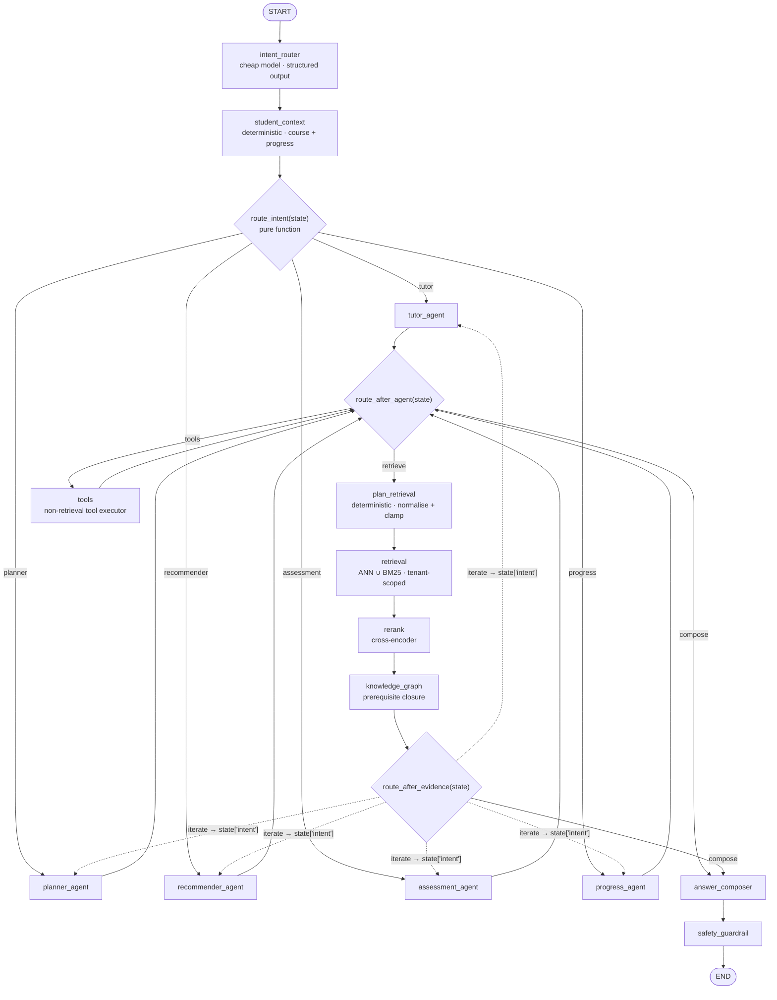
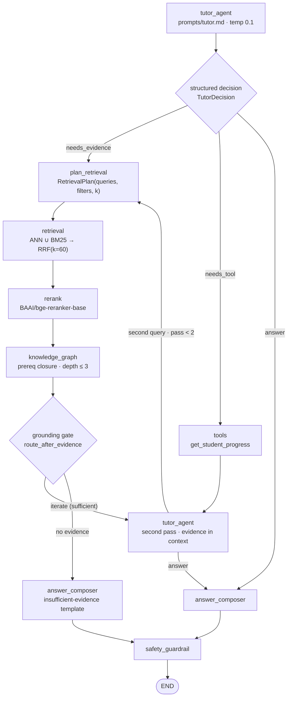

# Agent Architecture

> This document specifies the LangGraph agent layer of CourseLLM: the state contract,
> the graph topology, the contract of every node, the five agent roles, the tool
> registry and its permission matrix, and the loop, cost, persistence, failure and
> testing rules that bound the whole thing. It is the companion to
> [`system.md`](system.md) §5 (request lifecycle) and [`rag.md`](rag.md) (the retrieval
> pipeline that the retrieval nodes call). Terminology, table names and configuration
> variables are shared with those documents and are not redefined here.

---

## 1. Why LangGraph, and not a free-running agent loop

The distinction that matters is **workflow versus agent**. A workflow is a system whose
control flow is written down by engineers; an agent is a system whose control flow is
chosen by a model at runtime. CourseLLM is a **bounded graph with agentic nodes**: the
spine of the graph is fixed in code, and the model's freedom is confined to two
decisions — *which* of the routed capabilities handles this turn, and *which* tool to
call with *which* arguments. It is not an autonomous swarm, and no node can spawn
another agent.

| Property | Free-running agent loop | This graph |
|----------|-------------------------|-----------|
| Control flow | Model output determines the next action indefinitely | Fixed edges; model selects among five declared routes and a tool allowlist |
| State | Unstructured scratchpad, stringly typed | `ConversationState` TypedDict with reducers, validated at node boundaries |
| Termination | Prompt-level hope; a loop can run until the provider bill stops it | `GRAPH_MAX_STEPS`, `AGENT_MAX_TOOL_CALLS_PER_TURN`, `AGENT_TURN_DEADLINE_MS`, `recursion_limit` |
| Testability | Requires a live model to exercise any path | Every node is `(state) -> partial_state` and is tested with a fake LLM; routing is a pure function |
| Auditability | A transcript of prose | `agent_decisions` and `tool_calls` are typed, appended per node, and joined to `llm_usage` |
| Recovery | Restart from the beginning | Checkpointed per super-step; a turn resumes after a crash or a rollout |
| Human-in-the-loop | Manual interception | `interrupt()` on write tools, resumed from the checkpoint |

Concretely:

1. **Explicit typed state.** Every node declares what it reads and what it writes, and
   returns only the keys it changed. The state is a channel map with reducers
   (`add_messages` for conversation, an append reducer for evidence, a set-style
   reducer for `degraded`). A node that writes an undeclared key is a test failure, not
   a silent mutation.
2. **Conditional edges are code.** `route_intent` and `route_after_agent` are pure
   functions of state (§3). They can be unit-tested over hundreds of cases in
   milliseconds without a model call, and the routing accuracy metric is computed
   against a labelled set rather than inferred from behaviour.
3. **Deterministic control flow.** Retrieval, reranking, graph traversal, permission
   checks, budget checks, citation resolution and persistence are deterministic. The
   model never decides *whether* to enforce tenancy, *whether* to rerank, or *whether*
   a turn has exceeded its budget. Those are graph-level invariants.
4. **Loop bounds are first-class.** The retrieval sub-loop is bounded by
   `AGENT_MAX_RETRIEVAL_PASSES`; the ReAct sub-loop is bounded by
   `GRAPH_MAX_STEPS` and `AGENT_MAX_TOOL_CALLS_PER_TURN`; the whole turn is bounded
   by a wall-clock deadline. Each bound has a defined exit (§9).
5. **Checkpointing.** An `AsyncPostgresSaver` checkpoints state after every super-step,
   keyed by `thread_id = conversation_id` and namespaced by tenant. This buys three
   things a loop cannot offer: crash resume mid-turn, `interrupt()` for a human
   confirmation on a write tool, and time-travel replay of a saved thread for
   evaluation and debugging.

The trade-off is honest: a graph cannot do arbitrary multi-step tool planning, and
adding a capability means adding a node and an edge. That is the intended cost — the
capability list is small, stable, and each one is independently observable, degradable
and testable.

**Code locations.** `apps/api/src/coursellm/agents/graph.py` (topology),
`agents/state.py` (the schema in §2), `agents/routing.py` (the conditional edges),
`agents/nodes/` (one module per node), `tools/registry.py` (§7).

---

## 2. The state object

`ConversationState` is the single object that flows through the graph. Field groups are
grouped by *who writes them*, because that is what makes the read/write contract
reviewable.

```python
# apps/api/src/coursellm/agents/state.py
from __future__ import annotations

import operator
from enum import StrEnum
from typing import Annotated, Any, Literal, TypedDict
from uuid import UUID

from langchain_core.messages import AnyMessage
from langgraph.graph.message import add_messages
from pydantic import BaseModel, Field


class DegradationReason(StrEnum):
    RETRIEVAL_EMPTY = "retrieval_empty"
    LEXICAL_ONLY = "lexical_only"
    SEMANTIC_ONLY = "semantic_only"
    RERANKER_UNAVAILABLE = "reranker_unavailable"
    KNOWLEDGE_GRAPH_EMPTY = "knowledge_graph_empty"
    KNOWLEDGE_GRAPH_TIMEOUT = "knowledge_graph_timeout"
    GRAPH_LOW_CONFIDENCE_ONLY = "graph_low_confidence_only"
    LLM_FALLBACK_MODEL = "llm_fallback_model"
    LLM_UNAVAILABLE = "llm_unavailable"
    CHECKPOINT_UNAVAILABLE = "checkpoint_unavailable"
    TOOL_TIMEOUT = "tool_timeout"
    TOOL_LIMIT_REACHED = "tool_limit_reached"
    ITERATION_LIMIT_REACHED = "iteration_limit_reached"
    TOKEN_BUDGET_EXCEEDED = "token_budget_exceeded"
    DEADLINE_EXCEEDED = "deadline_exceeded"
    RECURSION_LIMIT_REACHED = "recursion_limit_reached"


Intent = Literal["tutor", "planner", "recommender", "assessment", "progress"]


def merge_unique(left: list[Any], right: list[Any]) -> list[Any]:
    """Reducer for set-like channels: append what is new, preserve first-seen order."""
    out = list(left)
    for item in right:
        if item not in out:
            out.append(item)
    return out


class RetrievedDocument(TypedDict):
    chunk_id: str
    document_id: str
    content: str
    page: int | None
    topic: str | None
    source_type: str
    semantic_rank: int | None
    lexical_rank: int | None
    graph_rank: int | None
    rrf_score: float
    rerank_score: float | None
    citation_id: str


class GraphEntity(TypedDict):
    concept_id: str
    name: str
    slug: str
    relation: str
    depth: int
    direction: Literal["prerequisite_of", "requires", "related_to", "contains"]
    weight: float
    confidence: float
    verified: bool
    path: list[str]
    provenance: dict[str, Any]  # document_id, chunk_id, page, extraction_run_id


class Citation(TypedDict):
    citation_id: str          # [S1], [S2], ...
    chunk_id: str
    document_id: str
    page: int | None
    source_type: str


class AgentDecision(TypedDict):
    node: str
    decision: str
    rationale: str
    model: str | None
    prompt_version: str | None
    latency_ms: int


class ToolCallRecord(TypedDict):
    tool: str
    arguments: dict[str, Any]
    status: Literal["ok", "error", "timeout", "denied", "unknown_tool"]
    latency_ms: int
    error: str | None


class AgentError(TypedDict):
    node: str
    error_type: str
    message: str
    retryable: bool


class TokenUsage(TypedDict):
    prompt_tokens: int
    completion_tokens: int
    total_tokens: int
    cost_usd: float
    calls: int


class RetrievalPlan(TypedDict):
    queries: list[str]
    course_id: str | None
    document_id: str | None
    topic: str | None
    page: int | None
    source_types: list[str]
    k_per_retriever: int
    rerank_top_k: int
    include_graph: bool
    graph_max_depth: int


class StudentProgress(TypedDict):
    course_id: str | None
    mastery: dict[str, float]        # concept_id -> 0..1
    attempts: dict[str, int]
    last_seen: dict[str, str]        # concept_id -> ISO-8601
    weak_concepts: list[str]
    completed_steps: list[str]


class EvaluationMetadata(TypedDict):
    retrieval_config_version: str
    prompt_versions: dict[str, str]
    models: dict[str, str]
    rerank_scores: list[float]
    graph_depth_used: int
    citation_hallucinations: int
    grounded: bool
    trace_id: str


class ConversationState(TypedDict, total=False):
    # --- identity and scope: written once by the API entrypoint, immutable after ---
    tenant_id: UUID
    user_id: UUID
    conversation_id: UUID
    request_id: UUID
    roles: frozenset[str]

    # --- task framing ---
    current_course_id: UUID | None
    current_topic: str | None
    learning_goal: str | None
    intent: Intent
    conversation_summary: str | None

    # --- conversation ---
    messages: Annotated[list[AnyMessage], add_messages]

    # --- evidence (append-only within a turn) ---
    retrieval_plan: RetrievalPlan | None
    retrieved_documents: Annotated[list[RetrievedDocument], operator.add]
    citations: Annotated[list[Citation], operator.add]
    graph_entities: Annotated[list[GraphEntity], operator.add]
    grounding: dict[str, Any]        # grounded, evidence_count, max_rerank_score

    # --- personalisation ---
    student_progress: StudentProgress

    # --- agent outputs ---
    answer_draft: dict[str, Any] | None
    recommendations: list[dict[str, Any]]
    roadmap: dict[str, Any] | None
    quiz: dict[str, Any] | None
    assessment: dict[str, Any] | None

    # --- control and observability (append-only audit channels) ---
    pending_tool_calls: list[dict[str, Any]]
    agent_decisions: Annotated[list[AgentDecision], operator.add]
    tool_calls: Annotated[list[ToolCallRecord], operator.add]
    evaluation_metadata: EvaluationMetadata
    degraded: Annotated[list[DegradationReason], merge_unique]
    errors: Annotated[list[AgentError], merge_unique]

    # --- loop counters and budgets ---
    iteration_count: int
    retrieval_pass: int
    tool_call_count: int
    token_usage: TokenUsage
    started_at_ns: int
    deadline_ns: int
```

### 2.1 Why each group exists, and what writes it

| Group | Keys | Why it exists | Written by |
|-------|------|---------------|-----------|
| Identity and scope | `tenant_id`, `user_id`, `conversation_id`, `request_id`, `roles` | Tenancy is a property of the query, not a filter applied afterwards (`system.md` principle 3). Every tool handler and repository call reads the tenant from here; no node may accept a tenant from model output. `request_id` correlates the turn across logs, spans and `llm_usage`. | `initial_state()` in the API entrypoint, from the verified JWT. Never rewritten. |
| Task framing | `current_course_id`, `current_topic`, `learning_goal`, `intent`, `conversation_summary` | The router resolves *what is being asked* once, so downstream nodes do not each re-parse the question. `conversation_summary` compresses turns older than `HISTORY_WINDOW_MESSAGES`. | `intent_router` (intent, topic, course), `student_context` (course/goal resolution and scope checks), API entrypoint (summary). |
| Conversation | `messages` | The only channel the model's chat history comes from. `add_messages` deduplicates by message id and supports edits, which matters when a human corrects a turn. | Every node that calls an LLM appends its request/response pair; `tools` appends `ToolMessage` objects. |
| Evidence | `retrieval_plan`, `retrieved_documents`, `citations`, `graph_entities`, `grounding` | Evidence is separated from prose so that grounding is a computed property of typed data, not a judgement about text. Reducers append rather than replace, so a second retrieval pass accumulates instead of discarding the first. | `plan_retrieval` (plan), `retrieval`/`rerank` (documents, ranks), `knowledge_graph` (entities), `answer_composer` (citations, grounding). |
| Personalisation | `student_progress` | Personalisation must be *read* data, not model-invented. Mastery, attempt counts and weak concepts come from `progress_events` and `quiz_attempts`. | `student_context`; refreshed by `tools` when the active agent calls `get_student_progress`; updated by `evaluate_answer` in the same turn. |
| Agent outputs | `answer_draft`, `recommendations`, `roadmap`, `quiz`, `assessment` | Each capability has a typed artifact so the API can serialise it without parsing prose, and so `answer_composer` only has to *phrase* a decision that was already made and validated. | The five agent nodes and their write tools. |
| Control and audit | `pending_tool_calls`, `agent_decisions`, `tool_calls`, `evaluation_metadata`, `degraded`, `errors` | This is the interview-defensible part: every routing choice, every tool invocation, every fallback and every error is an append-only record joined to the turn. `degraded` is the same vocabulary the UI banner and `apps/api/tests/integration/test_degradation.py` use. | All nodes. `pending_tool_calls` is the only non-append channel: agent nodes write it, `plan_retrieval` and `tools` clear it. |
| Loop counters and budgets | `iteration_count`, `retrieval_pass`, `tool_call_count`, `token_usage`, `started_at_ns`, `deadline_ns` | Bounds are data, checked by `route_after_agent` and `route_after_evidence` before any further model or tool call. `deadline_ns` is set once at entry so a slow provider cannot extend the turn. | API entrypoint (`started_at_ns`, `deadline_ns`, zeroed counters), agent nodes (`iteration_count`), `retrieval` (`retrieval_pass`), `tools`/`retrieval` (`tool_call_count`), every LLM call (`token_usage`). |

Two rules about the state:

- **Nothing secret enters the state.** No provider keys, no raw connection strings, no
  full document bodies beyond the retrieved excerpts. The state is checkpointed, and a
  checkpoint is persisted data.
- **`total=False` is deliberate.** Nodes return partial updates. The full initial state
  is constructed by one factory, `initial_state()`, which asserts the required keys and
  is the only place allowed to build a state from scratch. Rehydration (§10) calls the
  same factory.

---

## 3. The graph

### 3.1 Full topology



Exactly one agent node runs per turn. `route_after_evidence` returns a *node name*, so
the iterate edge is a dynamic target computed from `state["intent"]`; the five dashed
edges are drawn separately because Mermaid cannot express a dynamic target. The common
path is the linear reading: `tutor_agent → plan_retrieval → retrieval → rerank →
knowledge_graph → answer_composer → safety_guardrail`, with at most one iterate lap.

### 3.2 The conditional edge from the router

```python
# apps/api/src/coursellm/agents/routing.py
from typing import Literal

from coursellm.agents.state import ConversationState, Intent

_ROUTABLE: frozenset[str] = frozenset(
    {"tutor", "planner", "recommender", "assessment", "progress"}
)


class IntentClassification(BaseModel):
    intent: Intent
    confidence: float = Field(ge=0.0, le=1.0)
    course_id: UUID | None = None
    topic: str | None = Field(default=None, max_length=200)
    reason: str = Field(max_length=200)


def route_intent(state: ConversationState) -> Intent:
    """Conditional edge out of `student_context`. Pure, no I/O, no model call.

    Return values and their meaning:
      "tutor"        grounded question answering, explanation, prerequisite questions
      "planner"      build or revise a roadmap for a goal
      "recommender"  map knowledge gaps to real learning resources
      "assessment"   generate a quiz, or evaluate a submitted answer
      "progress"     summarise mastery, surface weak concepts and gaps
    """
    intent = state.get("intent")
    if intent in _ROUTABLE:
        return intent  # type: ignore[return-value]
    # Unknown, absent, or low-confidence routing defaults to the generalist, which
    # owns the refusal path (rag.md §8). A wrong answer here is recoverable; a wrong
    # write is not.
    return "tutor"
```

The router *node* calls the model once with a small structured-output schema and writes
`intent`, `current_course_id`, `current_topic` and an `agent_decisions` entry. If the
model call fails, the schema does not validate, or `confidence < INTENT_MIN_CONFIDENCE`,
the node falls back to deterministic pattern rules (the same cheap patterns described in
`rag.md` §2.3) and ultimately to `intent = "tutor"`, recording
`decision = "router_fallback"`. The edge itself never fails, because it does no I/O.

```python
def route_after_agent(state: ConversationState) -> Literal["retrieval", "tools", "compose"]:
    """Conditional edge out of every agent node. Deterministic admission control."""
    if state["iteration_count"] >= settings.GRAPH_MAX_STEPS:
        return "compose"
    if state["tool_call_count"] >= settings.AGENT_MAX_TOOL_CALLS_PER_TURN:
        return "compose"
    if _remaining_ms(state) <= 0:
        return "compose"

    pending = state.get("pending_tool_calls") or []
    if not pending:
        return "compose"

    retrieval_calls = [c for c in pending if c["name"] in RETRIEVAL_TOOLS]
    if retrieval_calls and state["retrieval_pass"] < settings.AGENT_MAX_RETRIEVAL_PASSES:
        return "retrieval"
    if pending:
        return "tools"
    return "compose"


def route_after_evidence(state: ConversationState) -> str:
    """Conditional edge out of `knowledge_graph`. Returns a node name.

    "answer_composer" is the only exit. Every other return value is an agent node,
    selected from state['intent'], reached at most GRAPH_MAX_STEPS times.
    """
    if state["evaluation_metadata"]["grounded"] and not state["pending_tool_calls"]:
        return "answer_composer"
    if state["iteration_count"] >= settings.GRAPH_MAX_STEPS:
        return "answer_composer"
    if state["retrieval_pass"] >= settings.AGENT_MAX_RETRIEVAL_PASSES:
        return "answer_composer"
    return f"{state['intent']}_agent"
```

Sufficiency in `route_after_evidence` is computed, not prompted: at least
`GROUNDING_MIN_EVIDENCE` passages above `GROUNDING_MIN_RERANK_SCORE`, or at least one
resolvable citation. An LLM judging whether its own evidence is sufficient is not a
control signal.

### 3.3 The tutor sub-path



The tutor loop has three termination conditions, all enforced before another model call:
evidence sufficient (exit to composer), `retrieval_pass >= AGENT_MAX_RETRIEVAL_PASSES`
(exit to composer with partial evidence and `degraded: ["retrieval_empty"]` if
nothing was found), or `iteration_count >= GRAPH_MAX_STEPS` (exit to composer with
`degraded: ["iteration_limit_reached"]`). The refusal path composes from typed state, so
it does not depend on a second successful model call.

### 3.4 Where writes happen

Only two nodes can cause persistent writes, and both do so through the tool registry,
never through a raw query: the `tools` node (`create_quiz`, `evaluate_answer`,
`update_learning_plan`) and `knowledge_graph` when the planner requests concept upserts
— which it does not, because graph writes belong to the ingestion worker's extraction
pipeline, not to a request path (`knowledge-graph.md` §5). The `retrieval` node is
read-only by construction; its handler receives a read-only session.

---

## 4. Node contracts

Every node is `async (state: ConversationState) -> dict[str, Any]` and returns only the
keys it writes. "LLM" means the node may call a generation model; the cross-encoder and
embedding models are not LLMs and are marked separately.

### 4.1 Read/write contract

| Node | Reads | Writes | LLM | Tools |
|------|-------|--------|-----|-------|
| `intent_router` | `messages`, `roles`, `conversation_summary` | `intent`, `current_course_id`, `current_topic`, `agent_decisions` | yes (small model, temp 0) | no |
| `student_context` | `tenant_id`, `user_id`, `current_course_id`, `learning_goal`, `intent` | `student_progress`, `current_course_id`, `conversation_summary`, `evaluation_metadata` | no | no (direct repository read) |
| `tutor_agent` | `messages`, `retrieved_documents`, `graph_entities`, `student_progress`, `current_topic`, `iteration_count` | `pending_tool_calls`, `answer_draft`, `agent_decisions`, `iteration_count`, `messages` | yes | declares calls; executes none |
| `planner_agent` | `messages`, `current_course_id`, `learning_goal`, `graph_entities`, `student_progress`, `roadmap` | `pending_tool_calls`, `roadmap`, `agent_decisions`, `iteration_count`, `messages` | yes | declares calls; executes none |
| `recommender_agent` | `messages`, `student_progress`, `graph_entities`, `current_course_id` | `pending_tool_calls`, `recommendations`, `agent_decisions`, `iteration_count`, `messages` | yes | declares calls; executes none |
| `assessment_agent` | `messages`, `current_topic`, `student_progress`, `retrieved_documents`, `graph_entities` | `pending_tool_calls`, `quiz`, `assessment`, `agent_decisions`, `iteration_count`, `messages` | yes | declares calls; executes none |
| `progress_agent` | `student_progress`, `current_course_id`, `graph_entities`, `messages` | `pending_tool_calls`, `agent_decisions`, `iteration_count`, `messages` | yes | declares calls; executes none |
| `plan_retrieval` | `pending_tool_calls`, `tenant_id`, `user_id`, `current_course_id`, `roles` | `retrieval_plan`, `pending_tool_calls`, `agent_decisions` | no | no |
| `retrieval` | `retrieval_plan`, `tenant_id`, `user_id` | `retrieved_documents`, `citations`, `retrieval_pass`, `tool_call_count`, `tool_calls`, `degraded` | no (embedding model only) | `search_documents`, `search_course`, `search_books`, `search_web_sources` |
| `rerank` | `retrieved_documents`, `retrieval_plan` | `retrieved_documents` (scores, order), `evaluation_metadata.rerank_scores`, `degraded` | no (cross-encoder) | no |
| `knowledge_graph` | `retrieval_plan`, `graph_entities` (to extend), `tenant_id` | `graph_entities`, `evaluation_metadata.graph_depth_used`, `tool_call_count`, `tool_calls`, `degraded` | no | `search_knowledge_graph` |
| `tools` | `pending_tool_calls`, `tenant_id`, `user_id`, `student_progress` | `tool_calls`, `tool_call_count`, `student_progress`, `recommendations`, `roadmap`, `quiz`, `assessment`, `errors`, `messages` | no (tools may call models internally) | `get_student_progress`, `create_quiz`, `evaluate_answer`, `update_learning_plan`, `get_recommendations` |
| `answer_composer` | `answer_draft`, `retrieved_documents`, `graph_entities`, `recommendations`, `roadmap`, `quiz`, `student_progress`, `intent` | `messages`, `citations`, `grounding`, `evaluation_metadata`, `answer_draft`, `token_usage` | yes | no |
| `safety_guardrail` | `messages` (last), `citations`, `retrieved_documents` | `answer_draft`, `errors`, `evaluation_metadata` | no | no |

Two contract notes:

- **Agent nodes do not execute tools.** They emit `pending_tool_calls`. Execution is a
  separate node so that permission checks, timeouts, retries and audit records happen
  in exactly one place.
- **`retrieval` and `rerank` are separate nodes even though the tool
  `search_documents` performs both.** The tool handler is the composition
  `rerank_passages(rrf(hybrid_search(...)))`; the graph decomposes it so that the
  retrieval half and the reranking half get independent spans, budgets and fallbacks.
  One implementation, two observation points.

### 4.2 Failure behaviour and latency budget

Budgets are **design targets**, not measurements. Achieved values are produced by the
per-node OpenTelemetry spans described in
[`observability.md`](observability.md) and published in [`evals/reports/`](../../evals/README.md).

| Node | Failure behaviour | Latency budget (P95) |
|------|-------------------|----------------------|
| `intent_router` | Structured output invalid → one retry; then deterministic pattern rules; then `intent = "tutor"`. Never fails the turn. | 500 ms |
| `student_context` | DB error or timeout → empty `student_progress`, `degraded: ["progress_unavailable"]`; answer proceeds unpersonalised. | 60 ms |
| `tutor_agent` | LLM error → LiteLLM fallback model; if both fail, `answer_draft = None` and the composer uses the extractive fallback. | 2000 ms per pass |
| `planner_agent` | LLM error → fall back to metadata ordering of the course (no graph), `degraded: ["knowledge_graph_empty"]` or `["llm_unavailable"]`. | 2000 ms |
| `recommender_agent` | LLM error → return catalogue ranking from `get_recommendations` without narrative. | 2000 ms |
| `assessment_agent` | LLM error → do not fabricate items; return a typed error and offer a retry. Quizzes are not degraded into prose. | 2000 ms |
| `progress_agent` | LLM error → deterministic summary computed from `student_progress`. | 2000 ms |
| `plan_retrieval` | Invalid or out-of-scope filters → dropped and logged; `k` clamped to `RETRIEVAL_TOP_K_PER_RETRIEVER`; empty plan → empty evidence, not an error. | 20 ms |
| `retrieval` | One retriever fails → single-retriever mode with `degraded: ["semantic_only"]` or `["lexical_only"]`; both fail → `retrieved_documents = []`, `degraded: ["retrieval_empty"]`. | 400 ms |
| `rerank` | Model unavailable, error, or `RERANK_TIMEOUT_MS` exceeded → keep RRF order, `degraded: ["reranker_unavailable"]`. | 900 ms (hard timeout 5000 ms) |
| `knowledge_graph` | Query timeout or empty result → `graph_entities = []`; `degraded: ["knowledge_graph_timeout"]` or `["knowledge_graph_empty"]`; retrieval result unaffected. | 150 ms |
| `tools` | Per-tool timeout / error / permission denial → record the failure, mark `degraded`, continue with the remaining calls; never retry a write more than `AGENT_TOOL_MAX_RETRIES` times. | per-tool budget (§7) |
| `answer_composer` | All generation models unavailable → extractive composition from `retrieved_documents` with citations, `degraded: ["llm_unavailable"]`. | first token 700 ms, full 5000 ms |
| `safety_guardrail` | Detector error → fail closed on instruction-region content, pass evidence-only output, `degraded: ["safety_guardrail_error"]`. | 80 ms |

The longest budgeted path is
`500 + 60 + 2000 + 20 + 400 + 900 + 150 + 2000 + 5000 + 80 ≈ 11.1 s`, inside
`AGENT_TURN_DEADLINE_MS`. That is an arithmetic consequence of the budgets, not a
measured result.

---

## 5. Agent roles

Five roles share one execution machinery: a system prompt from `prompts/`, a bound
subset of the tool registry, and a Pydantic output schema. A role is a *configuration*;
the graph node that runs it is the same shape for all five. That keeps the blast radius
of a role change to one prompt file and one allowlist entry.

### 5.1 Tutor Agent

**Responsibilities.** Answer course questions grounded in the student's own material,
with inline citations; decide whether evidence is needed and, if so, which retrieval
tool and arguments; answer prerequisite questions using graph closure rather than a
similarity guess; adjust depth to the student's measured mastery; refuse when evidence
is absent (`rag.md` §8).

**Non-responsibilities.** Does not build or modify roadmaps or `roadmap_steps`. Does not
create quizzes or grade anything. Does not curate or rank resources — the
recommendation path is a routed capability, not a tutor side effect. Does not write
documents, concepts, or edges. Does not answer from parametric memory; a question with
no evidence produces the insufficient-evidence response, not an ungrounded answer.

**May call:** `search_documents`, `search_course`, `search_knowledge_graph`,
`search_books`, `get_student_progress`, and `search_web_sources` only when
`AGENT_WEB_SEARCH_ENABLED` is true and the turn is marked
`evidence_insufficient` so the fallback is explicit.

**May not call:** `create_quiz`, `evaluate_answer`, `update_learning_plan`,
`get_recommendations`.

### 5.2 Learning Planner Agent

**Responsibilities.** Turn a goal concept and a course into an ordered
`roadmap` + `roadmap_steps`. The ordering is computed, not narrated: prerequisite
closure from the graph, filtered by the student's existing mastery, then a topological
sort with deterministic tie-breaking (`knowledge-graph.md` §8). Store the estimated
effort per step from course metadata. Revise the plan when progress events invalidate
it, preserving completed steps and recording the revision number and reason.

**Non-responsibilities.** Does not grade, does not generate quiz items, does not
recommend external resources (it names concepts; the recommender names resources), does
not invent concepts that are absent from the graph and the course, does not delete
completed steps.

**May call:** `search_knowledge_graph`, `search_course`, `get_student_progress`,
`update_learning_plan`.

**May not call:** `search_documents`, `search_books`, `search_web_sources`,
`create_quiz`, `evaluate_answer`, `get_recommendations`.

### 5.3 Recommendation Agent

**Responsibilities.** Map identified knowledge gaps to entries in the `resources`
catalogue, rank them by coverage, difficulty fit and freshness, and explain each match
in terms of the gap it closes. Use graph neighbours to widen the candidate concept set
before querying the catalogue.

**Non-responsibilities.** Does not invent resources, URLs, or courses; every returned
item is a `resources` row with provenance. Does not generate or modify graph edges. Does
not update the roadmap. Does not fetch arbitrary pages — `search_web_sources` is limited
to allowlisted domains and is off by default.

**May call:** `get_recommendations`, `search_knowledge_graph`, `get_student_progress`,
`search_web_sources` (when `AGENT_ALLOW_EXTERNAL_TOOLS` is true).

**May not call:** `search_documents`, `search_course`, `search_books`, `create_quiz`,
`evaluate_answer`, `update_learning_plan`.

### 5.4 Assessment Agent

**Responsibilities.** Generate quiz items grounded in retrieved passages and aligned to
graph concepts, with per-item citations; evaluate a submitted free-text or
multiple-choice answer against a rubric; emit a `progress_event` with the mastery delta
and misconception tags so the planner and progress views see the result without the
assessment agent writing a plan itself.

**Non-responsibilities.** Does not write or revise roadmaps. Does not modify verified
graph edges. Does not grade beyond the declared rubric (no holistic "vibe" score), and
does not change a previously recorded grade — a regrade is a new event with a reason.

**May call:** `create_quiz`, `evaluate_answer`, `search_documents`, `search_course`,
`search_knowledge_graph`, `get_student_progress`.

**May not call:** `update_learning_plan`, `get_recommendations`, `search_web_sources`,
`search_books`.

### 5.5 Progress Agent

**Responsibilities.** Summarise mastery and activity from `progress_events` and
`quiz_attempts`; identify knowledge gaps by joining prerequisite closure with the
absence of evidence (`knowledge-graph.md` §4.4); surface weak concepts, stale concepts
and the next best action. This is the read-side complement to the planner's write-side.

**Non-responsibilities.** Does not write progress events (those come from assessment),
does not alter grades, does not create or update the roadmap, does not create quizzes.

**May call:** `get_student_progress`, `search_knowledge_graph`, `search_course`.

**May not call:** `search_documents`, `search_books`, `search_web_sources`,
`create_quiz`, `evaluate_answer`, `update_learning_plan`, `get_recommendations`.

---

## 6. Agents decide, tools execute

**The rule.** Deterministic business logic never lives inside a prompt. The LLM chooses
*which* tool to call and *what arguments* to pass. The tool does the work: SQL, BM25,
vector arithmetic, graph traversal, scoring, persistence. If a behaviour must be
correct, repeatable, or auditable, it is Python behind a typed tool — never an
instruction the model is asked to follow.

Worked example — *"I keep failing the attention question. What do I need before
Transformers?"*, routed to `tutor`:

```mermaid
sequenceDiagram
    autonumber
    participant TA as tutor_agent (LLM)
    participant PR as plan_retrieval
    participant SD as search_documents (tool)
    participant DB as PostgreSQL + pgvector
    participant KG as search_knowledge_graph (tool)

    TA->>TA: structured decision
    Note over TA: ToolCall(name="search_documents",<br/>arguments={"query": "prerequisites of Transformers",<br/>"course_id": "...", "k": 20})
    TA->>PR: pending_tool_calls
    PR->>PR: validate scope, resolve course_id from tenant, clamp k, build RetrievalPlan
    PR->>SD: plan
    SD->>DB: ANN cosine (tenant-scoped, HNSW) ‖ BM25 (tenant-scoped)
    DB-->>SD: two ranked lists, 20 each
    SD->>SD: RRF(k=60) → rerank top-20 with BAAI/bge-reranker-base
    SD-->>PR: list[RetrievedDocument] (typed: chunk_id, ranks, scores, citation_id)
    PR->>KG: concept "Transformers" → prerequisite closure, depth ≤ 3
    KG-->>PR: list[GraphEntity] with relation, depth, confidence, provenance
    PR-->>TA: evidence in state
    TA->>TA: compose decision (cites [S1], [S2]; names missing prerequisites)
```

The same turn, stated as data flow:

1. **The model decides.** `tutor_agent` returns a `ToolCall` with `name="search_documents"`
   and a JSON argument object — nothing else. It does not write SQL, does not choose an
   index, does not compute a score, and cannot name a tenant.
2. **Deterministic code validates.** `plan_retrieval` checks that the requested
   `course_id` belongs to `state["tenant_id"]`, drops unknown filters, clamps `k` to
   `RETRIEVAL_TOP_K_PER_RETRIEVER`, and writes a `RetrievalPlan`.
3. **The tool does the work.** `search_documents` runs the `rag.md` pipeline: tenant
   predicates inside both scans, RRF fusion, cross-encoder reranking, citation ids.
4. **The tool returns typed data.** A `list[RetrievedDocument]`, not prose. Ranks and
   scores are preserved for explainability and evaluation.
5. **The graph fills the structural gap.** `search_knowledge_graph` returns the
   prerequisite closure with `relation`, `depth`, `confidence` and provenance — the
   transitive reasoning that vector similarity structurally cannot do
   (`knowledge-graph.md` §1).
6. **The model phrases.** `answer_composer` receives typed evidence and a typed
   decision and produces prose with citations. It never decides what is true.

Anti-patterns this rule forbids, all of which existed in the prototype:

| Anti-pattern | Why it fails | Where it lives instead |
|--------------|--------------|------------------------|
| "Compute the prerequisite order in the prompt" | Non-deterministic, untestable, may produce a cycle | `KnowledgeGraphRepository.plan_roadmap()` — topological sort in Python |
| "Write the SQL you need" | Injection surface, no tenancy guarantee, no plan stability | Repository methods with bound parameters and mandatory `tenant_id` |
| "Decide whether the answer is grounded" | The model grades itself; the failure mode is exactly the one being checked | `route_after_evidence` — evidence count and rerank score thresholds |
| "Filter by what the user is allowed to see" | A model cannot know the ACL | Permission check in the tool registry, before the handler runs |
| "Normalise the score in the prompt" | Arithmetic in prose is approximate and unrepeatable | `rrf()` and the cross-encoder, in Python |

---

## 7. Tool registry

### 7.1 The tool contract

Every tool is a `ToolSpec` with a Pydantic-generated argument schema, a declared
permission set, a declared side-effect class, a timeout, and an async handler. The
schema is generated from the handler's `Args` model, so the JSON schema the model sees
and the model the handler validates against cannot drift.

```python
# apps/api/src/coursellm/tools/registry.py
from dataclasses import dataclass
from enum import StrEnum
from typing import Awaitable, Callable, Literal

from pydantic import BaseModel


class Permission(StrEnum):
    DOCUMENTS_READ = "documents:read"
    COURSES_READ = "courses:read"
    GRAPH_READ = "graph:read"
    PROGRESS_READ = "progress:read"
    PROGRESS_WRITE = "progress:write"
    QUIZ_WRITE = "quiz:write"
    PLAN_WRITE = "plan:write"
    RESOURCES_READ = "resources:read"
    WEB_READ = "web:read"
    # Declared so the denial is explicit, granted to no agent:
    EMAIL_SEND = "email:send"
    DOCUMENTS_WRITE = "documents:write"
    SQL_EXECUTE = "sql:execute"


SideEffects = Literal["none", "read", "write", "external"]


@dataclass(frozen=True, slots=True)
class ToolSpec:
    name: str
    description: str
    parameters: type[BaseModel]          # -> JSON schema via model_json_schema()
    required_permissions: frozenset[Permission]
    side_effects: SideEffects
    timeout_ms: int
    handler: Callable[..., Awaitable[object]]


def tool(*, name, description, parameters, required_permissions, side_effects, timeout_ms):
    """Register a tool. Duplicate names and unregistered permissions raise at import."""
    def decorate(handler):
        spec = ToolSpec(name, description, parameters, frozenset(required_permissions),
                        side_effects, timeout_ms, handler)
        registry.register(spec)
        return handler
    return decorate
```

Enforcement points, in order:

1. **Registry membership.** A name that is not registered cannot be executed: the
   executor raises `UnknownToolError` and records
   `tool_calls[].status = "unknown_tool"`. A tool that does not exist cannot be called
   even if a model emits its name.
2. **Permission check.** The agent's granted permission set is the union of its
   allowlist; a call whose `required_permissions` are not a subset of the grant is
   rejected with `ToolPermissionError` *before* the handler is entered, so no query runs.
3. **Argument validation.** `parameters.model_validate(arguments)` — extra keys
   forbidden, identifiers type-checked.
4. **Scope injection.** `tenant_id` and `user_id` are injected from
   `state`, never from arguments. Any tool argument that names a tenant or user is
   rejected as an unknown field by the schema.
5. **Execution.** `asyncio.wait_for(handler(...), timeout_ms / 1000)`, one retry for
   `side_effects in {"none", "read"}` when the error is retryable, zero retries for
   `"write"` and `"external"` unless the handler is idempotent by key.
6. **Audit.** A `ToolCallRecord` is appended for every attempt: tool, redacted
   arguments, status, latency, error.

`side_effects` is not documentation, it is policy: `"external"` tools require
`AGENT_ALLOW_EXTERNAL_TOOLS=true` and are off by default; `"write"` tools are wrapped by
a `interrupt()` when `AGENT_REQUIRE_WRITE_CONFIRMATION` is enabled for the deployment.

Consequential writes follow the proposal/execution split in
[`security.md`](security.md) §5: an `update_learning_plan` revision that discards
completed steps, or any future bulk operation, is returned to the client as a typed
`ProposedAction` (`action`, `target`, `rationale`, `preview`) and executed only after an
explicit user confirmation re-validates it against the permission matrix and the current
`TenantContext`. Additive revisions that preserve completed steps execute directly. The
model never holds an execution capability for a consequential action.

### 7.2 The tool set

| Tool | Purpose | Key arguments | Returns | Permissions | Side effects | Timeout |
|------|---------|---------------|---------|-------------|--------------|---------|
| `search_documents` | Grounded evidence from the tenant's own documents | `query`, `course_id?`, `document_id?`, `topic?`, `page?`, `source_types?`, `k` | `list[RetrievedDocument]` — RRF-fused and reranked | `documents:read` | none | 7000 ms |
| `search_course` | Course structure: modules, lectures, topics, concepts | `course_id`, `query?`, `module?`, `limit` | `CourseOutline` with module/lecture/topic nodes and concept ids | `courses:read` | none | 3000 ms |
| `search_knowledge_graph` | Prerequisite closure, related concepts, gap detection | `concept_id?` or `concept_name?`, `relation?`, `direction`, `max_depth`, `min_confidence` | `list[GraphEntity]` with `depth`, `path`, `confidence`, `verified`, provenance | `graph:read` | none | 3000 ms |
| `search_books` | Evidence restricted to `source_type = "book"` (textbook chapters) | `query`, `course_id?`, `k` | `list[RetrievedDocument]` (same pipeline, source filter applied) | `documents:read` | none | 7000 ms |
| `search_web_sources` | Allowlisted external sources when the corpus is insufficient | `query`, `allowlist_domains?`, `k` | `list[WebSource]` — url, title, snippet, retrieved_at | `web:read` | external | 8000 ms |
| `get_student_progress` | Mastery, attempts, last-seen, weak concepts | `course_id?`, `concept_ids?` | `StudentProgress` | `progress:read` | none | 2000 ms |
| `create_quiz` | Persist a quiz draft aligned to concepts | `course_id`, `concept_ids`, `n_items`, `difficulty`, `item_types` | `QuizDraft` with item ids, citations, rubric | `quiz:write`, `documents:read` | write | 15000 ms |
| `evaluate_answer` | Score a submitted answer and record progress | `quiz_attempt_id`, `item_id`, `answer` | `AssessmentResult` — score, rubric breakdown, misconception tags, mastery delta | `quiz:write`, `progress:write` | write | 12000 ms |
| `update_learning_plan` | Persist a roadmap revision | `course_id`, `goal_concept_id`, `steps`, `reason`, `idempotency_key` | `RoadmapPlan` with revision number and step ids | `plan:write`, `graph:read` | write | 5000 ms |
| `get_recommendations` | Rank catalogue resources against knowledge gaps | `course_id`, `concept_ids`, `limit`, `difficulty_max?` | `list[Recommendation]` — resource, coverage, match reasons, provenance | `resources:read` | none | 4000 ms |

Per-tool notes that are not visible in the table:

- `search_documents` is the composition `rerank_passages(rrf(hybrid_search(...)))` and
  shares its implementation with the `retrieval` and `rerank` graph nodes. Its timeout
  is `RETRIEVAL` + `RERANK_TIMEOUT_MS` plus margin; when the reranker times out the tool
  still returns RRF-ordered results rather than failing.
- `search_knowledge_graph` never traverses `related_to` edges for a closure and never
  returns edges below `GRAPH_MIN_TRAVERSABLE_CONFIDENCE` unless the caller is the review
  UI, which requires the `graph:review` permission no agent holds.
- `search_web_sources` returns candidates only; it does not fetch full page bodies into
  the context window, and its output is delimitated as untrusted content
  (`system.md` principle 7).
- `create_quiz` and `evaluate_answer` call an LLM inside the handler. That is a tool
  implementation detail: it is billed to `llm_usage`, versioned by prompt version, and
  is not agent reasoning. The agent cannot see or influence the handler's internal
  prompts.
- `update_learning_plan` is idempotent by **content**: re-planning a goal whose
  deterministic plan is byte-for-byte the current revision returns the current
  roadmap instead of writing a new one. There is no `idempotency_key` column; the
  `(goal, plan content)` pair is the key. See
  `services/roadmap.py::create_or_reuse`.
- `get_recommendations` reads the curated `resources` catalogue only. When
  `search_web_sources` is enabled but makes no outbound call, it returns the result
  with `degraded: ["outbound_fetch_deferred"]`.

There is no MCP server. Selected read-only tools were intended to be exposed through an
MCP surface, but the directory is empty and the README no longer claims it; when it is
built, write and external tools must stay off that surface so a misconfigured client
cannot reach them.

---

## 8. Agent permission matrix

✓ = the agent may call the tool; ✗ = the call is rejected by the registry before the
handler runs, and recorded as `status = "denied"`.

| Agent | `search_documents` | `search_course` | `search_knowledge_graph` | `search_books` | `search_web_sources` | `get_student_progress` | `create_quiz` | `evaluate_answer` | `update_learning_plan` | `get_recommendations` | `send_email` | `delete_document` | `run_sql` |
|-------|:--:|:--:|:--:|:--:|:--:|:--:|:--:|:--:|:--:|:--:|:--:|:--:|:--:|
| Tutor | ✓ | ✓ | ✓ | ✓ | ✓* | ✓ | ✗ | ✗ | ✗ | ✗ | ✗ | ✗ | ✗ |
| Learning Planner | ✗ | ✓ | ✓ | ✗ | ✗ | ✓ | ✗ | ✗ | ✓ | ✗ | ✗ | ✗ | ✗ |
| Recommendation | ✗ | ✗ | ✓ | ✗ | ✓* | ✓ | ✗ | ✗ | ✗ | ✓ | ✗ | ✗ | ✗ |
| Assessment | ✓ | ✓ | ✓ | ✗ | ✗ | ✓ | ✓ | ✓ | ✗ | ✗ | ✗ | ✗ | ✗ |
| Progress | ✗ | ✓ | ✓ | ✗ | ✗ | ✓ | ✗ | ✗ | ✗ | ✗ | ✗ | ✗ | ✗ |

\* Only when `AGENT_WEB_SEARCH_ENABLED=true`; the default is `false`.

### 8.1 Denied to every agent

These three capabilities are *declared* in the `Permission` enum and *unregistered* in
the tool registry. Leaving them declared makes the denial explicit and testable;
leaving them unregistered means no schema exists to bind, so a model that emits the name
in a tool-call payload gets `UnknownToolError` rather than an opportunity to be
persuaded.

| Capability | Declared permission | Side effects | Why no agent has it | Safe alternative |
|------------|--------------------|--------------|--------------------|------------------|
| `send_email` | `email:send` | external | Outbound email is a consequential, irreversible action with a recipient outside the system. The prototype had IMAP/SMTP tooling; it is not exposed in the rebuild. Prompt injection in a PDF or a web result must not be able to reach a network side effect. | Product notifications are sent by the API on explicit user action, through the notification service, with the user authenticated. |
| `delete_document` | `documents:write` | write | Destructive and cascading (chunks, embeddings, edges, citations). An autonomous delete is the textbook excessive-agency failure. | `DELETE /api/v1/documents/{id}` on the user-authenticated API, which cascades and writes an audit row. |
| `run_sql` | `sql:execute` | write | Arbitrary SQL defeats tenancy (RLS is per-session, not per-statement), breaks the read/write split, and is an injection amplifier. | Repository methods with bound parameters, mandatory `tenant_id`, and RLS. Read-only aggregate questions are answered by named tools. |

Additional denials that matter as much as the three above, expressed as an allowlist
rather than a denylist: no agent has `documents:write`, `graph:write`, `sql:execute` or
`email:send`; no agent can grant itself a permission, register a tool, or spawn another
agent. The tool registry is static at import time, so the agent's capability set is a
property of the deployed image, not of the conversation.

---

## 9. Loop, cost and recursion control

| Variable | Default | Meaning | On breach |
|----------|---------|---------|-----------|
| `GRAPH_MAX_STEPS` | `8` | Maximum agent-node executions per turn. | `route_after_agent` returns `"compose"`; `degraded: ["iteration_limit_reached"]`. |
| `AGENT_MAX_RETRIEVAL_PASSES` | `2` | Maximum retrieval+rerank+graph laps per turn. | Further retrieval tool calls are routed to `tools`, which answers them from the cached evidence already in state. |
| `AGENT_MAX_TOOL_CALLS_PER_TURN` | `6` | Total tool invocations per turn, all nodes. | Remaining pending calls are dropped with `tool_calls[].status = "error"`; `degraded: ["tool_limit_reached"]`. |
| `AGENT_MAX_TOKENS_PER_TURN` | `24000` | Prompt + completion tokens across all model calls in the turn, computed from `llm_usage`. | No further model call is made; `answer_composer` uses the extractive fallback; `degraded: ["token_budget_exceeded"]`. |
| `AGENT_MAX_COST_USD_PER_TURN` | `0.25` | Computed cost ceiling, from `llm_usage` rates. | Same as the token ceiling; the turn completes extractively and the tenant budget alert fires. |
| `AGENT_TURN_DEADLINE_MS` | `30000` | Wall-clock deadline, set at entry as `deadline_ns`. | Checked before every model and tool call; on expiry the graph jumps to `answer_composer` with current evidence and `degraded: ["deadline_exceeded"]`. |
| `AGENT_TOOL_MAX_RETRIES` | `1` | Retries for `none`/`read` tools with retryable errors. | Failure recorded; remaining calls continue. |
| `GRAPH_RECURSION_LIMIT` | `2 * GRAPH_MAX_STEPS + 8` | LangGraph super-step ceiling passed to `ainvoke`. | LangGraph raises `GraphRecursionError`; caught by the service, which persists the partial turn and returns `degraded: ["recursion_limit_reached"]`. |
| `AGENT_MAX_SUBAGENT_DEPTH` | `1` | Structural: an agent cannot create an agent. | Not reachable — no spawn tool exists. Stated so the bound is explicit. |

Three properties of this design:

- **Bounds are checked before spending, not after.** `route_after_agent` and
  `route_after_evidence` are the only gates; they run before any further model or tool
  call, so a breach costs nothing more.
- **Every breach still produces an answer or an explicit refusal.** The exit is always
  `answer_composer`, which composes from whatever evidence exists, or refuses when none
  does. A bounded turn never ends in a blank screen (`system.md` principle 4).
- **The bounds are testable without a provider.** A fake LLM that always requests
  another tool call drives the graph into every limit, and the assertions are on
  `degraded` and `iteration_count` — see §12.

Cost accounting is per call, not per turn: every model invocation inside a node and
inside a tool handler writes an `llm_usage` row with provider, model, tokens, latency
and computed cost, joined to the turn by `request_id`. `/api/v1/evaluation/cost` reports
per-tenant and per-request aggregates.

---

## 10. State persistence

**The relational tables are the system of record. The checkpointer is not.**

Conversation turns are persisted to `conversations` and `messages` in the same
transaction that records `llm_usage` and the trace id. The LangGraph
`AsyncPostgresSaver` writes to its own `langgraph` schema (`checkpoints`,
`checkpoint_writes`, `checkpoint_blobs`) for a different purpose: resuming an in-flight
turn.

| Concern | Relational tables | Checkpointer |
|---------|-------------------|--------------|
| Purpose | The durable record of what was said, decided and cited | Resume, `interrupt()`, time-travel replay within a thread |
| Queryability | Joins with `documents`, `concepts`, `quiz_attempts`, `progress_events`, `eval_samples` | Opaque serialised blobs; the library's internal format |
| Selective deletion | Delete a conversation, or redact one message, with SQL | A blob must be rewritten or dropped wholesale |
| Tenancy | `tenant_id` on the row with RLS | Thread-level naming; the payload is a serialised object graph |
| Stability | Migration-controlled schema | Follows the LangGraph version, so it is not a product interface |
| Retention | Ordinary retention jobs | Disposable once the turn is terminal and persisted |

Why this split is worth the small duplication:

1. **Product queries need rows.** Conversation list, transcript pagination, "show my
   past quizzes", progress joins and per-tenant cost all read `messages` and
   `llm_usage`. Parsing serialised graph state for a transcript would couple the UI to a
   library's blob format.
2. **Deletion and retention are legal requirements, not features.** A tenant or user
   deletion must cascade deterministically. Row-level deletion and redaction are only
   expressible if the content is in rows.
3. **Evaluation replay needs a stable input.** `evals/` replays saved turns by
   `request_id`; a stable, queryable transcript joined to `evaluation_metadata` is what
   makes a regression attributable to a prompt version, a model, or a retrieval config
   version.
4. **A rollout must not strand state.** A LangGraph upgrade can invalidate old
   checkpoints; a conversation must survive that, because it is a user's data.

### 10.1 Persisted shape per turn

| Table | Row written |
|-------|-------------|
| `conversations` | Upsert: `id`, `tenant_id`, `user_id`, `course_id`, `updated_at`, `summary` |
| `messages` | One row per user and assistant message: `tenant_id`, `conversation_id`, `role`, `content`, `citations` (jsonb), `intent`, `model`, `prompt_version`, `prompt_tokens`, `completion_tokens`, `latency_ms`, `trace_id`, `created_at` |
| `llm_usage` | One row per model call, including calls made inside tool handlers |
| `progress_events` | One row per `evaluate_answer` outcome |
| `quiz_attempts`, `roadmaps`, `roadmap_steps` | Written by their tools when the relevant intent ran |

The full `ConversationState` is never stored as a blob in a product table: only the
typed artifacts, the citations, the decisions and the counters.

### 10.2 Rehydration path

```python
# apps/api/src/coursellm/services/chat_service.py
async def rehydrate(conversation_id: UUID, ctx: TenantContext) -> ConversationState:
    conversation = await conversations.get(tenant_id=ctx.tenant_id, id=conversation_id)
    history = await messages.recent(conversation_id, limit=settings.HISTORY_WINDOW_MESSAGES)
    progress = await progress_service.project(user_id=ctx.user_id, course_id=conversation.course_id)
    return initial_state(
        tenant_id=ctx.tenant_id,
        user_id=ctx.user_id,
        conversation_id=conversation_id,
        request_id=uuid4(),
        roles=ctx.roles,
        messages=to_langchain_messages(history),
        conversation_summary=conversation.summary,
        student_progress=progress,
        current_course_id=conversation.course_id,
        learning_goal=conversation.learning_goal,
        deadline_ns=time.monotonic_ns() + settings.AGENT_TURN_DEADLINE_MS * 1_000_000,
    )
```

Steps, in order:

1. Resolve `TenantContext` from the verified token. The client never supplies
   `tenant_id`.
2. Load the `conversations` row; a miss or a tenant mismatch is a 404, never a
   cross-tenant read.
3. Load the most recent `HISTORY_WINDOW_MESSAGES` messages in ascending order, with
   citations. Older context is represented by `conversation_summary`, produced offline
   when a conversation crosses `SUMMARY_TRIGGER_MESSAGES` and stored on
   `conversations.summary`, so the hot path never pays for summarisation.
4. Project `progress_events` and `quiz_attempts` into `StudentProgress` (a read
   projection; the events remain the source of truth).
5. Build the state with `initial_state()`: per-turn channels (evidence, decisions, tool
   calls, answers) empty, counters zeroed, deadline set.
6. Invoke the graph with `config={"configurable": {"thread_id": str(conversation_id),
   "checkpoint_ns": str(tenant_id)}, "recursion_limit": settings.GRAPH_RECURSION_LIMIT}`.
   The tenant in `checkpoint_ns` prevents two tenants that happen to share a
   conversation id from reading each other's checkpoints.
7. After `safety_guardrail`, persist the turn and the usage in one transaction, then
   stream the answer. A failed checkpoint write does not fail the turn: the turn is
   durable via the relational write, and `degraded: ["checkpoint_unavailable"]` is
   recorded so resume-after-crash is known to be unavailable for that turn.

---

## 11. Failure handling per node

| Failure | Detection | Fallback | User-visible effect |
|---------|-----------|----------|---------------------|
| `intent_router` model error | LiteLLM exception | One retry on the fallback model, then deterministic pattern rules, then `tutor` | None; routing quality may drop, recorded in `agent_decisions` |
| `intent_router` schema invalid | Pydantic `ValidationError` after retry | Pattern rules | None |
| `student_context` DB timeout | Statement timeout | Empty progress, `degraded: ["progress_unavailable"]` | Answer is correct but not personalised; banner notes progress unavailable |
| `plan_retrieval` invalid filter | Scope check fails | Filter dropped, decision logged | None; the dropped filter narrows or widens results only |
| `retrieval` semantic path fails | pgvector/DB error | Lexical-only retrieval, `degraded: ["lexical_only"]` | Grounded answer, labelled "lexical only" |
| `retrieval` lexical path fails | SQL error | Semantic-only retrieval, `degraded: ["semantic_only"]` | Grounded answer |
| `retrieval` both paths fail | Both error | `retrieved_documents = []`, `degraded: ["retrieval_empty"]` | Refusal: "I could not find this in your materials" |
| `rerank` unavailable or slow | Exception or `RERANK_TIMEOUT_MS` | RRF order retained, `degraded: ["reranker_unavailable"]` | Slightly lower precision; sources still listed |
| `knowledge_graph` empty | Zero rows for the concept | Roadmap falls back to course metadata ordering (planner) or graph augmentation is skipped (tutor), `degraded: ["knowledge_graph_empty"]` | Notice that prerequisites are low-confidence |
| `knowledge_graph` timeout | `GRAPH_STATEMENT_TIMEOUT_MS` | Skip graph evidence, keep vector/BM25 evidence | None for a factual question; prerequisite questions answer from documents only |
| `knowledge_graph` low-confidence only | All edges below `GRAPH_MIN_TRAVERSABLE_CONFIDENCE` | Treat as empty for answers; still visible in the review UI | Same as empty graph |
| Agent node LLM error | LiteLLM exception | Fallback model; then extractive composition; `degraded: ["llm_unavailable"]` | Sources with a "generation unavailable" banner |
| Tool timeout | `asyncio.wait_for` | Retry once for read-only tools; record and continue | Partial result; the affected section is omitted |
| Tool permission denied | Registry check | Call rejected before the handler, `status = "denied"` | None; the agent narrates without that tool |
| Unknown tool requested | Registry lookup | `UnknownToolError`, `status = "unknown_tool"` | None |
| Write tool fails | Handler exception | No partial write (single transaction); `errors` entry, planner/assessment narrates failure | "I could not save that" with the plan or quiz left unchanged |
| `answer_composer` all models down | Both routes exhausted | Extractive composition with citations | Ranked excerpts, no fabricated prose |
| `safety_guardrail` injection detected | Detector fires | Instruction region stripped, evidence-only output, turn flagged | Answer still shown; flagged in review queue |
| `safety_guardrail` citation unresolved | Cited id not in `retrieved_documents` | Citation dropped and counted in `citation_hallucinations` | No dangling citation in the answer |
| Iteration / tool / token / deadline limit | Counter or clock check | Exit to `answer_composer` with current evidence | Possibly shorter answer; `degraded` reason sets the banner |
| `GraphRecursionError` | LangGraph raises | Partial turn persisted, `degraded: ["recursion_limit_reached"]` | Answer from the evidence gathered so far, or refusal |
| Checkpoint write fails | Saver exception | Turn continues; relational persistence still succeeds | None; resume-after-crash unavailable for this turn |
| Graph query fails | `AsyncPostgresSaver` unavailable at entry | Run without checkpointer | None; write confirmation interrupts disabled |

This table is enforced by `apps/api/tests/test_degradation.py` and
`apps/api/tests/agents/test_failure_paths.py`; every row is one test that injects the
failure and asserts both the `degraded` entry and the user-visible behaviour.

---

## 12. Testing strategy

The testability claim in §1 is only worth making if it is cashed out. The test
pyramid for this layer:

### 12.1 Nodes, with a fake LLM

Every node is a plain function over state, so it is tested as one. The fake is a
scripted model, not a mock of the graph:

```python
class ScriptedLLM:
    """Returns queued responses; raises the queued exception for error paths."""
    def __init__(self, *responses): self._queue = deque(responses)
    async def ainvoke(self, messages): 
        item = self._queue.popleft()
        if isinstance(item, Exception): raise item
        return item
```

- `tests/agents/nodes/test_intent_router.py` — table-driven utterances to expected
  `Intent`, plus an invalid-schema response, a timeout, and a low-confidence response
  asserting the fallback chain ends at `tutor`.
- `tests/agents/nodes/test_answer_composer.py` — asserts that every citation in the
  output resolves to a passage in state; that zero evidence produces the refusal
  template; and that the extractive fallback is used when the scripted model raises.
- `tests/agents/nodes/test_plan_retrieval.py` — asserts out-of-tenant `course_id` is
  dropped, `k` is clamped, and unknown filter keys are rejected.
- `tests/agents/nodes/test_knowledge_graph_node.py` — a repository stub returns a known
  closure; asserts `graph_entities` and `graph_depth_used`, and that a timeout degrades
  instead of raising.

### 12.2 Routing

`route_intent`, `route_after_agent` and `route_after_evidence` are pure, so they get
exhaustive tests with no fake at all:

- `tests/agents/test_routing.py` — for each of the five intents, a state that routes
  there; an absent intent; an unknown intent string; a low-confidence classification.
- `tests/agents/test_loop_bounds.py` — a scripted LLM that always requests another tool
  call; asserts the graph terminates, that `iteration_count` stops at
  `GRAPH_MAX_STEPS`, and that `degraded` contains `iteration_limit_reached` and/or
  `tool_limit_reached`. The same test at the token and deadline ceilings asserts
  `token_budget_exceeded` and `deadline_exceeded`.

### 12.3 Tool permissions

`tests/agents/test_tool_permissions.py` is generated from the matrix in §8, so the
table is the test data:

```python
@pytest.mark.parametrize("agent, tool, allowed", PERMISSION_MATRIX)
async def test_permission_matrix(agent, tool, allowed, fake_state):
    with pytest.raises(ToolPermissionError) if not allowed else nullcontext():
        await executor.call(agent=agent, tool=tool, arguments=FAKE_ARGS[tool], state=fake_state)
```

Additional assertions in the same module:

- Every tool named in the matrix exists in the registry except the three denied
  capabilities, which are asserted **absent**:
  `assert "send_email" not in registry`, and likewise for `delete_document` and
  `run_sql`. This is the excessive-agency test: it fails if someone registers a denied
  capability.
- No registered tool accepts a `tenant_id` or `user_id` argument — asserted by
  inspecting each `parameters` JSON schema. Scope is injected, never supplied.
- A denied call leaves no side effect: the fake session records zero queries, proving
  the check precedes the handler.

### 12.4 The graph, end to end, with mocked providers

`tests/agents/test_graph_e2e.py` builds the real graph object with substituted
providers via FastAPI dependency overrides, and runs `graph.ainvoke`:

| Substitute | Stands in for |
|------------|---------------|
| `FakeEmbedder` | Deterministic vectors, so ANN ordering is reproducible |
| `FakeReranker` | Score = token overlap; can be set to raise or sleep |
| `InMemoryRetriever` | A fixture corpus, tenant-scoped, with a decoy tenant |
| `ScriptedLLM` | Router, agent, and composer responses |
| `InMemoryKnowledgeGraph` | The fixture DAG from `knowledge-graph.md` §11 |
| `RecordingSaver` | Checkpointer, asserting the thread id and namespace |

Assertions are on typed state, not on prose: the `intent`, the ordered set of visited
nodes, the tool calls with their statuses, `citation_hallucinations == 0`,
`degraded == []` on the happy path, and one assertion per degradation path in §11.

### 12.5 What is deliberately not unit-tested here

Answer *quality* — faithfulness, relevance, correctness — is not asserted in these
tests, because a scripted LLM cannot produce it. Quality is measured on the golden
dataset by the `evals/` runners and gated in CI (`system.md` §9). The agent tests
assert control flow, contracts, permissions, bounds and degradation; the eval gate
asserts quality. Keeping the two separate is what stops a prompt change from being
"tested" by an assertion about a substring.

---

## 13. Configuration reference

| Variable | Default | Meaning |
|----------|---------|---------|
| `AGENT_TEMPERATURE` | `0.1` | Agent and composer sampling temperature; the router uses `0.0`. |
| `GRAPH_MAX_STEPS` | `8` | Agent-node executions per turn. |
| `AGENT_MAX_RETRIEVAL_PASSES` | `2` | Retrieval laps per turn. |
| `AGENT_MAX_TOOL_CALLS_PER_TURN` | `6` | Tool invocations per turn. |
| `AGENT_MAX_TOKENS_PER_TURN` | `24000` | Prompt + completion tokens per turn. |
| `AGENT_MAX_COST_USD_PER_TURN` | `0.25` | Cost ceiling per turn. |
| `AGENT_TURN_DEADLINE_MS` | `30000` | Wall-clock turn deadline. |
| `AGENT_TOOL_MAX_RETRIES` | `1` | Retries for read-only tools. |
| `AGENT_ALLOW_EXTERNAL_TOOLS` | `false` | Enables `side_effects = "external"` tools. |
| `AGENT_WEB_SEARCH_ENABLED` | `false` | Enables `search_web_sources` for tutor and recommendation. |
| `AGENT_REQUIRE_WRITE_CONFIRMATION` | `false` | Withholds **every** write as a signed `ProposedAction`; when false, only a consequential `update_learning_plan` is withheld. |
| `GRAPH_RECURSION_LIMIT` | `2 * GRAPH_MAX_STEPS + 8` | LangGraph super-step ceiling. |
| `INTENT_MIN_CONFIDENCE` | `0.55` | Below this, the router falls back to pattern rules. |
| `GROUNDING_MIN_EVIDENCE` | `1` | Minimum passages for the grounding gate. |

There is no `AGENT_MODEL`, `AGENT_FALLBACK_MODEL` or `AGENT_ROUTER_MODEL`: the
gateway routes by `ModelTask` and the agent layer records the model
`resolve_model` actually returned (see §14.1 row 7).
| `GROUNDING_MIN_RERANK_SCORE` | per reranker calibration | Minimum cross-encoder score for a passage to count as evidence. |
| `HISTORY_WINDOW_MESSAGES` | `20` | Messages rehydrated into the state. |
| `SUMMARY_TRIGGER_MESSAGES` | `40` | Length at which the offline summariser writes `conversations.summary`. |
| `CHECKPOINT_BACKEND` | `postgres` | `postgres` or `none`; `none` disables resume and interrupts. |

Prompt and model versions are recorded, not just configured: each node writes its
`prompt_version` and model id into `agent_decisions` and `evaluation_metadata`, so a
behaviour change is attributable to a prompt revision, a model revision, or a retrieval
config revision (`RETRIEVAL_CONFIG_VERSION`, `rag.md` §10).

---

## 14. Deviations from this specification, and known gaps

This document is the design. The implementation was written against it, and where the
two differ the difference is recorded here rather than left for a reader to discover —
a specification that quietly disagrees with the code is worse than no specification,
because it makes every other claim in it unreliable.

### 14.1 Deliberate deviations

| # | This document says | The code does | Why |
|---|--------------------|---------------|-----|
| 1 | Checkpoints are namespaced by `configurable.checkpoint_ns = tenant_id` | The thread id is `f"{tenant_id}:{conversation_id}"` | LangGraph 1.2.12 ignores `checkpoint_ns` for top-level checkpoints — verified by writing with a namespace and reading back `""`. The composed thread id gives the same isolation guarantee and does not depend on library behaviour that is not honoured. |
| 2 | Agent role prompts live in `prompts/` | They are module constants in `agents/nodes/agents.py`; the composer still uses the versioned `prompts/tutor/*.md` files | `tests/unit/test_prompt_loader.py` asserts that the set of placeholders documented in `prompts/README.md` is exactly the set used on disk. Adding agent prompts with different placeholders would fail that guard, and prompt files sat outside that PR's scope. Moving them is worthwhile and is tracked below. |
| 3 | `Permission` has the members listed in §7.1; `DegradationReason` has the members listed in §2 | `GRAPH_WRITE` was added to `Permission`, and `PROGRESS_UNAVAILABLE`, `SAFETY_GUARDRAIL_ERROR`, `EXTERNAL_SOURCES_UNAVAILABLE`, `TOOL_UNAVAILABLE` and `TOOL_ERROR` were added to `DegradationReason` | The failure tables elsewhere in this document already named several of these reasons without declaring them. An enum that omits the values the code needs is a documentation bug; the enum is the fix. |
| 4 | `retrieved_documents` accumulates across retrieval passes | It does, via `operator.add`; `rerank` therefore emits scored copies and the composer de-duplicates by `chunk_id`, keeping the scored entry | The reducer is append-only by design so a second pass accumulates rather than discarding the first. Carrying the rerank score onto the accumulated entry without a mutable channel is the straightforward consequence. |
| 5 | Non-tutor intents are phrased by `answer_composer` | Tutor turns go through the model; planner, recommender, assessment and progress turns are phrased deterministically from their typed artifacts | The artifacts are already structured and validated. Asking a model to restate validated JSON adds latency, cost and a hallucination surface for no information gain. |
| 6 | The graph is the chat path | `POST /api/v1/chat` and `/chat/stream` default to the graph; the request body's `"engine": "rag"` selects the direct retrieval-augmented path, and the response carries the routed `intent`, the aggregated `degraded` reasons and the `trace_id` | The direct path must stay reachable, testable and comparable — it is what the graph's `retrieval`, `rerank` and `answer_composer` nodes call. Both engines persist through the same helper and share `AnswerGenerator`, so the citation and refusal machinery cannot diverge; the escape hatch changes routing, not grounding. |
| 7 | Per-role agent models are pinned by `AGENT_MODEL`, `AGENT_FALLBACK_MODEL` and `AGENT_ROUTER_MODEL` | The settings were deleted. `ModelTask` is the single model-selection mechanism; the agent layer records the model `resolve_model` actually returned | A setting that is recorded but cannot change routing is a configuration option that documents intent without changing behaviour, which is the one thing it must not do. Deleting it removes a second, unenforced source of truth instead of adding an override path that the rest of the gateway would not honour. |

### 14.2 Known gaps

These are things this document specifies that the code does **not** yet do. Each is a
deliberate deferral, not an oversight.

| Gap | Impact | Where it is closed |
|-----|--------|--------------------|
| `search_course` returns the course and its ready documents, without the module/lecture/topic nodes §7.2 describes | Course structure is coarser than specified, so a "which lecture covers this?" question is answered from documents rather than from structure. | Needs a schema for course structure. |
| `search_web_sources` performs no outbound HTTP | The tool is registered only when `AGENT_WEB_SEARCH_ENABLED` is set and returns a typed empty result with `degraded=["outbound_fetch_deferred"]`. | A future PR that also owns the domain allowlist which makes outbound fetching safe. |
| Agent role prompts live in `agents/nodes/agents.py` rather than `prompts/` (see §14.1 row 2) | The prompts are versioned with the code but not with the prompt library, so the evaluator cannot vary them per run. | A prompt-library migration that keeps `tests/unit/test_prompt_loader.py` green. |

Closed in PR 23 and removed from this table: the agent-model settings (deleted; see
§14.1 row 7) and the write-confirmation gap. `ToolExecutor` withholds a consequential
`update_learning_plan` (and, when `AGENT_REQUIRE_WRITE_CONFIRMATION` is set, every write)
as a signed `ProposedAction`; `POST /chat/confirm` re-validates the signature, expiry,
tenant, permission matrix and argument schema before the handler runs. The setting
therefore changes behaviour rather than merely recording intent.

### 14.3 Tools

Every registered tool is implemented. `search_documents` and `search_books` run the full
`rerank(rrf(hybrid_search(…)))` pipeline on the tenant-scoped session; `search_course`
reads the course and its ready documents; `search_knowledge_graph` traverses the real
repository; `get_student_progress` projects the caller's own append-only evidence;
`create_quiz`, `evaluate_answer` and `update_learning_plan` perform their writes (or
propose them for confirmation); `get_recommendations` ranks the seeded catalogue. The one
tool that does not reach the network is `search_web_sources`, which returns a typed empty
result with `outbound_fetch_deferred`. A model failure inside a tool still degrades to a
typed empty result with a named reason rather than being papered over.

### 14.4 Gaps closed by the request-path wiring

The earlier revision of this document described a graph that was implemented and tested
but never invoked by the product: `POST /api/v1/chat` ran the direct RAG path only, so
live traffic produced no `agent_graph` or per-node spans, the tool permission matrix was
exercised only by unit tests, and the planner, recommender, assessment and progress
routes were unreachable from HTTP. That gap is closed:

- `services/chat.ask` dispatches on the request's `engine` field. `"agent"` (the
  default) calls `services/agent.run_turn`, so the graph is the request path; `"rag"`
  keeps the direct path reachable and comparable.
- The graph receives the request's own tenant-scoped `AsyncSession` and verified
  `TenantContext`, so `ToolExecutor` injects the real `tenant_id`/`user_id` from state
  and every tool that reads the database does so under Row-Level Security. The tool
  audit records are returned on the answer and asserted by
  `tests/integration/test_chat_agent_path.py`.
- The direct path and the graph share `AnswerGenerator` (grounding, citation
  verification, the refusal template and the extractive fallback) and the same
  `messages` observability columns (`intent`, `model`, `prompt_version`, `latency_ms`,
  `trace_id`); the integration suite asserts that both engines return the same citation
  ids for one factual question and that every request writes exactly one user and one
  assistant row.
- A chat request now emits an `agent_graph` span whose children are the `node:*` spans
  that ran, with the `generation` and `llm_call` spans nested under `answer_composer`.
  The span redaction policy is unchanged: no span attribute carries prompt, document or
  completion text.
