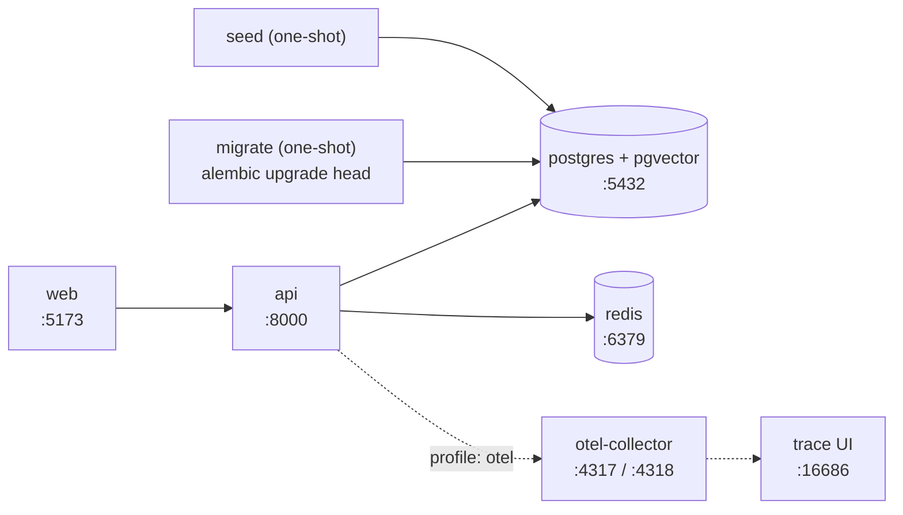
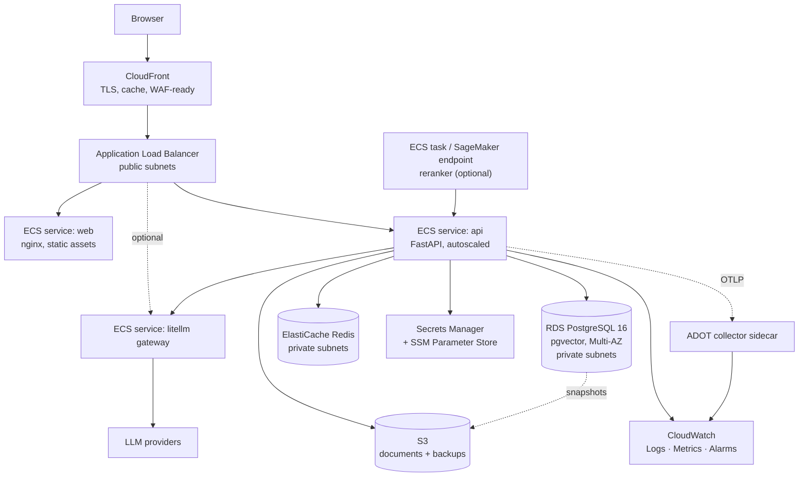
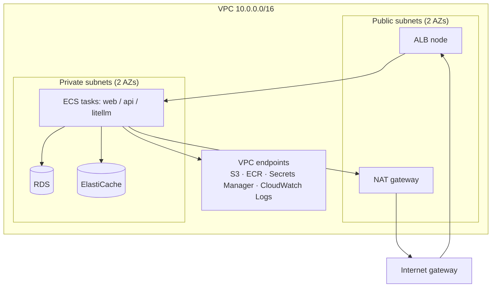

# Deployment

> This document specifies how CourseLLM runs locally and how it is intended to run on AWS:
> the container images, the network, migrations, scaling, secrets, cost drivers, and
> rollback. It also states plainly what is **not** deployed.
>
> **No live AWS deployment exists.** The repository contains infrastructure-as-code and a
> validated, planned Terraform configuration. `terraform plan` is safe and is the only
> command that has been run; `terraform apply` has not been executed against a real
> account. Nothing in this document should be read as a claim that a service is running,
> that a cost has been incurred, or that an alarm is armed.

---

## 1. Environments

| Dimension | local | dev | prod |
|-----------|-------|-----|------|
| Compute | docker compose on a laptop | ECS/Fargate, 1 task per service | ECS/Fargate, autoscaled |
| Database | `pgvector/pgvector:pg16` container | RDS PostgreSQL (`db.t4g.micro`-class) | RDS PostgreSQL (Multi-AZ, larger class) |
| Cache | Redis container | ElastiCache (single node) | ElastiCache (replica) |
| Object storage | local `uploads/` volume | S3 bucket, lifecycle to expire | S3 bucket, versioned, SSE-KMS |
| Secrets | `.env` file, gitignored | Secrets Manager + SSM | Secrets Manager + SSM |
| Tracing | off by default; console or local collector | OTLP to an ADOT sidecar, 100% sampled | OTLP to an ADOT sidecar, sampled per §3 of [observability.md](./observability.md) |
| LangSmith | off | optional, on by default for evaluation runs | off by default |
| HTTPS | no | ALB with an ACM certificate | CloudFront + ALB, ACM certificate |
| Backups | none | RDS automated, 1 day | RDS automated, longer retention, PITR |
| Cost | $0 | small but non-zero (NAT dominates) | real |
| Data | synthetic/seed | synthetic; no real student data | real student data |

The rule that keeps these from drifting: **environment differences are configuration, not
code paths.** A single image runs in all three; only environment variables and the
Terraform variables differ. Any behaviour that exists in prod but not local is a bug in
the environment configuration, not a reason for a branch.

---

## 2. Local



**Topology.** `docker-compose.yml` defines `postgres`, `redis`, `api`, and `web`; an
optional `otel` profile adds `otel-collector` and a trace UI. There is no LiteLLM
container in the default profile — LiteLLM runs in-process in the API. The standalone
gateway is an opt-in profile for testing provider routing.

**Ports.**

| Service | Port | Notes |
|---------|------|-------|
| `api` | 8000 | FastAPI, `/docs`, `/healthz`, `/readyz` |
| `web` | 5173 | Vite dev server with HMR |
| `postgres` | 5432 | `pgvector/pgvector:pg16`, named volume |
| `redis` | 6379 | `redis:7-alpine`, appendonly off (cache only) |
| `otel-collector` | 4317 / 4318 | OTLP gRPC / HTTP, `otel` profile |
| `otel-collector` | 8889 | Collector's own metrics |
| trace UI | 16686 | `otel` profile |

**Startup order.** Postgres and Redis start first and must report healthy before anything
else runs. `migrate` is a one-shot service that depends on Postgres health and runs
`alembic upgrade head`. `api` depends on `migrate` completing successfully
(`service_completed_successfully`), not merely on the database being up — otherwise two
containers race to create the same schema. `seed` is a second one-shot, after migrations,
that loads the global resource catalogue, the concept graph, and a demo corpus. It is
idempotent and safe to re-run.

**Healthchecks.**

| Service | Probe | Interval / timeout / retries | What it asserts |
|---------|-------|------------------------------|-----------------|
| `postgres` | `pg_isready -U coursellm` | 5 s / 3 s / 10 | Accepting connections |
| `redis` | `redis-cli ping` | 5 s / 3 s / 10 | Responding |
| `api` liveness | `GET /healthz` | 10 s / 3 s / 3 | The process is up; does not touch dependencies |
| `api` readiness | `GET /readyz` | 10 s / 3 s / 3 | DB reachable and `alembic current` == head; Redis checked but non-fatal per the degradation policy in [system.md](./system.md) §6 |

Liveness and readiness are deliberately different endpoints. A liveness probe that checks
the database restarts a healthy process when the database hiccups; a readiness probe that
does not check the database routes traffic to a process that cannot serve it.

**Developer entry points.** A `Makefile` is the single entry point: `make up`, `make down`,
`make migrate`, `make seed`, `make test`, `make eval`, `make lint`. Nothing requires the
developer to remember a raw compose invocation.

---

## 2a. Frontend hosting: no Vercel

The React client is built to static assets and served from **S3 behind CloudFront**,
or from the `web` container in the compose stack for local work. There is
deliberately **no Vercel project, no `vercel.json`, and no Vercel deployment step**
in CI.

The reason is coherence rather than preference. The API, the database and the
object store all live in one AWS account behind one VPC; putting the client on a
separate platform would add a second deployment pipeline, a second place for
environment variables to drift, a second origin to configure for CORS, and a
second thing to reason about when a request fails. One deployment story with one
rollback procedure is worth more here than a marginally simpler static deploy.

The prototype's history is the cautionary version of this: it carried
deployment plumbing for three separate hosting targets at once — Hugging Face
Spaces, Render and Vercel — none of which was working. `docs/PROJECT_AUDIT.md`
records that; this document records that the rebuild does not repeat it.

Reintroducing an external frontend host is a one-line change to CI, not a
forbidden choice — but it should be a decision with a reason, recorded as an ADR,
rather than a leftover configuration file.

## 3. Container images

### 3.1 Multi-stage strategy

| Stage | Base | Purpose |
|-------|------|---------|
| `builder` | `python:3.12-slim`, pinned by digest | Install build tooling (`build-essential`, `libpq-dev`) and compile/install wheels into a virtualenv |
| `runtime` | `python:3.12-slim`, pinned by digest | Copy only the virtualenv and application source; no compilers, no package manager cache |
| `web-build` (web image) | `node:20-alpine`, pinned | `pnpm build` producing static assets |
| `web-runtime` | `nginx:alpine`, pinned | Serve the built assets with an SPA fallback and gzip/brotli |

**Non-root.** The runtime image creates `app` with a fixed high uid (`10001`) and drops to
it. Fixed uid matters in a shared filesystem or an ECS volume context: a random uid makes
mounted volumes unwritable. The container does not require write access to anything except
a scratch directory and uploads, both of which are volumes.

**Pinned base images.** Bases are pinned by digest, not by a floating tag. `python:3.12-slim`
can change under the same tag; an image that changes without a commit is not reproducible
and not rollback-able.

**No build tools in the runtime layer.** This is why the venv is built in a separate stage:
the runtime image has no compiler, no `pip` cache, and no headers. The security benefit is a
smaller attack surface (a compromised process has no compiler to build a payload with) and
the operational benefit is a smaller image to pull on a cold start.

**Healthcheck.** The image declares a `HEALTHCHECK` equivalent for local compose
(`python -c "urllib.request.urlopen('http://127.0.0.1:8000/healthz')"`). In ECS the
container-level health check is configured on the task definition instead, and the ALB
target group health check is `/readyz`. Docker-level health and load-balancer readiness
are separate signals.

**Image size.** The runtime image is kept small deliberately. The single biggest lever is
dependency splitting:

| Extra | Contents | Size | Where it is installed |
|-------|----------|------|-----------------------|
| core | FastAPI, SQLAlchemy, asyncpg, pgvector client, LiteLLM, LangGraph, OTel SDK | tens of MB | API image, always |
| `rerank` | `sentence-transformers` → PyTorch | hundreds of MB to >1 GB | Reranker task/profile only, **not** the default API image |
| `local-embeddings` | Local embedding model runtime | large | Ingestion worker profile only |
| `dev` | pytest, ruff, mypy, ipython | moderate | Local and CI only, never in the runtime image |

**Why the split matters.** Torch in the API image would multiply the image size, cold-start
time, and memory floor for a capability the API does not need on every request. The
reranker is a separate deployment target (separate task or an inference endpoint), so the
API image carries only the client. In the default managed configuration, reranking is a
hosted inference call or a sidecar, and the heavy extra is not installed at all. This also
means the reranker can fail without taking the API down, which is exactly the degradation
path [rag.md](./rag.md) §6 specifies.

---

## 4. AWS target architecture



### 4.1 Component roles

| Component | Role | Why it is needed |
|-----------|------|------------------|
| **CloudFront** | TLS termination at the edge, static asset caching, geo hints, WAF attachment point | Keeps TLS and volumetric filtering off the origin, and makes the web bundle cheap to serve globally |
| **ALB** | HTTP routing to ECS target groups, health checks, sticky-free round robin | The API is stateless, so a plain L7 load balancer is sufficient; path routing splits web and API |
| **ECS service: web** | Serves the built SPA | Static content should not share a scaling policy or an image with the API |
| **ECS service: api** | FastAPI, agent graph, retrieval, ingestion dispatch | The only service that holds business logic; scales horizontally with no session state |
| **ECS service: litellm gateway (optional)** | Centralised provider routing, retries, fallbacks, spend tracking | Optional because LiteLLM already runs in-process; the gateway exists when multiple services must share provider policy or when spend must be enforced centrally |
| **RDS PostgreSQL + pgvector** | Vectors, full-text, relational data, knowledge graph, RLS | One datastore for four access patterns avoids a distributed consistency problem for metadata and vectors ([system.md](./system.md) §4.1) |
| **ElastiCache Redis** | Retrieval/embedding cache, rate-limit counters | Only provably repeated work; cache keys embed tenant and config version |
| **S3** | Raw uploads, extracted artefacts, exports | Object storage is the right shape for documents; keeps large blobs out of Postgres |
| **Secrets Manager** | Provider keys, DB credentials, JWT signing key | Credentials are injected at task start, never baked into an image |
| **SSM Parameter Store** | Non-secret configuration (feature flags, model ids, limits) | Config changes should not require editing a secret or rebuilding an image |
| **CloudWatch** | Logs, metrics, alarms, dashboards | Native to the surrounding services; the OTLP collector exports into it |
| **ADOT collector sidecar** | Receives OTLP from the app, batches, exports to CloudWatch/X-Ray | Keeps exporter configuration out of the application and survives app restarts |

---

## 5. Why ECS/Fargate over EKS

Honest trade-off, for this scale:

| Factor | ECS/Fargate | EKS |
|--------|-------------|-----|
| Operational surface | Task definitions and services; AWS manages the control plane and nodes | You own node groups, upgrades, CNI, ingress controller, and often an operator set |
| Cost floor | No cluster fee; pay for task vCPU/memory | ~$0.10/h control plane plus nodes, plus the operational time |
| Networking | `awsvpc` mode gives each task its own ENI and security group | Comparable, with more moving parts |
| Scaling | Service autoscaling on CPU/memory/ALB request count with a target-tracking policy | HPA/KEDA, more powerful and more to configure |
| Local parity | Compose maps cleanly onto task definitions | Requires kind/minikube, which is not the same runtime |
| Ecosystem | Fewer third-party operators | Rich (service mesh, operators, GitOps) |
| Portability | AWS-specific | Any Kubernetes |

**The call.** ECS/Fargate is chosen because this workload is three stateless HTTP services
plus an optional worker, and the team's constraint is attention, not compute. A Kubernetes
cluster would add a control plane, an ingress layer, and an upgrade cadence to operate for
no capability this system currently uses. The trigger to revisit is concrete: more than
roughly a dozen services, a need for a service mesh or a custom operator, or a hard
multi-cloud requirement. Until then, EKS would be resume-driven infrastructure.

---

## 6. Networking



| Element | Specification | Why |
|---------|---------------|-----|
| VPC | `/16`, split into public and private subnets across at least two AZs | Two AZs is the minimum for an ALB and for RDS Multi-AZ |
| Public subnets | ALB and NAT only | The only components that need an internet-facing presence |
| Private subnets | ECS tasks, RDS, ElastiCache | Application and data are unreachable from the internet, even if a security group is misconfigured |
| NAT gateway | One per AZ for dev simplicity; per-AZ in prod for availability | Outbound only — provider calls, ECR pulls if endpoints are absent. NAT is a significant cost line (§11) |
| Internet gateway | Attached to the VPC | Public subnet egress/ingress for the ALB |
| VPC endpoints | S3 (gateway), ECR/Secrets Manager/CloudWatch Logs (interface) | Keeps AWS API traffic off NAT, which is both cheaper and avoids a NAT dependency for pulling images |
| Security groups | `alb-sg` → `app-sg:8000`; `app-sg` → `rds-sg:5432` and `redis-sg:6379`; no `0.0.0.0/0` ingress on data groups | Security groups are referenced by group id, not CIDR, so instances can move without policy edits |
| ALB target groups | One per service, health check `/readyz`, deregistration delay long enough for in-flight SSE streams | A short deregistration delay kills a streaming tutor answer mid-token |
| RDS / Redis private-only | No public IP, no public accessibility flag | The data tier has no legitimate inbound path from the internet; RLS is the application-level boundary, the subnet is the network-level one |

---

## 7. Migrations in deployment

**Migrations run as a one-off ECS task before the service rolls, never on container start.**

```text
deploy pipeline
  ├── 1. build + push image tagged :<git-sha>
  ├── 2. terraform apply (targeted: task definitions)
  ├── 3. run one-off ECS task: alembic upgrade head   ← blocks
  ├── 4. update api service to the new task definition
  ├── 5. update web service
  ├── 6. wait for stability; roll back on circuit-breaker trip
```

**Why not on container start.** Two containers of the new revision start concurrently under
a rolling deployment. If each runs `alembic upgrade head` at boot, they race: both read the
same current revision, both attempt the same DDL, and one fails — or worse, both partially
apply and the version table disagrees with the schema. Alembic's version table is not a
distributed lock, so "it usually works" is a coincidence of timing. Running migrations once,
as a separate task, in the pipeline, makes the ordering explicit and the failure visible
before any traffic moves.

**Why not on the old service before the deploy either.** Migrations must be
backward-compatible with the *previous* application revision during the rollout window
(expand/contract, §12), so applying them ahead of the new code is safe and applying them
behind it is not. The one-off task is the natural place for that ordering.

**Additional rules.**

- The migration task runs with the same image as the API, so the migration code and the
  application code are provably the same commit.
- A migration failure aborts the pipeline before the service update. There is no state in
  which new code runs against an old schema.
- Startup logs `alembic current` vs head; a mismatch in production is a critical log and an
  alert ([observability.md](./observability.md) §9).

---

## 8. Scaling

### 8.1 Service autoscaling

| Service | Primary signal | Secondary | Notes |
|---------|----------------|-----------|-------|
| `api` | ALB `RequestCountPerTarget` | CPU utilisation | Request count tracks the actual load; CPU lags on an I/O-bound async service |
| `web` | CPU / request count | — | Static serving is cheap; usually pinned at a low task count |
| ingestion worker | Queue depth (SQS) or DB job-table backlog | CPU | The genuinely queue-shaped workload; scales on backlog, not on time |
| reranker (if self-hosted) | Request count / queue depth | GPU or CPU memory | Scales separately so a reranker burst cannot evict API capacity |

Target-tracking policies are preferred over step scaling: they converge without a
hand-tuned staircase, and the cooldown is expressed as a time window rather than a rule
ladder. Scale-in is deliberately slower than scale-out, and the ALB deregistration delay
must exceed the longest streamed response.

### 8.2 Database

| Concern | Approach |
|---------|----------|
| Vertical scaling | Instance class is the first lever for vector search; HNSW rebuilds and large corpora are memory-hungry |
| Storage | gp3, autoscaling; capacity is not the constraint, IOPS is |
| Read replicas | Useful for the evaluation and analytics path, which is read-heavy and latency-tolerant. **Not** a solution for request-path load: the retrieval path writes `llm_usage` and `messages`, and a replica cannot serve reads that must see the just-written row |
| Index maintenance | `hnsw.ef_search` is a session knob; `m`/`ef_construction` are build-time and require a rebuild to change ([rag.md](./rag.md) §3) |

### 8.3 Connection pooling

`asyncpg` opens one server-side connection per pool connection. Postgres has a hard
`max_connections` (a function of instance memory, often a few hundred). Tasks × pool size
must stay safely below it, and the failure mode when it does not is that *every* task
starts failing to acquire a connection at once — a correlated outage caused purely by
scaling out.

| Approach | When | Trade-off |
|---------|------|-----------|
| Direct `asyncpg` pool | Dev and low task counts | Simplest; concurrency is capped by `max_connections / tasks` |
| RDS Proxy | Managed, IAM-integrated, no extra container | Adds a hop and a small latency penalty; pins connections and multiplexes |
| pgbouncer (transaction mode) | Self-managed, most control | Another component to operate; **transaction mode is compatible with `SET LOCAL` but incompatible with session-level prepared statements**, which requires `asyncpg` statement caching to be disabled |

**The concrete arithmetic.** With a pool of 20 per task and 10 tasks, that is 200
connections before migrations, the worker, and any admin session. Sizing the instance for
200+ connections is expensive, so the intended production configuration is a pool of
~5–10 per task behind RDS Proxy, with the API pool sized from an environment variable
(`DB_POOL_SIZE`) rather than hardcoded. The RLS GUC is set with `SET LOCAL` per
transaction (see [security.md](./security.md) §7.4), which is exactly what makes pooling
safe under multiplexing — a session-scoped `SET` would leak the tenant across a
multiplexed connection and would rule out transaction-mode pooling entirely.

---

## 9. Secrets and configuration

| Kind | Store | Examples | Consumption |
|------|-------|----------|-------------|
| Credentials | Secrets Manager | `DATABASE_URL`, `JWT_SECRET`, provider API keys, `LANGSMITH_API_KEY` | Injected into the task as `secrets` (valueFrom the secret ARN), so the value never appears in the task definition or in CloudFormation-style plaintext |
| Non-secret config | SSM Parameter Store | `RERANK_ENABLED`, `RETRIEVAL_TOP_K_PER_RETRIEVER`, `RRF_K`, `RERANK_TOP_K`, `CONTEXT_TOKEN_BUDGET`, `EMBEDDING_MODEL`, `MAX_OUTPUT_TOKENS`, feature flags | Injected as `environment` values resolved from parameters, or read at startup |

**Why the split.** Secret values need an audit trail, rotation, and encryption at rest as a
first-class concern; non-secret configuration needs to be changeable and readable by anyone
who can read the service. Putting a feature flag in Secrets Manager hides it; putting a
provider key in Parameter Store plaintext leaks it.

**Task consumption.** The task execution role needs `secretsmanager:GetSecretValue` on the
specific ARNs and `ssm:GetParameters` on the specific parameter path — not wildcards. The
task role is separate from the execution role, so the running application does not hold the
permissions used to fetch its own secrets.

**Rotation.** Provider keys and the JWT signing key rotate on a schedule and immediately on
suspected compromise. Because the value is resolved at task start, rotation takes effect on
a new task definition revision; the previous revision is retained so the rotation is
rollback-able. The JWT signing key rotation requires a two-key window (verify with old and
new, sign with new) so in-flight sessions are not invalidated — this is a code requirement,
noted here because it constrains the rotation procedure. The application refuses to start
with a missing or placeholder secret in production
([security.md](./security.md) §10).

---

## 10. Observability in AWS

| Layer | Specification |
|-------|---------------|
| Trace collection | ADOT collector sidecar per API task, receiving OTLP on `localhost:4318`, batching, exporting to AWS X-Ray and/or CloudWatch. A sidecar is preferred over a daemon or a central collector because it ties collection to the task lifecycle and removes a network hop from the request path |
| Sampling | Configured in the application ([observability.md](./observability.md) §3), not in the collector. The collector does not re-sample |
| Logs | Container stdout → CloudWatch Logs, one log group per service, retention set explicitly (a log group with no retention retains forever and bills forever). Redaction happens in the application before the line is written |
| Metrics | OTel metrics exported through the collector as CloudWatch EMF or to a Prometheus-compatible backend, per the panel specification in [observability.md](./observability.md) §8 |
| Dashboards | The panel specification in [observability.md](./observability.md) §8, translated to CloudWatch or Grafana. **Specified, not deployed.** |
| Alarms | The alert table in [observability.md](./observability.md) §9, wired to the on-call channel. **Specified, not deployed.** |
| Uptime | ALB target-group health and a synthetic check against `/healthz` from outside the VPC |

The application is not coupled to CloudWatch. It emits OTLP/stdout and the collector
decides the destination, which is what allows the same image to run locally with a console
exporter and in AWS with ADOT.

---

## 11. Cost model

Order-of-magnitude drivers, not a quote. Prices change and region matters; the point is
which line dominates and what can be switched off.

| Driver | Billing unit | What drives it | Dominates when | Dev treatment |
|--------|--------------|----------------|----------------|---------------|
| **Fargate vCPU + memory hours** | per vCPU-hour and GB-hour, per task | task count × size × uptime | Always a baseline; grows with autoscaling | 1 small task per service; `0.25 vCPU / 0.5 GB` class |
| **RDS instance + storage + IOPS** | instance-hours; GB-month; IOPS above baseline | instance class, provisioned storage, gp3 IOPS, vector index rebuilds | Vector search and large corpora | Smallest burstable class, minimal storage, no Multi-AZ |
| **NAT gateway** | gateway-hours + $/GB processed | number of NAT gateways × uptime, plus egress bytes | **Frequently the largest line in a low-traffic dev account** — a NAT is billed per hour even when idle | One NAT, or none with VPC endpoints only; the single biggest dev saving |
| **ALB** | hours + LCU | provisioned ALB hours plus new connections, active connections, processed bytes | Proportional to traffic | One ALB; consider skipping it in dev and using a public task |
| **CloudFront** | $/GB + $/10k requests | asset delivery volume | Prod, static assets | Not used locally or in dev |
| **S3** | $/GB-month + requests | document volume, versioning, lifecycle | Grows with uploads; rarely dominant at this scale | Small bucket, short lifecycle |
| **ElastiCache** | node-hours | node class × count | Fixed cost whenever a node runs | Smallest node, or skip and run Redis in the task for dev |
| **LLM tokens** | per 1M input/output tokens | requests × context size × output cap × model price | **The dominant variable cost in prod**; unroutable to a fixed budget without caps | Use a small/cheap model and low `MAX_OUTPUT_TOKENS`; evaluation runs are the main dev spend |
| **Observability backend** | per GB ingested / per span | trace sample ratio, log volume, prompt capture | Quietly large if `PROMPT_CAPTURE_ENABLED` is on | Tracing off by default; console exporter when needed |
| **ECR** | $/GB-month | image size × revisions retained | Modest, but Torch-sized images are not | Lifecycle policy to expire old tags |

**Ranking, honestly.** In dev, NAT gateway hours and RDS are usually the top two lines and
the application compute is noise. In prod at any real usage, LLM tokens dominate the
variable cost and RDS dominates the fixed cost. The controls that matter follow from that:
token caps and model routing for the variable side; instance right-sizing and NAT
elimination for the fixed side.

**Nothing is provisioned by default.** The Terraform configuration creates no resources
until it is applied, there is no always-on environment, and `terraform plan` makes no
changes. A plan against the dev workspace is safe to run and is how the configuration is
validated.

---

## 12. Rollback and release

**Strategy.** Rolling deployment with the ECS deployment circuit breaker enabled and
`deployment_minimum_healthy_percent` / `maximum_percent` set so that new tasks become
healthy before old ones drain. The circuit breaker rolls the service back automatically
when a deployment fails to reach steady state. Blue/green (CodeDeploy with two target
groups and a traffic-shift hook) is the upgrade path when a release needs an instant,
atomic cutover or canary percentages; it is specified here as the alternative, not as the
current configuration.

**Image tagging.** Every image is tagged with the git SHA (`coursellm-api:<sha>`). `latest`
is not used in a task definition. The reasons are concrete: a rollback must name an
immutable artefact, an incident review must be able to say exactly which code ran, and a
tag that can change under a running task definition makes both impossible. A moving tag may
exist in ECR for convenience but is never referenced by a service.

**Database migration reversibility policy.**

1. **Expand/contract, always.** A release adds nullable columns, new tables, or new
   indexes; it does not drop or rename in the same release that stops using them. The
   contract step ships one or more releases later, after no running revision reads the old
   shape.
2. **Backward compatible across the rollout window.** The old revision keeps serving during
   the deployment, so every migration must be safe for both revisions. This is what makes
   "migrate before the service update" (§7) correct.
3. **Alembic downgrades exist for schema changes and are tested, but rollback of a data
   migration is a forward fix.** Dropping a column that has been written destroys data;
   `alembic downgrade` is therefore a tool for schema shape, not a data-recovery
   mechanism.
4. **Destructive changes are two-phase.** A column drop is: release N stops writing it;
   release N+1 (after a retention window) drops it.
5. **Vector migrations follow the same rule.** A change to `EMBEDDING_MODEL` backfills the
   new model's rows in `chunk_embeddings` and flips the config; the old rows are retained
   until the rollback window closes ([rag.md](./rag.md) §3, ADR-0006).

**Rollback procedure.** Point the service at the previous task definition revision — a
single ECS service update, no rebuild. Because the previous revision is still deployed and
the migration was additive, this restores the prior behaviour without touching the
database. If the failure is in the database migration itself, the recovery is a forward
fix, which is why migrations are reviewed and why the one-off task gates the rollout.

---

## 13. What is NOT deployed

Stated without hedging:

- **There is no live AWS deployment.** No account, no VPC, no ECS service, no RDS instance,
  no ALB, no CloudFront distribution, and no ElastiCache node are running as part of this
  repository. No AWS bill is being generated.
- **Terraform is validated and planned, not applied.** The configuration under
  `infra/terraform/` is intended to pass `terraform validate` and `terraform plan`. It has
  not been applied. A plan is a diff against nothing; it proves the configuration parses
  and that the dependency graph is coherent, and it proves nothing about a running system.
- **The dashboard and alarm specifications are not deployed.** [observability.md](./observability.md)
  §8 and §9 describe panels and alerts that a team would create; no Grafana or CloudWatch
  dashboard exists and no alarm is armed.
- **No performance or cost number in this document is measured.** The cost model is a
  driver ranking, not an observed bill. Latency budgets are targets. Where a number is a
  measurement, it comes from `evals/reports/` and is quoted there.
- **No compliance certification.** Nothing here asserts SOC 2, ISO 27001, HIPAA, or GDPR
  conformance; see [security.md](./security.md) §13.

The deliverable of this document is a configuration that can be applied deliberately, with
the cost and failure consequences understood in advance — not a claim that it has been.
