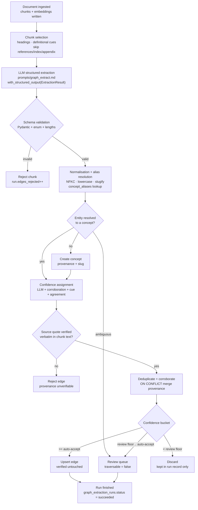
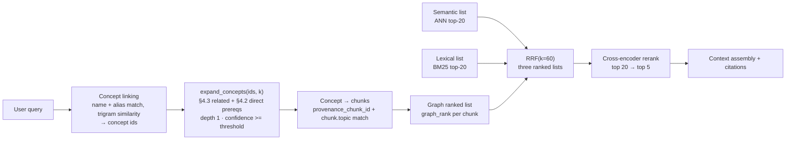

# Knowledge Graph

> This document specifies the concept graph: why it exists at all, why it is stored in
> PostgreSQL rather than a graph database, its schema and traversal queries, the
> extraction pipeline that fills it, the confidence model that keeps LLM-asserted edges
> honest, and how graph evidence joins the retrieval pipeline. It is the companion to
> [`system.md`](system.md) §4.2 and §8 and to [`rag.md`](rag.md) §5, where the graph
> contributes a third ranked list to RRF. Terminology, table names and configuration
> variables are shared with those documents.

---

## 1. Why a graph at all

Vector and lexical retrieval answer *"what is similar to this?"*. They have no
representation of dependency, order, or direction. A prerequisite question is not a
similarity question, and the two retrieval modes fail on it in a specific, predictable
way.

### 1.1 The concrete failure

Corpus: CS229-style lecture notes. The student asks:

> "What do I need before Transformers?"

**What semantic retrieval does.** The query embeds near the *topic* "Transformers". The
nearest chunks are the ones that talk about Transformers: self-attention, multi-head
attention, the encoder-decoder architecture. Those are the concepts that come *after*
the thing being asked about — precisely not the answer. The actual prerequisites
(linear algebra, the softmax function, gradient descent, backpropagation, sequence
models, RNNs, LSTMs, attention as an alignment mechanism) share almost no vocabulary
with the question and sit far away in embedding space. Cosine similarity is
symmetric and directionless: it cannot tell "requires" from "is required by".

**What BM25 does.** No better. `"before"` and `"need"` are common tokens, and the
high-IDF token `Transformers` dominates the score, so the lexical ranking is if anything
*more* biased toward the post-requisite chunks. The query is lexically about
Transformers, and the ranking is a lexical ranking.

**What the user gets.** A confident, well-cited answer about attention mechanisms for a
question about what precedes them. Grounding checks pass — the passages are real, the
citations resolve, faithfulness is high. The answer is grounded and wrong, which is the
failure mode evaluation harnesses are worst at catching.

A graph traversal answers it in one query: from the `Transformers` node, follow
`requires` edges backwards to closure, depth ≤ `GRAPH_MAX_DEPTH`, and return the
prerequisites ordered by depth. The result is structurally guaranteed to be
prerequisite-ward, independent of surface vocabulary.

### 1.2 What each retrieval mode can and cannot do

| Question class | Example | Vector / BM25 | Graph |
|----------------|---------|---------------|-------|
| Definition | "What is a cross-encoder?" | Strong | Not needed |
| Paraphrase | "How does the model know which passage matters?" | Strong | Not needed |
| Exact identifier | "What is `ef_construction`?" | BM25 strong, vector weak | Not needed |
| Prerequisite | "What do I need before Transformers?" | **Structurally wrong** | Correct by construction |
| Multi-hop closure | "What is the full chain from linear algebra to attention?" | Cannot express | Recursive traversal |
| Ordering | "In what order should I study these lectures?" | Cannot express | Topological sort |
| Cycle-free sequencing | "Does this roadmap contain a circular dependency?" | No concept of it | Cycle detection |
| Gap detection | "What am I missing before I can learn X?" | Similarity ≠ absence of evidence | Closure minus progress |
| Typed relations | "Is X part of Y, or does Y require X?" | No direction or type | Relation enum |

The graph is not a better retriever; it answers a different class of question. §9 covers
how it *complements* hybrid retrieval rather than replacing it.

---

## 2. Why PostgreSQL, not Neo4j

The honest version of this decision, and the conditions under which it would be
reversed.

### 2.1 The trade-off

| Dimension | PostgreSQL (chosen) | Neo4j (rejected for now) |
|-----------|---------------------|--------------------------|
| Scale | Thousands of concepts and low tens of thousands of edges per tenant; the working set is small enough that an indexed adjacency scan plus a depth-limited recursive CTE is cheap | Built for graphs several orders of magnitude larger; no advantage until the working set stops fitting the access pattern |
| Consistency with documents | `concepts`/`concept_edges` are written in the same transaction as `documents`, `chunks` and the extraction run record. Provenance FKs are real FKs | Dual-write: an extraction writes Postgres and Neo4j, and the two can diverge. Requires an outbox, a reconciliation job, and a story for reads that observe a half-written graph |
| Operational surface | One datastore: one backup, one HA configuration, one connection pool, one credential rotation, one migration tool, one RLS model, one restore drill | A second stateful service with its own backup, HA, auth and upgrade path |
| Tenancy | `tenant_id` on every row, enforced by the repository contract **and** Postgres RLS, exactly as for chunks | Row- or label-level multi-tenancy must be reimplemented; RLS does not carry over |
| Query capability | `WITH RECURSIVE` expresses closure, depth limiting, path accumulation, cycle detection and gap detection. All four queries in §4 are recursive CTEs | Cypher is more concise for variable-length patterns, but concision is not the constraint |
| Traversal latency in the request path | Bounded by the depth cap and `(tenant_id, source_concept_id)` index; the graph node has a 150 ms budget in `agent-architecture.md` §4.2 | Faster for deep variable-length traversal on large graphs; irrelevant at depth ≤ 3 over thousands of edges |
| Backup / HA story | Already exists because the vectors are there | New |
| Migrations | Alembic, same as every other table | Separate migration discipline |
| New dependency | None | Justified only by a load-bearing job (`system.md` principle 6) |

`system.md` §10 already records the conclusion: a second datastore would add operational
cost and a consistency problem for no query we need.

### 2.2 When Neo4j *would* become justified

Stated as thresholds, so the decision is revisitable rather than doctrinal:

1. **Scale:** more than roughly 10^7 edges in a single tenant's working set, or a
   graph that no longer fits the assumption that a tenant-scoped closure touches a few
   hundred nodes.
2. **Hot-path traversal depth or frequency:** multi-hop traversal (depth ≥ 4) as the
   dominant request path at high QPS, where the recursive CTE's repeated index scans and
   row materialisation become the latency bottleneck rather than the model call.
3. **Graph algorithms:** a product requirement for PageRank, community detection,
   betweenness centrality, node embeddings, or heuristic shortest paths (A*) over a
   large graph — algorithms that are not expressible at acceptable cost in recursive
   SQL.
4. **Whole-corpus reasoning:** recommendation or curriculum design that must traverse
   across many courses and tenants at once, rather than within one tenant's subgraph.

Without at least one of these, the second datastore is resume-driven engineering.

### 2.3 Migration path, if the thresholds are crossed

The schema is already edge-shaped, so the migration is an adapter and a sync job, not a
redesign:

- `concepts` maps to a node label; `concept_edges` maps 1:1 to a relationship with
  properties (`relation`, `weight`, `confidence`, `verified`, provenance columns).
  `concept_aliases` becomes secondary labels or a `:ALIAS` node with `SAME_AS`.
- Identifiers are UUIDs on both sides, so no key remapping is needed and provenance
  foreign keys survive.
- Neo4j would be a **derived read model**: the relational tables stay the system of
  record, and a sync job (or logical replication consumer) rebuilds the graph store.
  That removes the dual-write consistency problem in the direction that matters — there
  is one writer of truth, and the graph store is rebuildable from it.
- All access goes through `KnowledgeGraphRepository`. Only that one adapter changes;
  no node, agent or tool knows how traversal is implemented. This is the concrete payoff
  of keeping graph access behind a repository instead of spreading Cypher-or-SQL through
  the codebase.

The decision record is [ADR-0004](../decisions/ADR-0004-knowledge-graph-in-postgres.md).

---

## 3. Schema

All four tables are tenant-scoped. `tenant_id` is part of every index that matters, and
RLS applies exactly as it does to `chunks` (`system.md` principle 3, `rag.md` §3).

### 3.1 `concepts`

```sql
CREATE TABLE concepts (
    id                    uuid PRIMARY KEY DEFAULT gen_random_uuid(),
    tenant_id             uuid NOT NULL REFERENCES tenants(id) ON DELETE CASCADE,
    course_id             uuid REFERENCES courses(id) ON DELETE CASCADE,
    name                  text NOT NULL,
    slug                  text NOT NULL,
    description           text,
    difficulty            smallint NOT NULL DEFAULT 3,
    -- provenance
    provenance_document_id uuid REFERENCES documents(id) ON DELETE SET NULL,
    provenance_chunk_id    uuid REFERENCES chunks(id)    ON DELETE SET NULL,
    provenance_page        integer,
    extraction_run_id     uuid REFERENCES graph_extraction_runs(id) ON DELETE SET NULL,
    prompt_version        text,
    model                 text,
    -- lifecycle
    verified              boolean NOT NULL DEFAULT false,
    created_at            timestamptz NOT NULL DEFAULT now(),
    updated_at            timestamptz NOT NULL DEFAULT now(),
    CONSTRAINT concepts_slug_shape   CHECK (slug ~ '^[a-z0-9]+(-[a-z0-9]+)*$'),
    CONSTRAINT concepts_name_len     CHECK (char_length(name) BETWEEN 2 AND 200),
    CONSTRAINT concepts_difficulty   CHECK (difficulty BETWEEN 1 AND 5)
);
```

`slug` is the deterministic, alias-resolved key: NFKC, lowercased, punctuation removed,
whitespace collapsed to `-`. It is what makes deduplication and alias resolution
mechanical (§5) instead of a model judgement at write time.

`difficulty` is 1–5 and is used as the deterministic tie-breaker in roadmap ordering
(§8). It is never estimated in a prompt at request time; it is written at extraction and
can be corrected by a human.

Provenance columns are nullable with `ON DELETE SET NULL` rather than `CASCADE`: losing
the source chunk must not silently delete a concept that other edges and roadmap steps
reference. A concept whose provenance is null is flagged unverifiable and is excluded
from `verified` promotion, but it does not disappear mid-conversation.

### 3.2 `concept_aliases`

```sql
CREATE TABLE concept_aliases (
    id          uuid PRIMARY KEY DEFAULT gen_random_uuid(),
    tenant_id   uuid NOT NULL REFERENCES tenants(id) ON DELETE CASCADE,
    course_id   uuid REFERENCES courses(id) ON DELETE CASCADE,
    concept_id  uuid NOT NULL REFERENCES concepts(id) ON DELETE CASCADE,
    alias       text NOT NULL,
    alias_norm  text NOT NULL,
    source      text NOT NULL DEFAULT 'extraction'
                CHECK (source IN ('extraction', 'human')),
    created_at  timestamptz NOT NULL DEFAULT now(),
    CONSTRAINT concept_aliases_norm_unique UNIQUE (tenant_id, course_id, alias_norm)
);
```

`course_id` is denormalised from `concepts` on purpose: it scopes alias resolution to a
course (so "attention" in a vision course does not resolve to the NLP concept) and it is
part of the uniqueness constraint and the lookup index. A trigger keeps it in sync with
the parent concept.

The unique constraint is the alias conflict detector: if an extraction proposes an alias
that already maps to a different concept in the same course, the insert fails and the
extraction is routed to the review queue rather than silently reassigning a name.

### 3.3 `concept_edges`

```sql
CREATE TYPE concept_relation AS ENUM (
    'requires',     -- source depends on target   (target is a prerequisite of source)
    'contains',     -- source is a whole, target is a part of it
    'related_to',   -- symmetric, associative association; no direction
    'part_of',      -- source is a part of target
    'assesses',     -- source is an assessment item aligned to target concept
    'taught_by'     -- source concept is taught by target curriculum/lecture concept
);

CREATE TABLE concept_edges (
    id                     uuid PRIMARY KEY DEFAULT gen_random_uuid(),
    tenant_id              uuid NOT NULL REFERENCES tenants(id) ON DELETE CASCADE,
    source_concept_id      uuid NOT NULL REFERENCES concepts(id) ON DELETE CASCADE,
    target_concept_id      uuid NOT NULL REFERENCES concepts(id) ON DELETE CASCADE,
    relation               concept_relation NOT NULL,
    weight                 numeric(4,3) NOT NULL DEFAULT 1.000
                           CHECK (weight BETWEEN 0 AND 1),
    confidence             numeric(4,3) NOT NULL DEFAULT 0.000
                           CHECK (confidence BETWEEN 0 AND 1),
    corroboration_count    smallint NOT NULL DEFAULT 1 CHECK (corroboration_count >= 1),
    cue                    text NOT NULL DEFAULT 'inferred'
                           CHECK (cue IN ('explicit', 'inferred')),
    -- provenance
    provenance_document_id uuid REFERENCES documents(id) ON DELETE SET NULL,
    provenance_chunk_id    uuid REFERENCES chunks(id)    ON DELETE SET NULL,
    provenance_page        integer,
    source_quote           text,
    extraction_run_id      uuid REFERENCES graph_extraction_runs(id) ON DELETE SET NULL,
    prompt_version         text,
    model                  text,
    -- lifecycle
    verified               boolean NOT NULL DEFAULT false,
    created_at             timestamptz NOT NULL DEFAULT now(),
    updated_at             timestamptz NOT NULL DEFAULT now(),
    CONSTRAINT concept_edges_no_self_loop CHECK (source_concept_id <> target_concept_id),
    CONSTRAINT concept_edges_unique        UNIQUE (tenant_id, source_concept_id,
                                                   target_concept_id, relation)
);
```

**Relation semantics.** Direction is declared once and used consistently everywhere,
including in the SQL in §4.

| Relation | Reading | Traversed for closure | Transitive | Example |
|----------|---------|:--:|:--:|---------|
| `requires` | source requires target | yes | yes | `backpropagation requires gradient-descent` |
| `contains` | source contains target | yes (reverse) | yes | `lecture-7 contains attention` |
| `part_of` | source is part of target | yes | yes | `multi-head-attention part_of attention` |
| `related_to` | associated, no direction | **no** | no | `attention related_to memory` |
| `assesses` | source assesses target | no | no | `quiz-item-42 assesses attention` |
| `taught_by` | source is taught by target curriculum concept | used for scoping, not closure | no | `attention taught_by lecture-7` |

`related_to` is deliberately excluded from closures. It is the relation an LLM reaches
for when it is unsure, and it is non-transitive: chaining associations produces plausible
nonsense. It is used only for bounded expansion in graph-augmented retrieval (§9), at
depth 1.

### 3.4 `graph_extraction_runs`

Provenance needs one ledger row per extraction, so an edge can be traced to the prompt
version and model that produced it and so a bad prompt revision can be rolled back by
run id.

```sql
CREATE TABLE graph_extraction_runs (
    id                    uuid PRIMARY KEY DEFAULT gen_random_uuid(),
    tenant_id             uuid NOT NULL REFERENCES tenants(id) ON DELETE CASCADE,
    document_id           uuid NOT NULL REFERENCES documents(id) ON DELETE CASCADE,
    prompt_version        text NOT NULL,
    model                 text NOT NULL,
    extraction_config_version text NOT NULL,
    status                text NOT NULL DEFAULT 'running'
                          CHECK (status IN ('running', 'succeeded', 'failed', 'partial')),
    chunks_considered     integer NOT NULL DEFAULT 0,
    concepts_created      integer NOT NULL DEFAULT 0,
    edges_written         integer NOT NULL DEFAULT 0,
    edges_rejected        integer NOT NULL DEFAULT 0,
    edges_queued_for_review integer NOT NULL DEFAULT 0,
    cost_usd              numeric(10,4) NOT NULL DEFAULT 0,
    started_at            timestamptz NOT NULL DEFAULT now(),
    finished_at           timestamptz
);
```

### 3.5 Indexes

```sql
CREATE UNIQUE INDEX uq_concepts_tenant_course_slug
    ON concepts (tenant_id, course_id, slug);

CREATE INDEX idx_concepts_tenant_course
    ON concepts (tenant_id, course_id);

CREATE INDEX idx_concepts_name_trgm
    ON concepts USING gin (name gin_trgm_ops);

CREATE INDEX idx_concept_aliases_lookup
    ON concept_aliases (tenant_id, course_id, alias_norm);

CREATE INDEX idx_concept_edges_out
    ON concept_edges (tenant_id, source_concept_id, relation);

CREATE INDEX idx_concept_edges_in
    ON concept_edges (tenant_id, target_concept_id, relation);

-- The index that actually serves request-path traversal: unverified-but-traversable
-- edges are included, low-confidence and non-structural relations are not.
CREATE INDEX idx_concept_edges_traversable
    ON concept_edges (tenant_id, source_concept_id)
    WHERE relation IN ('requires', 'part_of') AND confidence >= 0.6;

CREATE INDEX idx_concept_edges_provenance
    ON concept_edges (provenance_document_id, provenance_chunk_id);

CREATE INDEX idx_concept_edges_review
    ON concept_edges (tenant_id, created_at DESC)
    WHERE verified = false AND confidence < 0.75;
```

Both directions get an index because the closure query walks `requires` out-edges while
the direct-prerequisite and gap queries walk them in reverse; a single-direction index
would force a sequential scan on half the traffic.

### 3.6 Tenancy

```sql
ALTER TABLE concepts            ENABLE ROW LEVEL SECURITY;
ALTER TABLE concept_aliases     ENABLE ROW LEVEL SECURITY;
ALTER TABLE concept_edges       ENABLE ROW LEVEL SECURITY;
ALTER TABLE graph_extraction_runs ENABLE ROW LEVEL SECURITY;

CREATE POLICY concepts_tenant_isolation ON concepts
    USING (tenant_id = current_setting('app.tenant_id')::uuid);
-- identical policies on the other three tables
```

Tenancy is enforced twice, as for every other tenant-scoped table: the repository
requires `tenant_id` as an explicit argument, and the policy rejects a row that slipped
through. Every traversal predicate repeats `tenant_id` even when the RLS policy would
catch it, because the predicate is what lets the planner use the composite index.

### 3.7 Cycle prevention

The graph is intended to be a DAG over `requires`, `part_of` and `contains`. Five
measures, in order of strength:

1. **Self-loops are impossible** — `concept_edges_no_self_loop`.
2. **Duplicate parallel edges are impossible** — the `(tenant, source, target,
   relation)` unique constraint makes upserts idempotent instead of duplicating.
3. **Insert-time reachability check.** Before an edge `s →requires→ t` is written,
   verify that `t` cannot already reach `s`. If it can, the insert would close a cycle:

   ```sql
   WITH RECURSIVE reach AS (
       SELECT e.target_concept_id AS id, 1 AS depth
       FROM   concept_edges e
       WHERE  e.tenant_id = :tenant_id
         AND e.source_concept_id = :target_concept_id
         AND e.relation IN ('requires', 'part_of')
       UNION ALL
       SELECT e.target_concept_id, r.depth + 1
       FROM   reach r
       JOIN   concept_edges e
         ON   e.source_concept_id = r.id
        AND   e.tenant_id = :tenant_id
        AND   e.relation IN ('requires', 'part_of')
       WHERE  r.depth < :max_depth
   )
   SELECT EXISTS (SELECT 1 FROM reach WHERE id = :source_concept_id) AS would_cycle;
   ```

   A `true` result rejects the edge, and the extraction pipeline demotes `requires` to
   `related_to` or queues it for human review (§5).
4. **Serialisation per course.** The check and the insert run in one transaction holding
   `pg_advisory_xact_lock(hashtext(:tenant_id || ':' || :course_id))`, so two concurrent
   extractions cannot each pass the check and jointly create a cycle.
5. **Traversal is cycle-guarded anyway.** Every recursive query carries a path array and
   `WHERE NOT c.id = ANY(path)` (§4). Defence in depth: if an edge is written by an
   operator or a migration that bypasses the check, a request cannot hang. This guard is
   not optional, because it is the only protection whose cost does not depend on the
   write path being correct.

---

## 4. Recursive CTE queries

All five queries below repeat `tenant_id` in every branch, and pass `:min_confidence`
explicitly. `GRAPH_STATEMENT_TIMEOUT_MS` bounds each one.

### 4.1 Prerequisite closure — "everything I need before Transformers"

```sql
-- :tenant_id, :concept_id = the Transformers node, :max_depth = GRAPH_MAX_DEPTH,
-- :min_confidence = GRAPH_MIN_TRAVERSABLE_CONFIDENCE
WITH RECURSIVE prereqs AS (
    -- seed: the direct prerequisites of the target concept
    SELECT
        e.target_concept_id          AS concept_id,
        c.name,
        c.slug,
        c.difficulty,
        1                            AS depth,
        ARRAY[e.source_concept_id, e.target_concept_id] AS path,
        e.weight,
        e.confidence,
        e.verified,
        e.provenance_document_id,
        e.provenance_chunk_id,
        e.provenance_page
    FROM   concept_edges e
    JOIN   concepts c
           ON c.id = e.target_concept_id
          AND c.tenant_id = e.tenant_id
    WHERE  e.tenant_id = :tenant_id
      AND  e.source_concept_id = :concept_id
      AND  e.relation = 'requires'
      AND  e.confidence >= :min_confidence

    UNION ALL

    -- step: prerequisites of prerequisites, depth-limited and cycle-guarded
    SELECT
        e.target_concept_id,
        c.name,
        c.slug,
        c.difficulty,
        p.depth + 1,
        p.path || e.target_concept_id,
        e.weight,
        e.confidence,
        e.verified,
        e.provenance_document_id,
        e.provenance_chunk_id,
        e.provenance_page
    FROM   prereqs p
    JOIN   concept_edges e
           ON e.source_concept_id = p.concept_id
          AND e.tenant_id = :tenant_id
          AND e.relation = 'requires'
          AND e.confidence >= :min_confidence
    JOIN   concepts c
           ON c.id = e.target_concept_id
          AND c.tenant_id = e.tenant_id
    WHERE  p.depth < :max_depth             -- depth cap
      AND  NOT c.id = ANY(p.path)           -- cycle guard
)
SELECT
    concept_id,
    name,
    slug,
    MIN(depth)          AS depth,           -- shallowest path wins on dedup
    MIN(difficulty)     AS difficulty,
    MAX(weight)         AS weight,
    MAX(confidence)     AS confidence,
    bool_or(verified)   AS verified
FROM   prereqs
GROUP  BY concept_id, name, slug
ORDER  BY depth, difficulty, weight DESC;
```

Three techniques, each doing a specific job:

- **`NOT c.id = ANY(path)`** is the cycle guard. `UNION ALL` is used deliberately rather
  than `UNION`: `UNION` would deduplicate rows and silently change which paths are
  explored, and it still permits exponential re-expansion on a cyclic graph. The path
  array makes each path finite, so the recursion terminates on a cyclic input even with
  `UNION ALL`.
- **`p.depth < :max_depth`** bounds the work independently of the graph's shape. The
  depth cap is what makes the query's cost predictable; the cycle guard is what makes it
  correct. Neither substitutes for the other.
- **`MIN(depth)` with `GROUP BY`** collapses the multiple paths that reach the same
  concept to the shortest one, which is the useful answer: the earliest point at which
  the prerequisite is needed.

The query returns the *concepts*, not the chunks. Turning those into text is either a
direct provenance lookup (`provenance_chunk_id`) or the graph-augmented retrieval path in
§9.

### 4.2 Direct prerequisites of a concept

```sql
SELECT
    c.id            AS concept_id,
    c.name,
    c.slug,
    c.difficulty,
    e.weight,
    e.confidence,
    e.verified,
    e.cue,
    e.provenance_document_id,
    e.provenance_chunk_id,
    e.provenance_page,
    d.title         AS source_document_title
FROM   concept_edges e
JOIN   concepts  c ON c.id = e.target_concept_id AND c.tenant_id = e.tenant_id
LEFT   JOIN documents d ON d.id = e.provenance_document_id AND d.tenant_id = e.tenant_id
WHERE  e.tenant_id = :tenant_id
  AND  e.source_concept_id = :concept_id
  AND  e.relation = 'requires'
  AND  e.confidence >= :min_confidence
ORDER  BY e.verified DESC, e.weight DESC, c.difficulty;
```

This is the seed of §4.1 without the recursion, and it is the query the tutor's
`search_knowledge_graph` call issues first. The `verified DESC` ordering puts
human-confirmed edges above inferred ones at the top of the answer, so the model cites
the strongest evidence first.

### 4.3 Related concepts

Two distinct queries, because "related" covers two different structures: direct
associations, and siblings under a shared parent.

```sql
-- Direct associations, symmetric: related_to and part_of in either direction.
SELECT
    c.id AS concept_id,
    c.name,
    c.slug,
    c.difficulty,
    e.relation,
    e.confidence,
    e.verified,
    e.weight,
    e.provenance_chunk_id,
    e.provenance_page
FROM   concept_edges e
JOIN   concepts c
       ON  c.id = CASE WHEN e.source_concept_id = :concept_id
                       THEN e.target_concept_id
                       ELSE e.source_concept_id END
       AND c.tenant_id = e.tenant_id
WHERE  e.tenant_id = :tenant_id
  AND  e.relation = 'related_to'
  AND  (e.source_concept_id = :concept_id OR e.target_concept_id = :concept_id)
  AND  e.confidence >= :min_confidence
ORDER  BY e.confidence DESC, e.weight DESC
LIMIT  :k;
```

```sql
-- Siblings: concepts that share a parent with this one.
WITH parent AS (
    SELECT e.target_concept_id AS parent_id
    FROM   concept_edges e
    WHERE  e.tenant_id = :tenant_id
      AND  e.source_concept_id = :concept_id
      AND  e.relation = 'part_of'
      AND  e.confidence >= :min_confidence
)
SELECT DISTINCT
    c.id AS concept_id, c.name, c.slug, c.difficulty, p.parent_id
FROM   parent p
JOIN   concept_edges e
       ON  e.target_concept_id = p.parent_id
      AND  e.tenant_id = :tenant_id
      AND  e.relation = 'part_of'
      AND  e.confidence >= :min_confidence
JOIN   concepts c ON c.id = e.source_concept_id AND c.tenant_id = e.tenant_id
WHERE  e.source_concept_id <> :concept_id
ORDER  BY c.difficulty
LIMIT  :k;
```

Siblings matter because a sibling is frequently the *actual* gap: a student who knows
`multi-head-attention` and is failing `positional-encoding` is missing a sibling, not a
distant prerequisite.

### 4.4 Knowledge gap — required but no evidence

The set difference between "required by the target, transitively" and "the student has
evidence of mastery". Absence of evidence is treated as mastery 0 only when the concept
appears in neither `progress_events` nor `quiz_attempts`; a concept the student attempted
and failed is reported with its real score, because those need different remediation.

```sql
-- :user_id = the student, :concept_id = the target (e.g. Transformers)
WITH RECURSIVE prereqs AS (
    SELECT e.target_concept_id AS concept_id, 1 AS depth,
           ARRAY[e.source_concept_id, e.target_concept_id] AS path
    FROM   concept_edges e
    WHERE  e.tenant_id = :tenant_id
      AND  e.source_concept_id = :concept_id
      AND  e.relation = 'requires'
      AND  e.confidence >= :min_confidence
    UNION ALL
    SELECT e.target_concept_id, p.depth + 1, p.path || e.target_concept_id
    FROM   prereqs p
    JOIN   concept_edges e
           ON  e.source_concept_id = p.concept_id
          AND  e.tenant_id = :tenant_id
          AND  e.relation = 'requires'
          AND  e.confidence >= :min_confidence
    WHERE  p.depth < :max_depth
      AND  NOT e.target_concept_id = ANY(p.path)
),
canonical AS (
    SELECT concept_id, MIN(depth) AS depth
    FROM   prereqs
    GROUP  BY concept_id
),
evidence AS (
    SELECT pe.concept_id,
           MAX(pe.mastery)      AS mastery,
           COUNT(*)             AS event_count,
           MAX(pe.occurred_at)  AS last_seen_at
    FROM   progress_events pe
    WHERE  pe.tenant_id = :tenant_id
      AND  pe.user_id = :user_id
      AND  pe.concept_id IS NOT NULL
    GROUP  BY pe.concept_id
)
SELECT
    c.id            AS concept_id,
    c.name,
    c.slug,
    c.difficulty,
    ca.depth,
    COALESCE(ev.mastery, 0.0)     AS mastery,
    COALESCE(ev.event_count, 0)   AS evidence_events,
    ev.last_seen_at,
    (ev.concept_id IS NULL)       AS never_assessed
FROM   canonical ca
JOIN   concepts c ON c.id = ca.concept_id AND c.tenant_id = :tenant_id
LEFT   JOIN evidence ev ON ev.concept_id = ca.concept_id
WHERE  COALESCE(ev.mastery, 0.0) < :mastery_threshold
ORDER  BY ca.depth DESC,            -- deepest first: the most immediate gap to close
          c.difficulty,
          never_assessed DESC;      -- no evidence at all outranks a low score
```

This is the query behind `get_student_progress`'s gap list, the planner's step selection
and the progress agent's "next best action". `:mastery_threshold` is configuration, not a
constant, because a threshold that suits a quiz-heavy course does not suit a reading
course.

### 4.5 Cycle detection — the query used by tests and the review UI

```sql
WITH RECURSIVE walk AS (
    SELECT e.source_concept_id, e.target_concept_id,
           ARRAY[e.source_concept_id, e.target_concept_id] AS path,
           false AS is_cycle
    FROM   concept_edges e
    WHERE  e.tenant_id = :tenant_id
      AND  e.relation IN ('requires', 'part_of')
    UNION ALL
    SELECT w.source_concept_id, e.target_concept_id,
           w.path || e.target_concept_id,
           e.target_concept_id = ANY(w.path) AS is_cycle
    FROM   walk w
    JOIN   concept_edges e
           ON  e.source_concept_id = w.target_concept_id
          AND  e.tenant_id = :tenant_id
          AND  e.relation IN ('requires', 'part_of')
    WHERE  NOT w.is_cycle
      AND  array_length(w.path, 1) < :max_path_len
)
SELECT DISTINCT source_concept_id, target_concept_id, path
FROM   walk
WHERE  is_cycle;
```

The `NOT w.is_cycle` predicate stops expanding a branch as soon as it closes a loop, so
the query enumerates cycles without exploring every cycle combination exhaustively.
`array_length(...) < :max_path_len` bounds it independently. `tests/graph/test_cycles.py`
runs this against the fixture graph and asserts zero rows for the healthy fixture and
exactly the injected cycle for the adversarial one (§11).

---

## 5. Extraction pipeline

Extraction runs in the **ingestion worker**, never in a request path. A student's
question is never an opportunity to write to the graph.



### 5.1 Chunk selection

Not every chunk is worth a model call. Selection is deterministic and cheap:

- Prefer chunks under a heading (lecture section, slide title) — structural markers
  correlate with concept introduction.
- Prefer chunks containing definitional and dependency cues: "is defined as", "recall
  that", "requires", "assumes", "builds on", "you must first", "depends on", "in order
  to".
- Skip chunks classified as references, bibliography, index, appendix, or containing
  code listings only, unless the document is a code-heavy course.
- Cap at `GRAPH_EXTRACTION_MAX_CHUNKS_PER_DOC` per document, ranked by the cue score, so
  a 900-page textbook costs a bounded number of calls.

### 5.2 The extraction contract

The model is given one chunk at a time with its heading path and asked for a single
structured object. There is no free-form output and no multi-turn reasoning in the
extraction call.

```python
# apps/api/src/coursellm/graph/extraction/schemas.py
from enum import StrEnum
from typing import Literal
from uuid import UUID

from pydantic import BaseModel, Field, field_validator, model_validator


class ConceptRelation(StrEnum):
    REQUIRES = "requires"
    CONTAINS = "contains"
    RELATED_TO = "related_to"
    PART_OF = "part_of"
    ASSESSES = "assesses"
    TAUGHT_BY = "taught_by"


class ExtractedConcept(BaseModel):
    model_config = {"extra": "forbid"}

    name: str = Field(min_length=2, max_length=200)
    aliases: list[str] = Field(default_factory=list, max_length=10)
    description: str | None = Field(default=None, max_length=600)
    difficulty: int = Field(ge=1, le=5, default=3)
    source_chunk_id: UUID
    source_quote: str = Field(min_length=10, max_length=1000)
    confidence: float = Field(ge=0.0, le=1.0)

    @field_validator("name", "aliases")
    @classmethod
    def _no_control_chars(cls, v):
        if isinstance(v, str) and any(ord(ch) < 32 for ch in v):
            raise ValueError("control characters are not permitted")
        return v


class ExtractedRelation(BaseModel):
    model_config = {"extra": "forbid"}

    source_name: str = Field(min_length=2, max_length=200)
    target_name: str = Field(min_length=2, max_length=200)
    relation: ConceptRelation
    rationale: str = Field(max_length=400)
    source_quote: str = Field(min_length=10, max_length=1000)
    cue: Literal["explicit", "inferred"]
    confidence: float = Field(ge=0.0, le=1.0)
    chunk_id: UUID

    @model_validator(mode="after")
    def _requires_is_never_inferred(self):
        # An inferred "requires" edge is the single most damaging extraction error:
        # it can reorder a roadmap or introduce a cycle. Such edges are not accepted
        # from the model at all; they must rest on an explicit textual cue.
        if self.relation is ConceptRelation.REQUIRES and self.cue == "inferred":
            raise ValueError("requires edges must cite an explicit textual cue")
        return self

    @model_validator(mode="after")
    def _no_self_relation(self):
        if self.source_name.strip().casefold() == self.target_name.strip().casefold():
            raise ValueError("self-relations are not permitted")
        return self


class ExtractionResult(BaseModel):
    model_config = {"extra": "forbid"}

    concepts: list[ExtractedConcept] = Field(default_factory=list, max_length=40)
    relations: list[ExtractedRelation] = Field(default_factory=list, max_length=80)
```

`extra = "forbid"` matters: a model that invents a field is returning a malformed
object, and the extraction should fail loudly rather than drop the unknown key silently.

### 5.3 Validation gates that reject edges

Every gate below is a hard rejection or a demotion to the review queue. None of them
increases the edge's confidence.

| Gate | Rejects when | Disposition |
|------|--------------|-------------|
| Schema validity | `ExtractionResult` fails Pydantic validation | Chunk rejected; `edges_rejected += 1` |
| Relation enum | `relation` is not one of the six values | Chunk rejected; free-text relations never reach the table |
| Self-relation | source and target normalise to the same slug | Edge rejected |
| Unresolved entity | source or target cannot be resolved to a concept, alias, or new concept with a valid slug | Edge rejected |
| Verbatim provenance | `source_quote` is not present in the chunk text after whitespace normalisation | Edge rejected — an unverifiable quote is a fabricated one |
| Confidence floor | `confidence < GRAPH_REVIEW_FLOOR_CONFIDENCE` after signal scoring | Discarded; retained only in the run counters |
| Inferred `requires` | `relation = requires` with `cue = inferred` | Rejected at the schema layer (§5.2) |
| Cycle | insert-time reachability check reports a cycle (§3.7) | Rejected; demoted to `related_to` or queued for review |
| Cross-course | edge joins concepts from different courses while `GRAPH_CROSS_COURSE_EDGES=false` | Rejected |
| Verified conflict | an existing `verified = true` edge with the same endpoints but a different relation | Never overwritten; contradictory edge queued for review |
| Quote length / boilerplate | quote is a heading, a bullet fragment, or under the minimum length | Edge rejected |
| Document scope | chunk's document is not in the same tenant as the concept | Rejected; tenancy violation, logged as a security event |

The last gate is the one that matters most for security: a document uploaded by tenant A
must never contribute a concept or edge to tenant B's graph, and the pipeline asserts
this explicitly rather than relying on the caller.

---

## 6. Do not trust LLM edges

A language model asked for relationships will produce them, including when the text does
not support them. Self-reported confidence is a poor signal: models are systematically
overconfident on extraction, and the errors are not random — they cluster on the
relations that matter most (`requires`).

The system therefore treats an LLM-asserted edge as **evidence to be corroborated**,
never as a fact.

### 6.1 Multi-signal confidence

Four signals, combined by a weighted sum with named configuration weights:

| Signal | Symbol | Range | Source |
|--------|--------|-------|--------|
| LLM self-report | `llm` | 0–1 | The extraction model's `confidence` field, capped at `GRAPH_LLM_CONFIDENCE_CAP` (0.8) so a single self-confident assertion cannot cross the auto-accept threshold alone |
| Corroboration | `corr` | 0–1 | Number of distinct chunks and distinct documents asserting the same edge: `1 - exp(-distinct_documents / 2)` — saturating, so the third source adds less than the second |
| Cue strength | `cue` | 0–1 | `1.0` for an explicit definitional/dependency cue ("requires", "builds on", "assumes", "you must first"), `0.4` for a structurally implied relation (a heading hierarchy), `0.0` for pure inference. Inferred `requires` edges do not exist (§5.2) |
| Graph agreement | `agr` | 0–1 | Consistency with the existing graph: `1.0` if a `verified` edge already asserts the same relation, `0.7` if a non-contradicting path exists in the same direction, `0.0` if a `verified` edge asserts the opposite direction |

```python
# apps/api/src/coursellm/graph/extraction/confidence.py
def edge_confidence(llm: float, corroboration: float, cue: float, agreement: float) -> float:
    """Weighted multi-signal confidence. Weights are configuration, not constants."""
    raw = (
        settings.GRAPH_W_BASE          * 1.0            # 0.15: nothing is certain from one signal
        + settings.GRAPH_W_LLM         * min(llm, settings.GRAPH_LLM_CONFIDENCE_CAP)  # 0.25
        + settings.GRAPH_W_CORROBORATION * corroboration                              # 0.30
        + settings.GRAPH_W_CUE         * cue                                          # 0.20
        + settings.GRAPH_W_AGREEMENT   * agreement                                    # 0.10
    )
    return max(0.0, min(1.0, raw))
```

The weights sum to 1.0 and the base term guarantees that no single signal reaches the
auto-accept threshold on its own: `llm = 1.0` (capped to 0.8) with everything else zero
yields `0.15 + 0.20 = 0.35`, which is a review-queue edge, not an accepted one.

### 6.2 Buckets and thresholds

| Confidence | Traversable | Written as | Disposition |
|------------|:--:|-----------|-------------|
| `>= GRAPH_AUTO_ACCEPT_CONFIDENCE` (0.75) **and** `cue = explicit` **and** at least two supporting documents | yes | `verified = false`, `confidence` recorded | Auto-accepted; used in traversal and answers |
| `GRAPH_REVIEW_FLOOR_CONFIDENCE` (0.50) – 0.75, or a single supporting document, or a structural cue | **no** (excluded by `idx_concept_edges_traversable`) | `verified = false` | Review queue; visible in the review UI with its source sentence |
| `< GRAPH_REVIEW_FLOOR_CONFIDENCE` (0.50) | no | not written | Discarded; counted in `edges_rejected` for extraction-quality metrics |
| Any confidence, against an existing `verified = true` edge with a conflicting relation | no | not written | Contradiction queued for review |

`verified` is deliberately a separate axis from `confidence`:

- `confidence` is a computed property of the evidence and is **not human-settable**.
- `verified` is a human assertion and is **never set by the pipeline**. Only the review
  UI, with the `graph:review` permission, sets it, and only a human can.

A consequence worth stating plainly: `verified = false` does not mean "untrustworthy".
Most traversable edges are `verified = false` and were auto-accepted; `verified = true`
means a human looked at the source sentence and agreed. The partial index on traversable
edges is what keeps the distinction operational.

### 6.3 Edges never overwrite a verified edge

Corroboration updates an edge only while it is unverified. This is enforced in the
upsert, not in application logic that could be bypassed:

```sql
INSERT INTO concept_edges (
    tenant_id, source_concept_id, target_concept_id, relation,
    weight, confidence, corroboration_count, cue,
    provenance_document_id, provenance_chunk_id, provenance_page,
    source_quote, extraction_run_id, prompt_version, model
) VALUES (
    :tenant_id, :source_concept_id, :target_concept_id, :relation,
    :weight, :confidence, 1, :cue,
    :document_id, :chunk_id, :page,
    :source_quote, :run_id, :prompt_version, :model
)
ON CONFLICT (tenant_id, source_concept_id, target_concept_id, relation)
DO UPDATE SET
    confidence          = GREATEST(concept_edges.confidence, EXCLUDED.confidence),
    weight              = GREATEST(concept_edges.weight, EXCLUDED.weight),
    corroboration_count = concept_edges.corroboration_count + 1,
    cue                 = CASE WHEN concept_edges.cue = 'explicit'
                              THEN 'explicit' ELSE EXCLUDED.cue END,
    updated_at          = now()
WHERE concept_edges.verified = false;   -- a human decision is final
```

Notes on this statement:

- The `WHERE` clause on `DO UPDATE` is what protects human review. If the existing row is
  verified, the conflict resolves to a no-op, and no error is raised; the new evidence is
  still recorded in the extraction run and surfaced in the review UI as a
  "new corroboration for a verified edge" item.
- `confidence` is merged with `GREATEST` rather than recomputed from the stored signals
  because the merged edge now has more corroboration than either contributing
  extraction; the next full recomputation (a batch job over `corroboration_count`) will
  raise it further. The value is monotone, never decreasing, so a student cannot be shown
  a weaker prerequisite because of an unrelated re-ingestion.
- `provenance_*` columns intentionally keep the *first* provenance. Additional
  provenances are appended to a per-edge provenance list in the review UI via
  `idx_concept_edges_provenance`; the row keeps the earliest source so the audit trail is
  stable.

### 6.4 Calibration

Whether the thresholds are right is an empirical question, and it is answered with a
measurement rather than an assertion: the precision of auto-accepted edges is computed
against a human-reviewed sample drawn from the review queue, per relation and per
confidence band. **That runner and its golden set
(`evals/datasets/golden_graph.jsonl`) are not implemented yet**; the committed
evaluation is retrieval-only (`evals/reports/baseline.json`). Until they exist the
thresholds are the documented defaults, not calibrated values, and this document says
so rather than quoting a precision it cannot produce.

---

## 7. Provenance

Every concept and every edge is traceable to the exact sentence that justified it.

### 7.1 The chain

| Level | Identifier | Stored on |
|-------|-----------|-----------|
| Edge | `concept_edges.id` | — |
| Source text | `provenance_document_id`, `provenance_chunk_id`, `provenance_page`, `source_quote` | `concept_edges` |
| Extraction | `extraction_run_id`, `prompt_version`, `model` | `concept_edges` |
| Run metadata | `document_id`, `prompt_version`, `model`, `extraction_config_version`, counts, cost | `graph_extraction_runs` |
| Document | `documents.id`, title, `source_type`, upload timestamp | `documents` |

`source_quote` is the verbatim sentence offered by the extraction model, and it was
verified against the chunk text at write time (§5.3). The pair
(`provenance_chunk_id`, `source_quote`) is therefore sufficient to show *why* the edge
exists without re-running the model.

### 7.2 Showing a user the source sentence

```sql
SELECT
    e.id             AS edge_id,
    e.relation,
    e.confidence,
    e.verified,
    e.source_quote,
    e.provenance_page,
    c_src.name       AS source_concept,
    c_tgt.name       AS target_concept,
    d.title          AS document_title,
    d.source_type,
    r.prompt_version,
    r.model,
    r.started_at     AS extracted_at
FROM   concept_edges e
JOIN   concepts  c_src ON c_src.id = e.source_concept_id AND c_src.tenant_id = e.tenant_id
JOIN   concepts  c_tgt ON c_tgt.id = e.target_concept_id AND c_tgt.tenant_id = e.tenant_id
LEFT   JOIN documents d ON d.id = e.provenance_document_id AND d.tenant_id = e.tenant_id
LEFT   JOIN graph_extraction_runs r ON r.id = e.extraction_run_id AND r.tenant_id = e.tenant_id
WHERE  e.id = :edge_id
  AND  e.tenant_id = :tenant_id;
```

The API surfaces this as clickable provenance on every prerequisite in the UI: the
concept name opens the source document at `provenance_page` with `source_quote`
highlighted, and shows the model, prompt version and extraction date. Two product
consequences follow, and both are the point of doing the work:

- A student who disagrees with a prerequisite can see the sentence the system relied on
  and flag it. The flag is the human input that eventually sets `verified` or deletes the
  edge.
- A bad extraction is diagnosable from the UI: `prompt_version` and `model` on the edge
  make a regression attributable to a prompt revision, and `extraction_run_id` makes a
  bad run revertible as a unit.

Provenance is also what the eval harness checks: an edge whose `source_quote` no longer
appears in its chunk (because the document was re-parsed) is marked stale by a
reconciliation job and excluded from traversal until re-extracted. The document remains
the source of truth; the graph is a derived index over it.

---

## 8. How the graph is used

| Use | Function | Query / algorithm |
|-----|----------|-------------------|
| Prerequisite reasoning ("what do I need before X?") | `KnowledgeGraphRepository.prerequisite_closure(concept_id, max_depth, min_confidence)` | §4.1 recursive CTE |
| Direct prerequisites of a concept | `KnowledgeGraphRepository.direct_prerequisites(concept_id)` | §4.2 |
| Roadmap ordering | `KnowledgeGraphRepository.plan_roadmap(course_id, goal_concept_id, user_id)` | §4.1 closure, filtered by §4.4 progress, then a topological sort in Python |
| Related-concept expansion for retrieval | `KnowledgeGraphRepository.expand_concepts(concept_ids, k)` | §4.3 (both queries), depth 1 only |
| Knowledge-gap detection | `KnowledgeGraphRepository.knowledge_gaps(user_id, target_concept_id, threshold)` | §4.4 |
| Course and resource recommendation | `RecommendationRepository.resources_for_gaps(concept_ids, limit)` | Join `resource_concepts` → `resources` (the `RESOURCE }o--o{ CONCEPT` relation in `system.md` §8), ranked by coverage |
| Assessment alignment | `KnowledgeGraphRepository.assessments_for_concepts(concept_ids)` | `concept_edges` where `relation = 'assesses'` |
| Ingestion-time integrity | `KnowledgeGraphRepository.find_cycles(course_id)` | §4.5 |

### 8.1 Roadmap ordering: why the sort is in Python

`plan_roadmap` fetches the closure's edges with SQL and performs the topological sort in
Python. Three reasons:

1. **Tie-breaking must be deterministic and explainable.** When several concepts are
   simultaneously available, the next step is chosen by `(difficulty ASC, verified DESC,
   weight DESC, slug ASC)`. Expressing a stable multi-key priority in a recursive CTE is
   possible but unreadable; in Python it is five lines and unit-testable.
2. **Cycles must be reported, not just avoided.** A topological sort that cannot complete
   identifies the remaining nodes, which is exactly the information the review UI needs.
   A CTE with a path guard silently drops the cycle and returns a plausible order.
3. **The step set is small.** A closure is hundreds of nodes at most, so the sort is not
   a performance question.

```python
# apps/api/src/coursellm/graph/planning.py
def topological_plan(nodes: list[Concept], edges: list[Edge], mastery: dict[str, float]) -> PlanResult:
    """Kahn's algorithm with deterministic tie-breaking. Returns ordered steps and any
    nodes left over from a cycle, so a cycle surfaces instead of being hidden."""
    pending = {n.id: set(prereqs) for n, prereqs in group_prerequisites(nodes, edges)}
    ordered, cycle = [], []
    while pending:
        ready = [nid for nid, deps in pending.items() if not deps]
        if not ready:
            cycle = sorted(pending)            # a cycle exists; report it
            break
        nxt = min(ready, key=lambda nid: priority(nodes_by_id[nid]))  # (difficulty, -verified, -weight, slug)
        ordered.append(nxt)
        pending.pop(nxt)
        for deps in pending.values():
            deps.discard(nxt)
    return PlanResult(steps=ordered, unmet_cycle=cycle)
```

### 8.2 Knowledge-gap detection drives three features

The §4.4 query is the same query behind three different surfaces, which is why it earns
its complexity:

- **Progress view:** the ordered gap list with mastery and last-seen dates.
- **Planner:** the candidate step set, so a roadmap never schedules a concept whose
  prerequisites the student has no evidence for.
- **Recommender:** the concept set handed to `resources_for_gaps`, which is why
  recommendations are tied to a measured gap rather than to a topic the student merely
  mentioned.

---

## 9. Graph-augmented retrieval

The graph contributes a **third ranked list** to the RRF fusion in `rag.md` §5. It is a
complement to the semantic and lexical lists, not a replacement for either.

### 9.1 Expansion flow



Chunk selection for a graph-expanded concept uses the provenance columns on the concept
and its edges plus the chunk `topic` metadata — the concept→chunk mapping is derived from
data that already exists, not from a separate embedding index. The limitation is stated
plainly: expansion reaches chunks that *mention* a neighbouring concept, which is
high-precision and low-recall. It is not a substitute for an ANN scan over the whole
corpus.

### 9.2 Fusion

```python
# apps/api/src/coursellm/rag/fusion/rrf.py
def rrf(rank_lists: list[list[str]], k: int = 60) -> dict[str, float]:
    """Semantic, lexical and graph rankings fuse identically. RRF needs only ranks,
    which is why a third list requires no new weights and no score normalisation."""
    scores: dict[str, float] = {}
    for ranks in rank_lists:
        for rank, doc_id in enumerate(ranks, start=1):
            scores[doc_id] = scores.get(doc_id, 0.0) + 1.0 / (k + rank)
    return scores
```

Because the three lists are combined by rank and not by score, adding the graph list
requires no calibration against the other two and no re-tuning of `RRF_K`. A chunk that
the graph list and the semantic list both surface is rewarded by agreement, which is the
desired behaviour: it is both topically similar and structurally relevant.

Each `RetrievedDocument` keeps `semantic_rank`, `lexical_rank` and `graph_rank`
independently (`agent-architecture.md` §2), so evaluation can distinguish "the graph found the right
passage and fusion dropped it" from "the graph never produced it". Without per-list ranks
that class of regression is invisible.

### 9.3 Why this is a complement, not a replacement

| Property | Vector | BM25 | Graph |
|----------|--------|------|-------|
| Query phrasing and paraphrase | Strong | Weak | None |
| Rare identifiers and symbols | Weak | Strong | None |
| Dependency direction | None | None | Strong |
| Transitive structure | None | None | Strong |
| Coverage | The whole corpus | The whole corpus | Only concepts extraction has seen |
| Freshness | Immediate on ingest | Immediate on ingest | Lags ingest by the extraction run |
| Failure mode | Confident related-but-wrong content | Term-match false positives | Silent omission when extraction missed a concept |

The graph cannot rank a chunk by its relevance to the question's wording, and it cannot
help at all for a concept extraction has not yet seen. Its failure mode is omission
rather than error, which is exactly why it must not be the only retriever. Conversely,
vector and BM25 cannot produce a prerequisite ordering no matter how the query is
phrased. Three failure modes, three lists, one fusion function.

### 9.4 Degradation

- An empty graph or a failed linking step → RRF runs over two lists, exactly as in
  `rag.md`; there is no `GRAPH_RETRIEVAL_ENABLED` setting because graph neighbours are
  not a fused list yet. `degraded: ["knowledge_graph_empty"]` is recorded so the
  difference is visible in evaluation.
- Graph query timeout → the graph list is dropped for that request only.
- No concept linked to the query → expansion is skipped; this is the common case for
  conversational queries and is not an error.

---

## 10. Failure and degradation

| Failure | Detection | Degradation | User sees |
|---------|-----------|-------------|-----------|
| Graph empty for the tenant (no extraction has run) | Zero concepts for the course | Roadmap from course metadata ordering; graph list omitted from RRF; `degraded: ["knowledge_graph_empty"]` | Roadmap with a "low-confidence prerequisites" notice; tutor answers from documents only |
| Extraction LLM unavailable | LiteLLM error after retries | `graph_extraction_runs.status = 'failed'`; document remains fully searchable; retried by the worker | Nothing; documents are still answerable |
| Extraction schema validation fails | Pydantic `ValidationError` | Chunk rejected, `edges_rejected += 1`, run continues with other chunks | Nothing |
| Extraction produces empty output | Zero concepts and zero relations for a document | Run marked `succeeded` with zero counts; that document contributes no graph coverage | Nothing; retrieval unaffected |
| Cycle detected at insert | Reachability check returns `would_cycle` | Edge rejected; `requires` demoted to `related_to` or queued for review | Prerequisite list without the offending edge |
| Cycle present at traversal | Path guard truncates a branch | Traversal returns the bounded result; `find_cycles` surfaced in the review UI | Complete answer; the review queue shows the bad edges |
| Low-confidence-only edges | All candidate edges below `GRAPH_MIN_TRAVERSABLE_CONFIDENCE` | Treated as an empty graph for answers; still listed in review | Same as empty graph |
| Concept not linked from the query | No name, alias or trigram match above the linking threshold | Graph list omitted; retrieval degrades to semantic + lexical | None |
| Graph query timeout | `GRAPH_STATEMENT_TIMEOUT_MS` exceeded | Graph list omitted for this request; `degraded: ["knowledge_graph_timeout"]` | None for factual questions; prerequisite questions answer from documents with a notice |
| Provenance chunk deleted or re-parsed | Reconciliation job finds `source_quote` absent from chunk text | Edge marked stale, excluded from traversal, queued for re-extraction | Prerequisite disappears from answers rather than citing a missing source |
| Document deleted | `documents` cascade; `ON DELETE SET NULL` on provenance | Edges with no remaining provenance support are re-scored; if corroboration reaches zero the edge is deleted | Graph coverage narrows; answers use remaining sources |
| Alias conflict on insert | Unique constraint on `(tenant_id, course_id, alias_norm)` | Extraction routed to review rather than reassigning the alias | Nothing |
| Concept linking matches the wrong concept | Two concepts with high trigram similarity | Ambiguous match returns both candidates to the review UI and is not auto-resolved at retrieval time | Retrieval may include both concepts' chunks; no wrong answer is asserted |

The empty-graph and low-confidence rows are the two that occur in practice before the
first extraction completes, and both are ordinary states rather than errors: the system
is designed to be useful without the graph and better with it.

---

## 11. Testing

### 11.1 The fixture graph

`tests/graph/fixtures/fixture_graph.py` builds a known DAG per test run, tenant-scoped,
with a deterministic shape:

- A chain `linear-algebra → gradient-descent → backpropagation → neural-networks →
  sequence-models → rnn → attention → transformers`, plus branches
  (`softmax` required by `attention`, `probability` required by `softmax`).
- A `related_to` edge that must **not** appear in closure results:
  `attention related_to memory`.
- A `part_of` hierarchy with two siblings, for the sibling query.
- A decoy tenant owning 99% of concepts and edges, for the isolation tests.
- An optional injected cycle `rnn → requires → backpropagation` inserted with the
  cycle-prevention trigger disabled, for the traversal-guard tests.

The fixture is data, not schema, so closure correctness is asserted against a
hand-computed expected set rather than against the implementation.

### 11.2 Closure correctness

`tests/graph/test_closure.py`:

| Test | Assertion |
|------|-----------|
| Closure of `transformers`, depth 3 | Exactly the expected concept set; `attention` at depth 1, `softmax` at depth 2, `probability` and `gradient-descent` within depth 3 |
| Depth limiting | Depth 1 returns only direct prerequisites; no concept appears at depth 2 |
| Path accumulation | Every returned row has a `path` whose first element is the query concept and whose last is the returned concept |
| Deduplication | A concept reachable by two paths appears once, at `MIN(depth)` |
| Relation filter | `related_to` and `assesses` edges never appear in closure output |
| Confidence filter | An edge below `GRAPH_MIN_TRAVERSABLE_CONFIDENCE` is excluded |
| Randomized property test | For generated DAGs, the closure equals a reference implementation over `networkx`, is acyclic, contains no duplicates, and respects the depth cap |

The randomized test is the one that catches subtle recursion errors: hand-written
fixtures confirm known cases, generated DAGs confirm the invariant.

### 11.3 Cycle handling

`tests/graph/test_cycles.py`:

1. An insert that would close a cycle is rejected by the reachability check, and the
   transaction rolls back with no partial edge written.
2. With the check bypassed and the cycle physically present, `prerequisite_closure`
   terminates, returns a bounded result, and does not exceed `GRAPH_STATEMENT_TIMEOUT_MS`
   — the path guard is the assertion, not the elapsed time.
3. `find_cycles` returns exactly the injected cycle's endpoints and path.
4. `plan_roadmap` returns a non-empty `unmet_cycle` and still emits a partial order.
5. Concurrent inserts of two edges that jointly form a cycle cannot both succeed: one
   transaction blocks on the advisory lock and then fails the reachability check.

### 11.4 Tenancy isolation on graph queries

`tests/graph/test_tenant_isolation.py` mirrors the adversarial approach used for ANN
retrieval in `rag.md` §3:

- The decoy tenant owns 99% of concepts and edges; the queried tenant owns the rest.
  Every query in §4 is asserted to return only the queried tenant's ids, with no
  cross-tenant id in any result set, at every depth.
- The same queries run with row-level security enabled and with the repository's explicit
  `tenant_id` predicate removed, proving the policy alone is sufficient — and then with
  RLS disabled, proving the predicate alone is sufficient. Either layer failing is
  visible.
- A cross-tenant provenance reference (an edge whose document belongs to another tenant)
  is rejected by the extraction pipeline and logged as a security event.
- The repository contract test asserts that every public graph method takes `tenant_id`
  as a required keyword argument, so a new method that forgets it fails at import rather
  than at runtime.

### 11.5 Extraction and confidence

- `apps/api/tests/unit/test_graph_extraction.py` — the extraction gates, one test per
  row of the §5.3 table. The fabricated-quote case is the important one: a
  `source_quote` that does not appear in the chunk must be rejected, because that is
  the mechanism that makes provenance real.
- `apps/api/tests/unit/test_graph_confidence.py` — unit tests over signal combinations
  asserting the bucket for each: a high-LLM-confidence inferred edge stays in review;
  an explicit, thrice-corroborated edge auto-accepts; a contradictory edge against a
  verified one is never written.
- `apps/api/tests/integration/test_graph_extraction_pipeline.py::test_verified_edge_is_never_overwritten`
  — asserts the upsert cannot modify a row with `verified = true`, including under
  repeated corroboration.
- The precision of auto-accepted edges is measured, not asserted in a unit test: it is
  intended to be computed against the human-reviewed sample by a graph evaluation
  runner over `evals/datasets/golden_graph.jsonl`. **Neither the golden set nor the
  runner exists yet**, so no precision figure is quoted here; that is the honest state,
  and the retrieval baseline is the only committed evaluation artefact.

---

## 12. Configuration reference

| Variable | Default | Meaning |
|----------|---------|---------|
| `GRAPH_EXTRACTION_ENABLED` | `true` | Whether ingestion runs the extraction pipeline. |
| `GRAPH_MAX_DEPTH` | `3` | Depth cap for closure traversal. |
| `GRAPH_MIN_TRAVERSABLE_CONFIDENCE` | `0.60` | Below this, an edge is excluded from traversal and answers. |
| `GRAPH_AUTO_ACCEPT_CONFIDENCE` | `0.75` | Threshold for writing a traversable edge without review (with an explicit cue and two supporting documents). |
| `GRAPH_REVIEW_FLOOR_CONFIDENCE` | `0.50` | Below this, an edge is discarded rather than queued. |
| `GRAPH_CROSS_COURSE_EDGES` | `false` | Whether edges may join concepts from different courses. |
| `GRAPH_STATEMENT_TIMEOUT_MS` | `1500` | Per-query traversal timeout. |
| `GRAPH_EXTRACTION_MODEL` | set per deployment | Model used by the extraction pipeline; empty falls back to `FAST_MODEL`. |
| `GRAPH_EXTRACTION_PROMPT_VERSION` | `graph-extract-v1` | Prompt revision written to every extracted concept and edge. |
| `GRAPH_MAX_EXTRACTION_CHUNKS_PER_DOCUMENT` | `200` | Bound on extraction model calls per document. |
| `GRAPH_MAX_EDGES_PER_CHUNK` | `20` | Per-response cap on edges one chunk may contribute. |
| `GRAPH_MAX_EDGES_PER_DOCUMENT` | `200` | Per-document cap on written edges. |
| `GRAPH_LLM_CONFIDENCE_CAP` | `0.80` | Ceiling applied to a model's self-reported confidence. |
| `GRAPH_W_BASE` | `0.15` | Constant term in the confidence model. |
| `GRAPH_W_LLM` | `0.25` | Weight of the (capped) LLM self-report. |
| `GRAPH_W_CORROBORATION` | `0.30` | Weight of multi-document corroboration. |
| `GRAPH_W_CUE` | `0.20` | Weight of explicit vs inferred textual cue. |
| `GRAPH_W_AGREEMENT` | `0.10` | Weight of agreement with the existing verified graph. |

The five confidence weights must sum to 1.0; the application validates this at startup,
because a drifted weight set silently changes which edges are traversable, and that must
not be discoverable only from a behaviour change. The thresholds are validated in the
same place, and the same values are used to build
:class:`coursellm.graph.confidence.ConfidenceWeights` for each extraction run.

Two knobs this document previously named do **not** exist, because the features they
described do not: `GRAPH_RETRIEVAL_ENABLED` (graph neighbours are not yet a third ranked
list in RRF) and `GRAPH_EXPANSION_K` (there is no neighbour-expansion stage; a closure is
bounded by `GRAPH_MAX_DEPTH` and the tool's `limit`). They are removed from this table
rather than left as configuration that changes nothing.

`extraction_config_version` on `graph_extraction_runs` is a hash of the extraction
configuration (model, prompt version, chunk-selection thresholds, weight set), recorded
on every run so an extraction-quality regression is attributable to a specific
configuration rather than to "the graph changed".

---

## 12. Deviations from this specification, and known gaps

Recorded for the same reason as in [`agent-architecture.md`](agent-architecture.md) §14:
a specification that quietly disagrees with the code makes every other claim in it
unreliable.

### 12.1 Deliberate additions

| Addition | Why |
|----------|-----|
| `concepts.confidence` | Concept-level confidence is needed to rank "what should I learn first" when two prerequisites tie; the DDL omitted it. |
| `concept_edges.provenance_sources` (JSONB) | The scalar provenance columns keep the *first* source, which is enough for display but not for corroboration. The JSONB set is what the confidence model counts, so corroboration is a stored fact rather than a re-query. |
| `graph_extraction_runs.rejection_counts` (JSONB) | Per-gate rejection counts. Without them an operator can see that an extraction rejected 40 edges but not why, which makes the gates unauditable in practice. |
| A `dependent_closure` CTE | `search_knowledge_graph(direction="dependents")` needs the reverse traversal. The spec described only the prerequisite direction. |
| `plan_roadmap(strict=True)` | The spec returns an `unmet_cycle` marker. A marker is right for a user-facing roadmap, but callers that must not proceed need a hard failure, so both are offered and the default follows the spec. |
| `plan_roadmap` tie-breaks by `slug` | A topological sort is not unique. Without a deterministic tie-break the same graph can produce two different roadmaps, which makes a roadmap diff meaningless. |

### 12.2 Known gaps

| Gap | Impact | Where it is closed |
|-----|--------|--------------------|
| Graph edges are not yet a third ranked list in RRF | The repository and the tool are real, but `hybrid_search` fuses two lists. Graph neighbours are available to an agent as a *tool* rather than as a retrieval participant, so prerequisite questions are answered well while graph-augmented *ranking* is not exercised. | The evaluation harness that would measure whether the third list helps. Adding an unmeasured ranking signal is not an improvement. |
| `search_web_sources` performs no outbound HTTP | The tool returns an empty, typed result with `outbound_fetch_deferred`; it is registered only when `AGENT_WEB_SEARCH_ENABLED` is set. | A future PR that also owns the domain allowlist which makes outbound fetching safe. |
| `documents.title` does not exist; the query uses `documents.filename` | Cosmetic, and the query is correct against the real schema. The document's DDL reference is what is wrong. | Corrected here rather than by adding a column for a doc typo. |

Closed by PR 23 and removed from this table: the confidence weights and thresholds are
now `Settings` fields (`GRAPH_W_*`, `GRAPH_LLM_CONFIDENCE_CAP`,
`GRAPH_AUTO_ACCEPT_CONFIDENCE`, `GRAPH_REVIEW_FLOOR_CONFIDENCE`) built into
`ConfidenceWeights` per run; `GRAPH_MIN_EDGE_CONFIDENCE` was deleted as unused;
`graph:review` is a first-class `Permission` that no agent holds; and `knowledge_gap`
now receives real projected mastery because callers join `progress_events` and
`quiz_attempts` through `learning.planner.load_mastery`.
