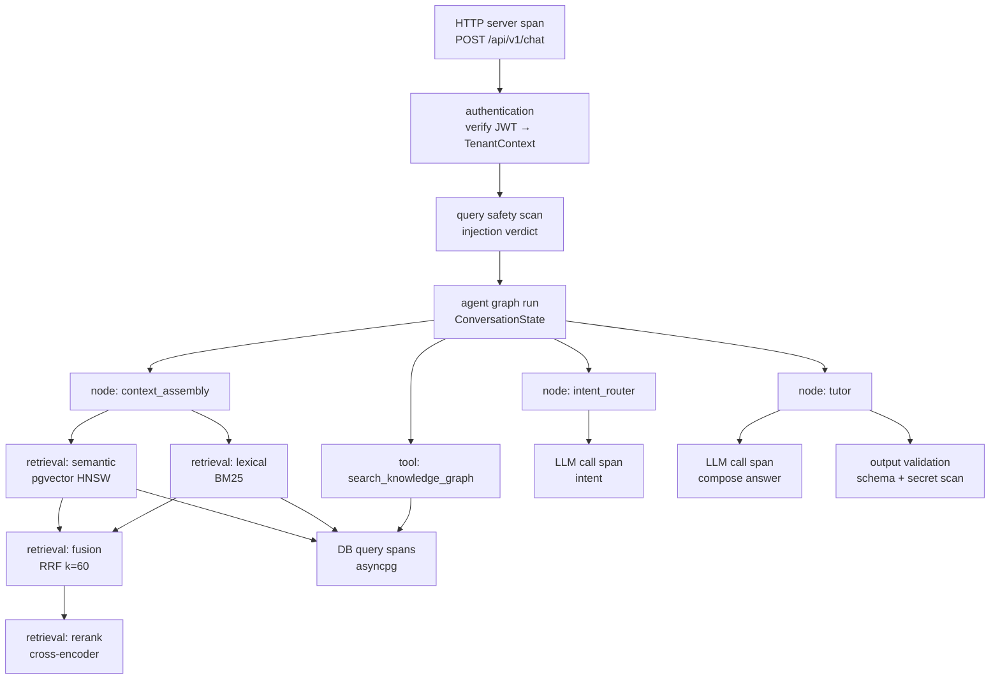

# Observability

> This document specifies how CourseLLM is instrumented: what is traced, what is measured,
> what is logged, what is deliberately redacted, and what a degraded reading looks like.
> It also states, explicitly, what is **not** instrumented.
>
> Nothing in this document should be read as a claim that a metric was measured, a
> dashboard exists, or an alert has fired. The dashboards in §8 are a specification
> (Grafana or CloudWatch) and are not claimed to be deployed. Numbers quoted anywhere in
> the repository come from a run artefact under `evals/reports/`; nothing else counts.

---

## 1. Three pillars and what we actually instrument

| Pillar | Instrumented | Not instrumented | Why the boundary sits here |
|--------|--------------|------------------|----------------------------|
| **Traces** | HTTP server span, authentication, agent graph run, per-node spans, retrieval (semantic, lexical, fusion, rerank), DB query spans, LLM call spans, ingestion job spans | Browser-side RUM, VPC flow logs, provider-internal queue time | Traces answer "which layer was slow"; the browser and the provider's internals are outside our control boundary and would add noise without an actionable lever |
| **Metrics** | Request counts, error rates, per-layer latency histograms, token usage, cost, fallback and degradation rates, retrieval candidate counts, reranker score distribution, evaluation scores, cache hit ratio, active graph runs | Per-tenant business KPIs (enrolment, completion), provider status beyond our own error rate | Metrics must be bounded-cardinality and cheap; business KPIs are answered from the database, not from a metrics backend |
| **Logs** | Structured JSON application logs with trace/request/tenant correlation, security events, degradation decisions, migration and startup events | Raw prompts, document text, PII, tool argument values | Logs are the searchable narrative; they must never become the place student content leaks (§6) |

Honest scope statement: the instrumentation described here is **specified** in the code
layout and configuration reference. Per-layer span emission for retrieval, rerank, graph
nodes, and LLM calls is the target; where a layer is named below it is a requirement on
that layer, not a report of an existing export.

---

## 2. OpenTelemetry

A single OTel SDK is initialised in the API process. Instrumentation is via
`opentelemetry-instrumentation-fastapi`, `-asyncpg`, `-httpx`, plus a manual tracer for the
agent graph and LlamaIndex/LangGraph callbacks. Spans exported over OTLP/HTTP; the
exporter is chosen by `OTEL_TRACES_EXPORTER` (`otlp`, `console`, or `none`).

### 2.1 Span hierarchy



Spans are nested so that duration is *inclusive*: the graph span covers every node, and
each node's span covers its own retrieval, DB, and LLM children. This is what makes a
latency regression attributable — a slow answer is either a slow retriever, a slow
reranker, a slow provider, or a slow query, and the tree distinguishes them without
guesswork.

### 2.2 Span attribute schema

**HTTP server span** (`http.server.request.duration` root)

| Attribute | Type | Example |
|-----------|------|---------|
| `http.request.method` | string | `POST` |
| `http.route` | string | `/api/v1/chat` |
| `http.response.status_code` | int | `200` |
| `url.path` | string | `/api/v1/chat` |
| `coursellm.request_id` | string (uuid) | `9f2c…` |
| `coursellm.stream` | bool | `true` |
| `coursellm.tenant_id` | string (uuid) | `t_4b1…` |
| `coursellm.user_id` | string (uuid) | `u_88a…` |
| `coursellm.config_version` | string | `RETRIEVAL_CONFIG_VERSION` hash |

**Authentication span**

| Attribute | Type | Example |
|-----------|------|---------|
| `auth.method` | string | `jwt` |
| `auth.result` | enum | `ok` \| `expired` \| `invalid_signature` \| `missing` |
| `auth.roles` | string[] | `["student"]` |
| `coursellm.tenant_id` | string (uuid) | `t_4b1…` |

**Agent graph run span**

| Attribute | Type | Example |
|-----------|------|---------|
| `graph.name` | string | `tutor_graph` |
| `graph.intent` | enum | `tutor` \| `planner` \| `recommender` \| `assessment` \| `progress` |
| `graph.steps` | int | `4` |
| `graph.tool_calls` | int | `2` |
| `graph.degraded` | string[] | `["reranker_unavailable"]` |
| `graph.outcome` | enum | `answered` \| `refused` \| `partial` \| `error` |

**Per-node span** (one per node: `intent_router`, `context_assembly`, `tutor`, `planner`, …)

| Attribute | Type | Example |
|-----------|------|---------|
| `graph.node` | string | `tutor` |
| `graph.node.iteration` | int | `1` |
| `graph.node.tool_calls` | int | `1` |
| `graph.node.tokens_in` | int | `2831` |
| `graph.node.tokens_out` | int | `412` |
| `graph.node.retry_count` | int | `0` |

**Retrieval spans** (parent `retrieval`, children `retrieval.semantic`, `retrieval.lexical`, `retrieval.fusion`, `retrieval.rerank`)

| Attribute | Type | Example |
|-----------|------|---------|
| `retrieval.stage` | enum | `semantic` \| `lexical` \| `fusion` \| `rerank` |
| `retrieval.top_k_per_retriever` | int | `RETRIEVAL_TOP_K_PER_RETRIEVER` = 20 |
| `retrieval.candidates_in` | int | `40` |
| `retrieval.candidates_out` | int | `20` |
| `retrieval.rrf_k` | int | `RRF_K` = 60 |
| `retrieval.rerank_top_k` | int | `RERANK_TOP_K` = 5 |
| `retrieval.filters` | string[] | `["tenant_id", "course_id"]` (names only) |
| `retrieval.fused` | int | `20` |
| `retrieval.degraded` | bool | `true` |
| `retrieval.duration_ms` | float | `41.7` |

The reranker never records passage text. It records the score vector and the winning chunk
ids only, which is enough to distinguish a recall failure from a ranking failure
([rag.md](./rag.md) §6) without retaining student content.

**DB query span** (`db.system = postgresql`)

| Attribute | Type | Example |
|-----------|------|---------|
| `db.system` | string | `postgresql` |
| `db.operation.name` | enum | `SELECT` \| `INSERT` \| `UPDATE` |
| `db.collection.name` | string | `chunk_embeddings` |
| `db.query.summary` | string | `SELECT chunk_embeddings … WHERE tenant_id = $1` (parameterised, tenant value redacted) |
| `db.rows_affected` | int | `20` |
| `db.tenant_scoped` | bool | `true` |
| `db.rls_active` | bool | `true` |

**LLM call span** (`gen_ai.*` semantic conventions)

| Attribute | Type | Example |
|-----------|------|---------|
| `gen_ai.system` | string | `openai` |
| `gen_ai.request.model` | string | `gpt-4o-mini` |
| `gen_ai.response.model` | string | `gpt-4o-mini-2024-07-18` |
| `gen_ai.operation.name` | enum | `chat` \| `embeddings` |
| `gen_ai.usage.input_tokens` | int | `2831` |
| `gen_ai.usage.output_tokens` | int | `412` |
| `gen_ai.response.finish_reasons` | string[] | `["stop"]` |
| `coursellm.llm.provider` | string | `openai` |
| `coursellm.llm.cost_usd` | float | `0.00412` |
| `coursellm.llm.retry_count` | int | `1` |
| `coursellm.llm.fallback_used` | bool | `false` |
| `coursellm.llm.cache_hit` | bool | `false` |
| `coursellm.llm.prompt_version` | string | `tutor:p3` |

### 2.3 Redaction defaults and prompt capture

**Redacted by default — never exported as span attributes:**

| Data | Status |
|------|--------|
| Raw prompt text (system or user) | Redacted |
| Document / passage contents | Redacted |
| Model completion text | Redacted |
| PII (names, email addresses, student ids) | Redacted |
| Tool argument *values* | Redacted (argument *names* are retained) |
| `tenant_id` / `user_id` as metric labels | Not emitted as labels (see §5); retained on spans, where cardinality is not a cost problem |
| Credentials, tokens, connection strings | Redacted by the log/span processor filter ([security.md](./security.md) §10) |

**Opt-in prompt capture.** `PROMPT_CAPTURE_ENABLED` (default `false`) attaches prompt and
completion content to spans for debugging. Enabling it writes student document content and
query text to the tracing backend, which changes the data-processing posture of that
backend. It is intended for a local or short-lived debug environment, it logs a warning at
startup when enabled, and it must not be enabled in production without an explicit
decision about the trace store's retention and access controls. The safe default is
metadata-only tracing.

---

## 3. Sampling

**Head-based sampling is the default**, because the decision must be made before the trace
exists and because tail-based sampling requires a collector that buffers every span — an
operational cost not justified at this scale.

| Parameter | Default | Meaning |
|-----------|---------|---------|
| `OTEL_SAMPLE_RATIO` | `0.1` | Parent-based ratio sampler for traced routes |
| `OTEL_TRACES_SAMPLER` | `parentbased_traceidratio` | Standard OTel sampler |
| `OTEL_SAMPLE_RATIO_EVAL` | `1.0` | Evaluation runs are always fully sampled |

**Per-route overrides.**

| Route class | Ratio | Rationale |
|-------------|-------|-----------|
| `/healthz`, `/readyz`, `/metrics` | `0.0` | Volume with no diagnostic value |
| Read-only metadata (`GET /api/v1/courses`, …) | `0.05` | Cheap and high-volume |
| `/api/v1/chat`, graph runs | `0.2` | The path that carries latency and cost; worth 2× the base rate |
| `/api/v1/documents` upload + ingestion | `1.0` | Low volume, failure-prone, and the point where quarantine decisions happen |
| Evaluation runs | `1.0` | Reproducibility requires the full trace |
| Any request that errors | `1.0` | Always-sample-errors |

**Always-sample-errors.** The sampler is wrapped so that a request whose outcome is an
error is recorded regardless of the head decision. In OTel terms this is implemented by
forcing the sampled flag for error spans at the `on_end` boundary of the HTTP span rather
than by switching to tail sampling. The rationale: the traces that matter most for
debugging are the rarest, and a uniform 10% sample systematically under-represents exactly
those. The implementation caveat is stated honestly — the child spans of a request that
fails late may already have been dropped by the head decision, so error traces are
guaranteed at the HTTP-span level and best-effort below it.

---

## 4. LLM-specific instrumentation

Every model call emits an LLM span and a row in the `llm_usage` table. The span is for
latency and causality; the table is for accounting and is the durable record.

| Field | Span attribute | `llm_usage` column | Notes |
|-------|----------------|--------------------|-------|
| Provider | `gen_ai.system` | `provider` | `openai`, `anthropic`, `google` |
| Requested model | `gen_ai.request.model` | `model_requested` | What we asked for |
| Served model | `gen_ai.response.model` | `model_served` | What actually answered; differs on alias rollover |
| Operation | `gen_ai.operation.name` | `operation` | `chat` \| `embeddings` \| `rerank` |
| Input tokens | `gen_ai.usage.input_tokens` | `tokens_in` | Billed input |
| Output tokens | `gen_ai.usage.output_tokens` | `tokens_out` | Billed output |
| Latency | span duration | `latency_ms` | Time to last token |
| Time to first token | — | `ttft_ms` | Streaming quality, separate from total |
| Cost | `coursellm.llm.cost_usd` | `cost_usd` | Computed from a versioned price table |
| Retries | `coursellm.llm.retry_count` | `retry_count` | LiteLLM-level retries |
| Fallback | `coursellm.llm.fallback_used` | `fallback_used` | Primary route failed, secondary answered |
| Cache hit | `coursellm.llm.cache_hit` | `cache_hit` | Exact-match cache; a hit means zero tokens were billed |
| Finish reason | `gen_ai.response.finish_reasons` | `finish_reason` | `stop`, `length`, `content_filter` |
| Prompt version | `coursellm.llm.prompt_version` | `prompt_version` | Which prompt file produced the call |
| Tenant / user | span attributes | `tenant_id`, `user_id` | The billing dimension |

**Why a table and a span.** Spans are sampled and retained briefly; cost accounting must be
complete and queryable per tenant over a billing period. `llm_usage` is authoritative for
cost; the span is authoritative for *where in the request* the cost was incurred. A
`finish_reason = length` at a high rate is a truncation bug in the output cap, not a
provider problem, and it is only visible when the two are read together.

---

## 5. Metrics

Metric names are namespaced `coursellm.*` for domain metrics and follow OTel semantic
conventions for infrastructure metrics. Histograms are the default for anything with a
distribution; counters for events; gauges for current state.

| Metric | Type | Labels | Question it answers |
|--------|------|--------|---------------------|
| `http.server.request.duration` | histogram | `route`, `method`, `status_class` | How slow are requests, by endpoint? |
| `coursellm.requests.total` | counter | `route`, `intent`, `outcome` | How many requests, and what did the agent decide to do? |
| `coursellm.errors.total` | counter | `route`, `error_class` | What is failing, and how? |
| `coursellm.retrieval.duration` | histogram | `stage` (semantic/lexical/fusion), `degraded` | Is retrieval slow, and at which stage? |
| `coursellm.rerank.duration` | histogram | `model`, `timeout` | Is the cross-encoder within budget? |
| `coursellm.llm.duration` | histogram | `model`, `provider`, `operation` | How long does generation take, by model? |
| `coursellm.request.duration` | histogram | `route`, `intent` | End-to-end latency (totals the layers) |
| `coursellm.llm.tokens` | counter | `model`, `direction` (in/out) | How many tokens are we spending, and on what? |
| `coursellm.llm.cost_usd` | counter | `model`, `provider` | What is it costing? |
| `coursellm.llm.fallback.total` | counter | `from_model`, `reason` | How often is the primary model unavailable? |
| `coursellm.llm.retries.total` | counter | `model`, `reason` | Are retries masking a provider problem? |
| `coursellm.degraded.total` | counter | `reason` | Which degradation paths are firing? |
| `coursellm.retrieval.candidates` | histogram | `stage`, `retriever` | Are the retrievers returning healthy candidate sets? |
| `coursellm.rerank.score` | histogram | `model` | Is the reranker discriminating, or returning a flat distribution? |
| `coursellm.eval.score` | gauge | `metric` (faithfulness, recall@20, nDCG@5, …), `dataset_version` | Is quality trending up or down? |
| `coursellm.cache.hit_ratio` | counter → ratio | `cache` (retrieval/embedding/llm) | Is the cache effective, or is it thrashing? |
| `coursellm.graph.runs.active` | gauge | — | How many graph runs are in flight? |
| `coursellm.graph.steps` | histogram | `intent` | Are runs looping more than they should? |
| `coursellm.injection.verdicts` | counter | `verdict`, `class` | What is the attack surface doing? |
| `coursellm.ingestion.jobs` | counter | `state` (queued/running/failed/quarantined) | Is ingestion healthy? |

### High-cardinality warning

**No metric label may be an unbounded value.** Specifically, the following are forbidden as
labels: `user_id`, `tenant_id`, `request_id`, `trace_id`, `query_text`, `document_id`,
`course_id`, `conversation_id`, `chunk_id`, `email`, `url`, and any raw error message.
Each of these multiplies the series count by the size of the population and turns a cheap
counter into a memory and cost problem in the metrics backend. The same information is
available where it belongs: on spans (sampled, high cardinality is acceptable) and in logs
(searchable by `trace_id`).

**Allowed label set.** `route`, `method`, `status_class`, `intent`, `outcome`,
`error_class`, `stage`, `retriever`, `model`, `provider`, `operation`, `direction`,
`reason`, `cache`, `verdict`, `class`, `state`, `dataset_version`, `metric`, `env`,
`service_version`. Every label value is drawn from a closed enumeration checked in code.

---

## 6. Structured logging

Logs are single-line JSON on stdout, collected by the platform (CloudWatch Logs in AWS).
Format is fixed by a structlog-style processor chain; no `print` and no free-form string
interpolation in application code.

**Required fields on every record:**

| Field | Purpose |
|-------|---------|
| `timestamp` | ISO-8601 UTC |
| `level` | `debug` \| `info` \| `warning` \| `error` \| `critical` |
| `logger` | Module path |
| `message` | Short, constant-ish, greppable event name plus a rendered summary |
| `trace_id` / `span_id` | Correlates the log line to the trace (from the active OTel span context) |
| `request_id` | Stable per HTTP request even when the trace is unsampled |
| `tenant_id` | Present on every tenant-scoped operation |
| `user_id` | Present where a user acted |
| `service`, `service_version`, `env` | Deployment identity |
| `config_version` | `RETRIEVAL_CONFIG_VERSION`, so a behaviour change is attributable |

`trace_id` is the join key between all three pillars: a log line names the trace, the trace
names the spans, and the metrics point at the route. A request with an unsampled trace
still has `request_id`, which is why it is a separate field rather than derived.

**Log levels.**

| Level | What belongs here | Examples |
|-------|-------------------|----------|
| `debug` | Verbose diagnostic detail, off in production | Raw filter extraction decisions, cache key computation, span attribute dumps (redacted) |
| `info` | Normal lifecycle and business events worth counting | Request start/end summary, retrieval stage completion, degradation chosen with reason, ingestion job state transitions, migration applied |
| `warning` | Something recoverable happened and a fallback was taken | Reranker timeout → RRF order, provider retry succeeded, cache unavailable, rate limit failing open, invalid output repaired on first attempt |
| `error` | The request or job could not deliver its intended result | All retrieval paths failed, provider exhausted after fallback, schema validation failed twice, DB error, ingestion failed |
| `critical` | The process is in an unsafe state and should not continue | Startup secret check failed in production, RLS GUC could not be set, migration revision mismatch |

**Never logged (explicit list):**

- Raw prompt text, system prompt contents, or prompt file bodies
- Document or chunk content, filenames that contain student names, extracted text
- Model completions (beyond length and finish reason)
- Credentials, API keys, authorization headers, JWTs, connection strings, signed URLs
- Email addresses, student names, student ids, or any other direct identifier
- Tool argument values (tool name and argument names are logged; values are not)
- Full request or response bodies

Enforcement is at emit time: the logging processor runs the same redaction filter as the
span processor, so a developer who logs a forbidden field gets a redacted value rather
than a leak. Redacting at read time would be too late — the log store is the leak.

---

## 7. LangSmith

**What it adds beyond OTel.** OTel is a general distributed-tracing standard; it models a
span and a duration well and a prompt poorly. LangSmith is LLM-native: it renders prompt
and completion structure, groups runs into datasets, runs the same dataset against two
configurations and presents a scored comparison, and evaluates traces with LLM-as-judge.
The division of labour is deliberate — OTel answers "where did the 6 seconds go", LangSmith
answers "did this prompt change make the answers better".

| Capability | OTel | LangSmith |
|------------|------|-----------|
| Cross-service latency attribution | Yes | Partial |
| Infra/service spans (DB, Redis, HTTP) | Yes | No |
| Prompt/response structure and diffing | No | Yes |
| Dataset versioning and experiment comparison | No | Yes |
| LLM-as-judge evaluation runs | No | Yes |
| Cost/token rollups per model and prompt version | Manual | Yes |

**How it is enabled.** Env-gated and off by default:

| Variable | Default | Meaning |
|----------|---------|---------|
| `LANGSMITH_TRACING` | `false` | Master switch |
| `LANGSMITH_API_KEY` | (unset) | Required when tracing is on; read from Secrets Manager, never committed |
| `LANGSMITH_PROJECT` | `coursellm-local` | Project name |
| `LANGSMITH_ENDPOINT` | SaaS default | Self-hosted endpoint if required |

When off, the LangSmith callback is not registered and no network calls are made — the
W3C `traceparent` context is still propagated through OTel, so LangSmith and OTel traces
can be correlated by trace id when both are active.

**What is traced.** Agent graph runs, each node, each tool call, each LLM call, and the
retrieval/rerank chain, as nested runs with the same naming as the OTel span tree. Prompts
and completions *are* sent to LangSmith when it is enabled — that is the point of the tool
— which is precisely why it is off by default and why the environment it runs in must be
chosen deliberately. It is not enabled in the default production configuration.

**Run and project naming convention.**

```
project:  coursellm-{env}                 # coursellm-dev, coursellm-prod
run name: {graph}:{node}:{prompt_version}:{config_version}
example:  tutor_graph:tutor:p3:v7
```

`prompt_version` comes from the prompt file's front matter; `config_version` is
`RETRIEVAL_CONFIG_VERSION`. Every evaluated run therefore records the exact prompt and
retrieval configuration that produced it, which is the same property
[rag.md](./rag.md) §10 requires of evaluation runs.

---

## 8. Dashboards

**This is a panel specification, not a deployed dashboard.** It is written to be
translated into Grafana (Prometheus/OTLP data source) or CloudWatch (EMF metrics from the
OTLP collector). No dashboard is claimed to exist.

| # | Panel | Source metric | Healthy | What a bad reading looks like, and what it indicates |
|---|-------|---------------|---------|------------------------------------------------------|
| 1 | RAG requests | `coursellm.requests.total` by `intent` | Steady or smoothly varying | Sudden step down → client/edge or auth break; flat zero → traffic path broken upstream; step up with cost panel flat → cache gone |
| 2 | P50/P95 latency by layer | `coursellm.retrieval.duration`, `coursellm.rerank.duration`, `coursellm.llm.duration`, `coursellm.request.duration` | Each layer stable; total ≈ sum + small overhead | One layer's P95 rising while others are flat localises the regression; total rising with all layers flat points at orchestration or queueing |
| 3 | LLM latency by model | `coursellm.llm.duration` by `model` | Per-model baselines | One model's P95 rising is a provider issue; all models rising in lockstep is network or egress, not the provider |
| 4 | Token usage | `coursellm.llm.tokens` by `direction` | Proportional to request volume | Input tokens rising at flat request volume → context assembly is over-packing; output tokens near the cap → truncation |
| 5 | Estimated cost | `coursellm.llm.cost_usd` | Within the per-hour budget line | Cost rising faster than requests → a more expensive model is being selected by fallback or routing; a step change at a deploy → prompt or cap change |
| 6 | Error rate | `coursellm.errors.total` / `coursellm.requests.total` by `error_class` | < 1% | A single `error_class` dominating is a bug; uniform 5xx is infrastructure; 4xx rise is a client contract break |
| 7 | Fallback rate | `coursellm.llm.fallback.total` by `from_model` | < 2% steady | A step up is a provider degradation; sustained > 10% means the primary model is effectively not in service |
| 8 | Degradation reasons | `coursellm.degraded.total` by `reason` | Mostly zero; `reranker_unavailable` rare | `lexical_only` sustained → vector index or embedding path broken; `reranker_unavailable` rising → memory pressure or timeout; any sustained non-zero deserves a look |
| 9 | Evaluation score trend | `coursellm.eval.score` by `metric`, `dataset_version` | Flat or improving across runs | A drop after a prompt/config change with latency flat is a quality regression that no runtime metric would catch; a drop confined to `dataset_version` change means the dataset moved, not the system |
| 10 | Retrieval candidate counts | `coursellm.retrieval.candidates` | Semantic and lexical both near `RETRIEVAL_TOP_K_PER_RETRIEVER` | Mean semantic candidates collapsing below the limit while latency improves is the classic ANN post-filter bug — recall is failing silently |
| 11 | Reranker score distribution | `coursellm.rerank.score` | Bimodal, clear separation between top and tail | A flat distribution means the reranker is not discriminating — likely a model/tokeniser mismatch, and RRF would be no worse |
| 12 | Cache hit ratio | `coursellm.cache.hit_ratio` by `cache` | Stable and non-zero for retrieval/embeddings | A sudden drop with a flat query mix means cache keys changed (usually a `RETRIEVAL_CONFIG_VERSION` bump) or Redis was evicted |
| 13 | Injection verdicts | `coursellm.injection.verdicts` by `verdict`, `class` | Mostly `allow` | A spike in `refuse` for one tenant is either an attack or a false-positive regression; a new `class` appearing means the detector changed or the attacker did |

---

## 9. Alerting

Alerts are specified with a threshold, a window, and a rationale. Alert thresholds are
tuned to be actionable: an alert that fires on normal variance is an alert that gets
muted.

| Alert | Condition | Window | Severity | Rationale |
|-------|-----------|--------|----------|-----------|
| API error rate | `errors.total / requests.total > 2%` on `/api/v1/*` | 10 min | page | Users are seeing failures; 2% is above normal noise for a read-heavy API |
| Total latency | P95 `coursellm.request.duration > 8s` | 15 min | page | The interactive budget for a tutor answer; beyond this the product is unusable even if correct |
| Retrieval latency | P95 `coursellm.retrieval.duration > 1.5s` | 15 min | ticket | Retrieval should be tens of milliseconds; this is early warning before total latency degrades |
| LLM fallback rate | `fallback.total / llm.duration count > 10%` | 10 min | page | The primary model is effectively out of service; the system is degrading for everyone |
| Degradation rate | `degraded.total / requests.total > 25%` | 15 min | page | A degradation path is not a fallback any more, it is the operating mode |
| Cost burn | `llm.cost_usd` per hour > `COST_ALERT_USD_PER_HOUR` | 1 h | page | Denial-of-wallet and ordinary cost regression look identical at the budget line; both need a human |
| Tenant budget | `llm_usage` daily spend > 80% of `TENANT_DAILY_TOKEN_BUDGET` | 1 h | ticket | Warn before the hard cap refuses a paying tenant's requests |
| Reranker timeouts | `rerank.duration{timeout="true"}` rate > 20% | 15 min | ticket | Retrieval quality is silently degrading to RRF order |
| Retrieval candidate collapse | mean `retrieval.candidates{stage="semantic"} < 5` | 30 min | ticket | Recall is failing while latency looks healthy — the failure mode [rag.md](./rag.md) §3 warns about |
| Evaluation regression | `eval.score{metric="faithfulness"}` drops > 0.05 vs the previous run | per run | ticket | Quality regression that no runtime metric detects |
| Security event | any `policy_violation` or `secret_redaction` event, or cross-tenant assertion failure | immediate | page | Zero tolerance: these are not statistical events, each one is a defect |
| Injection spike | `injection.verdicts{verdict="refuse"}` > 20× the 7-day baseline for a tenant | 30 min | ticket | Either an attack campaign or a detector regression; both need investigation |
| DB pool saturation | pool in-use / pool size > 90% | 15 min | page | Saturation precedes timeouts and is the leading indicator of a connection leak |
| Ingestion failures | `ingestion.jobs{state="failed"}` rate > 10% | 30 min | ticket | Uploads are silently not becoming retrievable |
| Migration mismatch | `alembic current` != head at startup | immediate | page | The running code and the schema disagree; every query is suspect |

---

## 10. Local development

Tracing is opt-in locally. The default developer experience makes no network calls.

**1. Tracing off (default).**

```bash
OTEL_ENABLED=false docker compose up
```

The OTel SDK is initialised with a no-op tracer provider. Spans are created and discarded;
no exporter, no collector, no latency. This is the right default for unit tests and for
ordinary feature work.

**2. Console exporter — see the span tree without infrastructure.**

```bash
OTEL_ENABLED=true OTEL_TRACES_EXPORTER=console docker compose up api
```

Spans are pretty-printed to stdout with their attributes. Useful for verifying that a new
node emits the right attributes and that redaction is working (a forbidden attribute
appears as the redaction placeholder). Note that console output is a log stream: with
`PROMPT_CAPTURE_ENABLED=false` it contains no student content, and the two flags should not
be enabled together outside a throwaway container.

**3. OTLP collector — full local pipeline.**

```bash
docker compose --profile otel up
```

The `otel` profile adds an OpenTelemetry Collector and a trace UI (Jaeger all-in-one or
Grafana Tempo, both acceptable local choices). Relevant endpoints:

| Service | Port | Purpose |
|---------|------|---------|
| `api` | `8000` | FastAPI |
| `web` | `5173` | Vite dev server |
| `postgres` (pgvector) | `5432` | Database |
| `redis` | `6379` | Cache and rate limits |
| `otel-collector` | `4317` / `4318` | OTLP gRPC / HTTP ingest |
| `otel-collector` | `8889` | Prometheus scrape of collector metrics |
| trace UI | `16686` | Trace search and waterfall |

Point the API at the collector with
`OTEL_EXPORTER_OTLP_ENDPOINT=http://otel-collector:4318` and set
`OTEL_SAMPLE_RATIO=1.0` locally — sampling exists to control cost at volume, and locally
every trace is worth keeping. The collector is a development convenience and is not part
of the production topology; in AWS the same OTLP endpoint is served by an ADOT collector
sidecar (§10 of [deployment.md](./deployment.md)).
