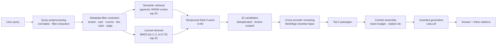

# Advanced RAG

This document specifies the retrieval-augmented generation pipeline: what each stage
does, why it exists, the exact parameters, and how each stage is measured.

---

## 1. Pipeline



Each stage is independently testable and independently degradable. If a stage fails,
the pipeline degrades rather than aborting (§7).

---

## 2. Stage 1 — Query preprocessing

Deterministic, LLM-free, cheap, and therefore safe to run in front of every request.

1. **Normalise** — Unicode NFKC, collapse whitespace, strip control characters,
   truncate to `MAX_QUERY_CHARS` (2000).
2. **Safety scan** — injection detection runs *before* retrieval so a hostile query
   never reaches the LLM (see `docs/architecture/security.md`). The scan does not
   mutate the query used for retrieval; it only raises the threat verdict.
3. **Metadata filter extraction** — cheap patterns resolve the common cases without a
   model call:
   - `"in lecture 5"` / `"page 12"` → `page = 12`
   - `"in CS229"` / explicit `course_id` parameter → `course_id`
   - topic phrases matched against the tenant's known topic list.
   Anything unresolved is left to the intent router, which may emit filters as part
   of structured agent output. This is a deliberate split: high-frequency patterns are
   handled deterministically, and only the residue costs a model call.
4. **Query expansion is *not* performed by default.** HyDE and multi-query expansion
   add latency and variance; they are behind a config flag and are only enabled after
   an evaluation run shows a recall gain that justifies the cost.

---

## 3. Stage 2a — Semantic retrieval (pgvector + HNSW)

```sql
SELECT c.id, c.document_id, c.content, c.page, c.topic,
       e.embedding <=> :query_vec AS distance
FROM   chunk_embeddings e
JOIN   chunks  c ON c.id = e.chunk_id
WHERE  e.tenant_id = :tenant_id          -- tenancy INSIDE the scan
  AND  e.embedding_model = :model        -- vector-space guard
  AND  (:course_id IS NULL OR c.course_id = :course_id)
  AND  (:document_id IS NULL OR c.document_id = :document_id)
  AND  (:topic IS NULL OR c.topic = :topic)
ORDER BY e.embedding <=> :query_vec
LIMIT  :k;
```

**Index:**

```sql
CREATE INDEX idx_chunk_embeddings_hnsw
  ON chunk_embeddings
  USING hnsw (embedding vector_cosine_ops)
  WITH (m = 16, ef_construction = 64);
```

`m = 16` and `ef_construction = 64` are the pgvector defaults. They are stated
explicitly rather than left implicit, and `hnsw.ef_search` is set per session
(default 100) so the recall/latency trade-off is tunable without a rebuild.

### Why the tenant predicate is inside the scan

pgvector performs an approximate nearest-neighbour search. Two properties matter:

- **`WHERE` clauses that are ordinary scalar predicates are applied by the planner
  before or during the index scan** when an appropriate index exists, so the ANN search
  explores the tenant's rows rather than the whole table.
- **Filtering *after* the ANN scan is incorrect**, because the scan returns the global
  top-K first and only then discards other tenants' rows. If tenant A owns 1% of the
  corpus, a post-filtered `LIMIT 20` typically yields far fewer than 20 rows — in the
  worst case zero — because the global neighbours overwhelmingly belong to other
  tenants. Recall silently collapses while latency looks fine.

Two things are required together:

1. **The tenant predicate must be in the SQL the application issues.** Application-side
   filtering after the query removes the information the planner needs to choose a safe
   plan, and guarantees the failure measured below.
2. **A B-tree index on `(tenant_id, embedding_model)` must exist** so that the planner
   has a non-ANN alternative for a selective tenant filter. This is the mitigation that
   actually works, and it works precisely because the choice belongs to the planner
   rather than to the application.

### Measured behaviour, and a correction to an earlier claim

The following was **measured** on PostgreSQL 18.4 with pgvector 0.8.2, not assumed.
Corpus: 35,250 vectors across three tenants, of which the tenant under test owns 50
(0.14%). The query requests `LIMIT 20`.

| Strategy | Rows returned for the 50-vector tenant |
|---|---|
| Global ANN, filtered in application code | **0** |
| Tenant predicate in the query, planner free to choose | **20** |
| Tenant predicate in the query, ANN path **forced** (`enable_sort = off`) | **0** |
| Forced ANN path **plus** `hnsw.iterative_scan = strict_order` | **0** |
| Forced ANN path plus `iterative_scan = relaxed_order`, `max_scan_tuples = 40000` | **0** |
| Forced ANN path, same query against a tenant owning 30,200 of the vectors | 20 |

Rows three to five correct an earlier version of this document, which stated that
`hnsw.iterative_scan = strict_order` keeps the scan going until `LIMIT` rows are found.
**It does not, for a highly selective scalar filter, in pgvector 0.8.2.** The plan shows
the mechanism:

```text
Index Scan using ix_chunk_embeddings_hnsw_cosine on chunk_embeddings e
  Order By: (embedding <=> '...'::vector)
  Filter: (tenant_id = '55555555-...'::uuid)
```

The tenant predicate is applied as a **filter during** the ANN scan. If the tenant's
rows are not in the graph neighbourhood the scan explores, no `ef_search` value and no
iterative mode produces them. The last row of the table is the control: the same forced
plan works when the tenant's vectors *are* the neighbourhood.

Two consequences follow, and they are the reason the design is what it is:

* Recall for a small tenant is protected by **the planner declining to use the ANN
  index**. It declines because the tenant predicate is a plain equality on an indexed
  column and the exact alternative is cheaper. The `(tenant_id, embedding_model)`
  index is therefore load-bearing, not redundant next to HNSW; removing it as
  "unused because we have an ANN index" would silently reintroduce a zero-recall bug.
* `LIMIT k` means *k rows belonging to this tenant* only because the predicate is in the
  query. The application never filters results after retrieval.

At a scale where the exact fallback becomes too slow — hundreds of millions of vectors,
or a tenant slice large in absolute terms — the correct answers are per-tenant partial
HNSW indexes or `PARTITION BY tenant_id` with a local index per partition, not a larger
`ef_search`. That threshold is recorded in
[ADR-0002](../decisions/ADR-0002-postgres-pgvector-single-datastore.md) as the trigger
to revisit rather than being implemented speculatively.

`apps/api/tests/integration/test_tenant_isolation.py` asserts the tenant-visible
outcome with an adversarial corpus in which a decoy tenant dominates the table.

### Embeddings and vector-space integrity

Chunks do not store a bare `vector` column; embeddings live in `chunk_embeddings`
keyed by `(chunk_id, embedding_model, dim)`. This makes the vector space an explicit
part of the key:

- Retrieval filters on `embedding_model`, so a query embedded by model *B* can never be
  compared against vectors produced by model *A*.
- A model upgrade is a migration, not a silent corruption: backfill the new model's
  rows, flip `EMBEDDING_MODEL`, and keep the old rows until the rollback window closes.
- Re-indexing strategy is documented in
  [ADR-0006](../decisions/ADR-0006-embedding-model-versioning.md).

---

## 4. Stage 2b — Lexical retrieval (BM25)

`ts_rank` is **not** BM25. It has no term-frequency saturation, no document-length
normalisation, and no inverse-document-frequency component, so a long document that
repeats a rare term does not score the way BM25 ranks it. The prototype used
`ts_rank`; this version implements BM25 explicitly.

### Scoring

For query terms $q_1..q_n$ over document $d$:

$$
\text{score}(d) = \sum_{i=1}^{n} \text{IDF}(q_i) \cdot
\frac{f(q_i, d) \cdot (k_1 + 1)}
     {f(q_i, d) + k_1 \cdot \left(1 - b + b \cdot \frac{|d|}{\text{avgdl}}\right)}
$$

with

$$
\text{IDF}(q_i) = \ln\!\left(1 + \frac{N - n(q_i) + 0.5}{n(q_i) + 0.5}\right)
$$

where $N$ is the number of chunks in the tenant, $n(q_i)$ the number of chunks
containing $q_i$, $f(q_i,d)$ the term frequency in $d$, $|d|$ the chunk length in
tokens, and `avgdl` the tenant mean chunk length. Defaults `k1 = 1.2`, `b = 0.75`
(the standard Okapi values).

### Storage

| Table | Columns | Purpose |
|-------|---------|---------|
| `chunk_terms` | `chunk_id, tenant_id, term, tf` | Per-chunk term frequencies (PK `chunk_id, term`; B-tree on `tenant_id, term`) |
| `tenant_lexical_stats` | `tenant_id, term, doc_freq` | Document frequency per term, per tenant |
| `tenant_corpus_stats` | `tenant_id, doc_count, avg_doc_len, total_tokens` | Corpus-level constants |

Candidate selection is served by a B-tree index on `(tenant_id, term)`, and the query
predicate is an equality against an array of terms:

```sql
WITH candidates AS (
    SELECT ct.chunk_id, ct.term, ct.tf
    FROM   chunk_terms ct
    WHERE  ct.tenant_id = :tenant_id
      AND  ct.term = ANY(:query_terms)
)
SELECT ...
```

**Why a stored bag-of-words table rather than `tsvector` and `to_tsvector`.** Two
reasons, and the second is the important one.

1. BM25 needs term frequencies, document length and corpus-level document frequencies.
   A `tsvector` stores lexemes with positions but not the per-tenant document-frequency
   statistics a score requires, so those tables would be needed either way.
2. Tokenisation must be **identical** at index time and query time. Using PostgreSQL's
   `english` configuration would put that symmetry out of reach of the application: the
   analyser's stemming and stopword list become a property of the database
   configuration, so a `search_path`, extension upgrade or locale change could alter it
   without a code change. Analysing in Python makes the symmetry a unit-tested
   property.

The analyser deliberately does **no stemming** and preserves identifier characters, so
`ef_construction`, `bge-reranker-base`, `gpt-4o` and `c++` each survive as a single
term. That is the point of having lexical retrieval at all: dense vectors blur exactly
these tokens, and a stemmer would fold `HNSW` and a related word together while
splitting nothing useful.

Terms are produced by the same analyser at index and query time (Unicode NFKC
normalisation, lowercasing, stopword removal), so the term sets are comparable by
construction: `normalize_query` is literally `tokenize_for_index`. A query consisting
only of stopwords therefore yields no terms, and the lexical retriever reports
`empty_query_terms` rather than searching for terms the index cannot contain. (An
earlier version fell back to the unfiltered tokens, which made the two analysers
differ and forced callers to re-filter.)

### Why BM25 at all, given embeddings?

Embeddings are good at *meaning* and bad at *identifiers*. A student asking about
`HNSW`, `ef_construction`, `BCEWithLogitsLoss`, or `eq. 4.2` needs exact-term matching
that a dense vector blurs. BM25 covers rare, high-information tokens; the dense
retriever covers paraphrase and synonymy. They fail in different ways, which is
precisely why fusing them beats either alone.

### Why BM25 statistics are per-tenant

Document frequency must be computed over the corpus that retrieval is allowed to
return. Using global statistics would leak information about other tenants'
vocabularies into IDF, which is both a correctness problem and a subtle
cross-tenancy information leak. Statistics are therefore keyed by `tenant_id`.

---

## 5. Stage 3 — Reciprocal Rank Fusion

```python
def rrf(rank_lists: list[list[str]], k: int = 60) -> dict[str, float]:
    scores: dict[str, float] = {}
    for ranks in rank_lists:
        for rank, doc_id in enumerate(ranks, start=1):
            scores[doc_id] = scores.get(doc_id, 0.0) + 1.0 / (k + rank)
    return scores
```

Implemented in `apps/api/src/coursellm/rag/fusion/rrf.py`; `k` defaults to 60 and is
configurable through `RRF_K`.

**Why RRF instead of a weighted score sum.** The prototype normalised both result sets
with min–max scaling and combined them as `0.7 * semantic + 0.3 * keyword`. That has
three defects:

1. **Min–max normalisation is corpus-dependent.** Scores are rescaled by the best and
   worst candidates *in that result set*, so adding one outlier changes every other
   document's contribution. The ranking is not stable under a changing candidate pool.
2. **Cosine distance and BM25 are not on comparable scales.** Any fixed weight between
   them is arbitrary and does not transfer across queries, corpora, or models.
3. **The prototype's inversion was applied inconsistently** — semantic distances were
   inverted after normalisation while keyword scores were not, and the "score" field of
   a chunk present in both lists was overwritten rather than accumulated.

RRF needs only *ranks*, which are ordinal and therefore scale-free. It is the standard
fusion method for exactly this reason, and the constant `k = 60` comes from the
original TREC work (Cormack et al., 2009), where it was shown to be near-optimal across
collections. `k` is configurable because it interacts with list length.

**Deduplication.** A chunk appearing in both lists contributes both terms, so
agreement between the two retrievers is rewarded. Each chunk keeps its per-retriever
rank for explainability, and the RRF score is persisted in the trace.

---

## 6. Stage 4 — Cross-encoder reranking

**Model:** `BAAI/bge-reranker-base` (configurable via `RERANKER_MODEL`).

**Why a cross-encoder.** Both the bi-encoder (embedding) and BM25 score the query and
the passage *independently*: the bi-encoder pools the passage into a vector before it
ever sees the query. A cross-encoder concatenates `[query, passage]` and runs full
self-attention across both, so every query token can attend to every passage token.
That is strictly more expressive and measurably more precise — at a cost of one forward
pass per candidate, which is why it is applied only to the fused top-N.

**Parameters:**

| Parameter | Value | Rationale |
|-----------|-------|-----------|
| `RETRIEVAL_CANDIDATES` (N) | 20 | Each retriever contributes 20; after fusion the pool is capped at 20 for reranking. |
| `RERANK_TOP_K` | 5 | Passed to the generator. Enough context for a synthesis answer, small enough to keep the prompt focused and cheap. |
| `max_length` | 512 | Model limit; BGE was trained at 512. |
| `batch_size` | 16 | Bounded to keep peak memory predictable on CPU. |
| `RERANK_TIMEOUT_MS` | 5000 | A slow reranker must not hold the request; on timeout we fall back to RRF order. |

**Why N=20 → k=5.** Reranking is a precision filter over a high-recall candidate set.
20 is a practical point where recall from the fused stage is already high for the
corpus sizes involved, while 20 forward passes stay within the latency budget
(measured in `evals/reports/`). Passing 5 to the generator limits context dilution:
recall keeps rising with k, but precision and faithfulness fall once irrelevant
passages enter the window.

**Explainability.** The reranker score for every candidate is retained, so the API can
return *why* a source was surfaced, and evaluation can distinguish "the right document
was never retrieved" (a recall failure) from "the right document was retrieved but
ranked below the cut" (a ranking failure). These require different fixes.

**Fallbacks.** If the model cannot be loaded, errors, or exceeds the timeout, the
system falls back to the RRF ordering and marks the response
`degraded: ["reranker_unavailable"]`. It never fails the request.

---

## 7. Stage 5 — Context assembly and citations

1. Candidates are ordered by reranker score.
2. Passages are packed until the token budget (`CONTEXT_TOKEN_BUDGET`, default 3000)
   is reached, measured with the generation model's tokeniser.
3. Adjacent chunks from the same document are merged when they overlap, so the model
   sees continuous prose instead of duplicated seams.
4. Each passage is assigned a stable citation id (`[S1]`, `[S2]`, …) carrying
   `document_id`, `page`, `chunk_id`, `source_type`, and a provenance URL where one exists.
5. The prompt receives evidence in a **delimited, untrusted-content region**; the model
   is instructed to cite ids and to refuse when evidence is insufficient.
6. After generation, cited ids are extracted from the answer. A citation that does not
   resolve to a retrieved passage is dropped and counted as a **citation hallucination**
   metric. Answers with zero citations and zero refusal are flagged for review.

---

## 8. Grounding and refusal policy

The system prompt establishes three rules, in order of precedence:

1. If the retrieved evidence answers the question, answer it and cite `[Sn]`.
2. If the evidence is partial, say what is supported and state explicitly what is not.
3. If the evidence does not cover the question, say so. **Do not answer from parametric
   memory.** The response is marked `grounded: false` and the UI offers to search
   external sources instead.

Rule 3 is enforced by testing, not just by prompting: `apps/api/tests/integration/test_grounding.py` runs
out-of-corpus questions and asserts that the system reports insufficient evidence
rather than emitting a confident answer.

---

## 9. Metadata filtering

Filterable dimensions, all tenant-scoped:

| Dimension | Source | Notes |
|-----------|--------|-------|
| `tenant_id` | Auth context | Not user-supplied. Applied to every query. |
| `user_id` | Auth context | Narrows to a user's own uploads within their tenant. |
| `course_id` | Parameter or query pattern | Composite index with `tenant_id`. |
| `document_id` | Parameter | |
| `topic` | Chunk metadata, extracted at ingest | |
| `page` | Query pattern (`"page 12"`) | |
| `source_type` | Document metadata | `lecture`, `paper`, `book`, `syllabus`, … |
| `created_after` | Document metadata | Freshness filtering. |

Filters are pushed into both retrievers, not applied after fusion, so both rank lists
are drawn from the same eligible set and RRF combines comparable rankings.

---

## 10. Configuration reference

| Variable | Default | Meaning |
|----------|---------|---------|
| `EMBEDDING_MODEL` | `BAAI/bge-small-en-v1.5` | Embedding model id, recorded per vector. The `local` provider is the default; `hashing` is the deterministic CI substitute. |
| `EMBEDDING_DIM` | `384` | Must match the model, and must equal the dimension the migration created. A mismatch is a startup error, not a silent vector-space corruption. |
| `RETRIEVAL_TOP_K_PER_RETRIEVER` | `20` | Candidates per retriever before fusion. |
| `RRF_K` | `60` | RRF constant. |
| `RERANK_ENABLED` | `true` | |
| `RERANKER_MODEL` | `BAAI/bge-reranker-base` | |
| `RERANK_TOP_K` | `5` | Passages passed to the generator. |
| `RERANK_TIMEOUT_MS` | `5000` | |
| `CONTEXT_TOKEN_BUDGET` | `3000` | |
| `HYBRID_LEXICAL_WEIGHT_ENABLED` | `false` | RRF is rank-based; weights are off by default. |
| `BM25_K1` / `BM25_B` | `1.2` / `0.75` | Okapi parameters. |
| `HNSW_EF_SEARCH` | `100` | Session-level recall/latency knob. |

Retrieval configuration is hashed into `RETRIEVAL_CONFIG_VERSION`. The hash forms part
of the cache key and is recorded on every evaluation run, so a change in retrieval
behaviour can never be attributed to a stale cache or an unrecorded config drift.

---

## 11. How this pipeline is measured

Every stage has a corresponding metric on the golden dataset
(`evals/datasets/golden_rag.jsonl`):

| Stage | Metric |
|-------|--------|
| Semantic retriever | Recall@20 |
| Lexical retriever | Recall@20 |
| Fused (RRF) | Recall@10, MRR |
| After reranking | Context Precision, Context Recall, nDCG@5 |
| Generation | Faithfulness, Answer Relevance, Answer Correctness |
| Citations | Citation precision, citation hallucination rate |
| System | P50/P95 latency per stage, tokens, cost, error and fallback rate |

Measured numbers are published in [`evals/reports/`](../../evals/README.md) and are
reproducible with `make eval`. No metric is quoted in the README unless a run artefact
in `evals/reports/` produced it.
