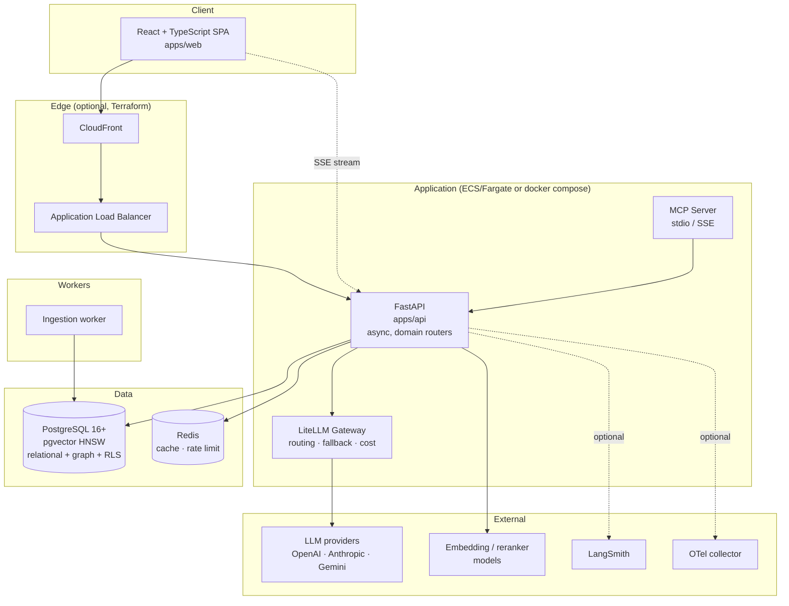
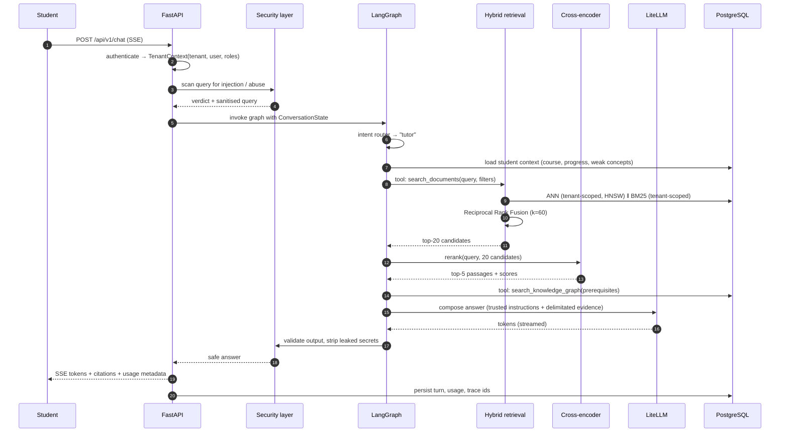
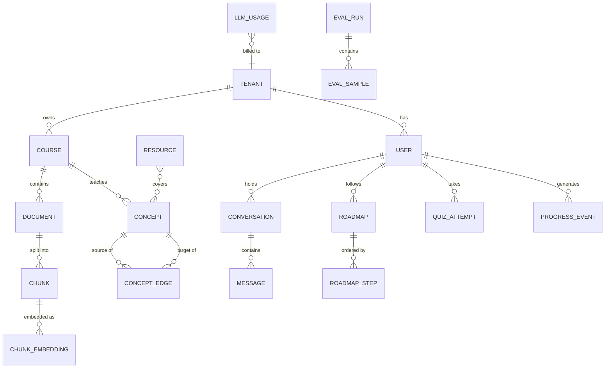

# System Architecture

> CourseLLM is an agentic AI learning platform. A student uploads course material
> (lecture notes, PDFs, slides), states a goal, and the system answers questions
> grounded in *their* documents, reasons over a prerequisite knowledge graph,
> recommends real learning resources, builds a personalised roadmap, quizzes them,
> and adapts the roadmap from measured progress.

---

## 1. Design principles

These principles drive every decision in the codebase. Where a trade-off was made,
it is recorded as an ADR in [`docs/decisions/`](../decisions/).

| # | Principle | Consequence |
|---|-----------|-------------|
| 1 | **Retrieval before generation.** The LLM never answers a course question without retrieved evidence. | Every tutor answer carries citations or explicitly states that evidence was missing. |
| 2 | **Agents decide, tools execute.** | Deterministic work (SQL, BM25, graph traversal, scoring) lives in typed tools, not in prompts. |
| 3 | **Tenancy is a property of the query, not a filter applied afterwards.** | Tenant scope is inside every ANN scan and every SQL predicate, enforced twice (repository + Postgres RLS). |
| 4 | **Every external dependency has a declared failure path.** | LLM, reranker, vector search, and network tools all degrade to a defined fallback; the UI never shows a blank screen. |
| 5 | **AI quality is a testable engineering property.** | Faithfulness/recall thresholds are enforced in CI against a versioned golden dataset. |
| 6 | **No technology without a load-bearing job.** | Each dependency below is mapped to the problem it solves (§4). |
| 7 | **Untrusted text is never trusted text.** | Document and web content is data. It is delimitated, sanitised, and never concatenated into the instruction region of a prompt. |

---

## 2. Context: what this system replaced

The starting point was a working but unhardened prototype: question → vector search →
LLM answer. It had no tenancy boundary beyond a `user_id` predicate, no lexical
retrieval worth the name (`ts_rank`, not BM25), a weighted-sum fusion instead of
RRF, no knowledge graph, no evaluation, no cost tracking, and committed credentials.
The full inventory is in [`docs/PROJECT_AUDIT.md`](../PROJECT_AUDIT.md).

The rewrite keeps the useful shape (FastAPI + PostgreSQL + pgvector + a React client)
and replaces the parts that could not survive production or an interview.

---

## 3. Runtime topology



**Why this shape.** The API is a stateless async service, so it scales horizontally
behind an ALB and holds no session state — conversation state lives in Postgres and
is keyed by tenant. Redis is used only for things that are provably repeated
(retrieval results for identical queries, embeddings, rate-limit counters), never for
personalised answers. LiteLLM is a library in-process, and can also be run as a
standalone gateway; both are documented in the deployment doc.

---

## 4. Component responsibilities and justification

### 4.1 Backend

| Component | Responsibility | Why it is here |
|-----------|----------------|----------------|
| **FastAPI** | Async HTTP, validation, streaming, OpenAPI | Native async matches async DB/LLM I/O; Pydantic validation is the same schema layer used for LLM structured outputs. |
| **SQLAlchemy 2.0 (async) + Alembic** | Typed persistence, explicit migrations | Async engine on `asyncpg`; Alembic gives a reviewable migration history instead of `create_all`. |
| **PostgreSQL + pgvector** | Vectors, full-text, relational, graph, RLS | One datastore for four access patterns avoids a distributed-transaction problem for metadata + vectors. HNSW gives sub-linear ANN. |
| **Redis** | Retrieval/embedding cache, rate limiting | Cache keys embed tenant + model + config version, so a cache hit can never cross a tenancy or version boundary. |
| **LiteLLM** | Single LLM interface, routing, retries, fallbacks, spend | Removes provider SDKs from application code and makes "what happens when the provider is down" a configuration question. |
| **LangGraph** | Stateful agent orchestration | Explicit typed state and conditional edges make the control flow auditable and testable, unlike a free-running agent loop. |

### 4.2 Intelligence layer

| Component | Responsibility |
|-----------|----------------|
| **Hybrid retriever** | pgvector cosine ANN ∪ BM25 lexical, both tenant-scoped, fused with RRF. |
| **Cross-encoder reranker** | Jointly scores (query, passage) pairs; the only component that sees the query and the passage together. |
| **Knowledge graph** | Prerequisite closure, related concepts, knowledge-gap detection, roadmap ordering. |
| **Agent graph** | Intent routing, context assembly, delegation to tutor/planner/recommender/assessment/progress nodes. |
| **Tool registry** | Typed, permission-checked operations the agents may invoke. |
| **Safety layer** | Injection detection, content delimitation, output validation, secret redaction. |

### 4.3 Frontend

React + TypeScript + Vite, TanStack Query for server state, a typed API client
generated from the OpenAPI schema, and SSE for token streaming. It is a product, not
a demo: dashboard, tutor chat with citations, courses, documents, roadmap,
recommendations, progress, and quiz.

---

## 5. Request lifecycle (tutor question)



Every arrow is an OpenTelemetry span. Retrieval, reranking, graph, and LLM timings
are recorded separately so that a latency regression can be attributed to a layer.

---

## 6. Failure model (explicit degradation paths)

| Failure | Detection | Degradation | User sees |
|---------|-----------|-------------|-----------|
| Primary LLM unavailable | LiteLLM raises after retries | Try fallback model, then extractive answer from retrieved context | Answer composed from sources + banner "generation unavailable" |
| All LLMs unavailable | Both routes exhausted | Return ranked excerpts with citations, no generation | Sources list, no fabricated prose |
| Reranker unavailable / OOM | Exception or timeout | Fall back to RRF order | Same answers, slightly lower precision |
| Vector search unavailable | DB error on ANN path | Lexical-only retrieval (BM25) | Answer still grounded, marked "lexical only" |
| BM25 unavailable | SQL error | Semantic-only retrieval | Answer still grounded |
| Both retrievers fail | Both errored | No evidence → refuse to answer from memory | "I could not find this in your materials" |
| Knowledge graph empty | Zero prerequisite edges | Roadmap from course metadata ordering | Roadmap with a "low-confidence prerequisites" notice |
| Network tool (recommendations) fails | Timeout | Internal catalogue only | Recommendations limited to ingested/known resources |
| Redis unavailable | Connection error | Cache bypassed, rate limiting fails open with logging | No user-visible change |

This table is enforced by tests in `apps/api/tests/test_degradation.py`.

---

## 7. Repository layout

```text
coursellm2/
├── apps/
│   ├── api/                  FastAPI service (src layout) + tests + alembic
│   └── web/                  React + TypeScript client
├── evals/                    Golden dataset, runners, metrics, reports
├── prompts/                  Versioned prompt files (tutor, planner, …)
├── infra/terraform/          AWS IaC: modules + dev/prod environments
├── docs/                     Audit, architecture, ADRs
├── scripts/                  Developer and CI helper scripts
├── mcp_server/               MCP server exposing selected tools
├── interview_prep/           Local-only interview notes (gitignored)
├── docker-compose.yml        Postgres + Redis + API + Web
├── Makefile                  Single entry point for every workflow
└── .github/workflows/        CI, evaluation gate, security scan
```

Dependencies point inward: `api → services → domain → db/llm/rag`. Routers never
contain business logic; domain code never imports FastAPI.

---

## 8. Data model at a glance

Twelve tenant-scoped tables plus two global catalogues. `tenant_id` is present on
every tenant-scoped row and is part of every index that matters.



`RESOURCE` is the recommendation catalogue (courses, books, docs, papers, tutorials).
It is global, curated, and carries provenance; it is never LLM-generated at request
time. `LLM_USAGE` records provider, model, tokens, latency, and computed cost for
every model call.

---

## 9. Quality attributes and how they are demonstrated

| Attribute | Mechanism | Where to verify |
|-----------|-----------|-----------------|
| Retrieval quality | Recall@k / MRR / context precision & recall on a golden set | `evals/`, CI gate |
| Answer grounding | Faithfulness + citation coverage; refusal when evidence is absent | `evals/`, `apps/api/tests/integration/test_grounding.py` |
| Tenancy isolation | RLS policies + repository contract + ANN pre-filtering | `apps/api/tests/integration/test_tenant_isolation.py` |
| Injection resistance | Detector + delimitation + tool permission matrix | `apps/api/tests/security/` |
| Latency | Per-layer spans, P50/P95 in `/api/v1/metrics` | `docs/architecture/observability.md` |
| Cost | Token + cost accounting per request and per tenant | `llm_usage`, `/api/v1/evaluation/cost` |
| Reproducibility | Config + model + prompt versions recorded on every eval run | `evals/reports/` |

---

## 10. What is deliberately *not* here

Stated plainly, because interviewers ask:

- **No Neo4j.** See [ADR-0004](../decisions/ADR-0004-knowledge-graph-in-postgres.md).
  Prerequisite traversal is a recursive CTE over a few thousand edges; a second
  datastore would add operational cost and a consistency problem for no query we need.
- **No Kafka / separate vector DB.** The write volume is a student upload, not a
  firehose. pgvector with HNSW meets the latency budget; adding a stream processor or
  a dedicated vector store would be resume-driven engineering.
- **No fine-tuning.** Prompt versioning plus retrieval improvements are cheaper,
  measurable, and reversible.
- **No autonomous email sending.** The prototype had IMAP/SMTP tooling. Outbound
  email is a consequential action; it is not exposed to any agent by default
  (see the permission matrix in `docs/architecture/security.md`).
