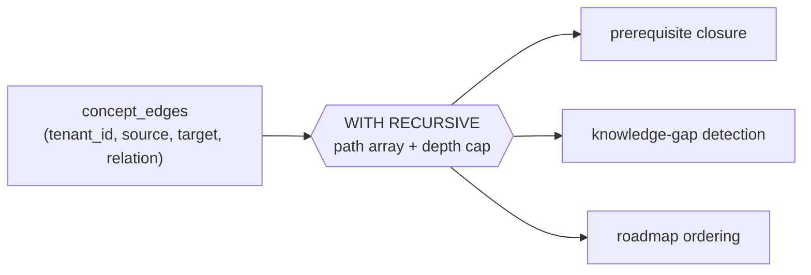

# ADR-0004: Knowledge graph in PostgreSQL using recursive CTEs

- **Status:** Accepted
- **Date:** 2026-01-01
- **Deciders:** CourseLLM engineering
- **Supersedes:** —
- **Related:** ADR-0002, ADR-0009

## Context

Several product behaviours depend on relationships *between concepts*, not on
document similarity: prerequisite closure ("what must I understand before this
topic?"), related-concept discovery, knowledge-gap detection, and roadmap
ordering. The prototype had a `models/knowledge.py` model but no traversal
engine, so relationships were not the basis of any feature.

The graph is small and bounded by the domain: a course has tens to a few hundred
concepts, a tenant accumulates perhaps thousands to low tens of thousands of
edges, traversals are a handful of hops (prerequisite chains rarely exceed four
to six), and the workload is read-mostly and tenant-scoped. Graph algorithms
(PageRank, community detection, centrality) are not product requirements, and
neither is multi-hop pattern matching across many relationship types.

The project rule (`docs/architecture/system.md` §6 and §10) is **no technology
without a load-bearing job**, and specifically **no graph database unless
justified**. Neo4j would be a second datastore: another backup and restore
procedure, HA topology, upgrade cadence, connection pool, and tenancy mechanism,
plus a consistency problem with the course and concept rows in Postgres. That
cost must be paid for by a query the current design cannot serve.

## Decision

Keep the knowledge graph **in PostgreSQL** as a property graph over two tables,
traversed with **recursive CTEs**. Do **not** add Neo4j. This ADR records the
justification for *not* adding one.

- `concepts(id, tenant_id, course_id, name, description, created_at)`, unique on
  `(tenant_id, course_id, normalised_name)`.
- `concept_edges(id, tenant_id, source_concept_id, target_concept_id, relation,
  weight, provenance)`, where `relation` is `prerequisite_of`, `related_to`, or
  `part_of`, and `provenance` records extracted, authored, or inferred.
- Indexes lead with `tenant_id`: `(tenant_id, source_concept_id)` and
  `(tenant_id, target_concept_id)`.
- Traversal uses `WITH RECURSIVE`, carrying the visited path as an array for cycle
  detection and a depth counter capped by `GRAPH_MAX_DEPTH`, filtered by
  `tenant_id` at every level.
- Access is behind a `GraphRepository` interface, so the query layer is swappable
  and the rest of the application never writes graph SQL.

```sql
WITH RECURSIVE prereqs(concept_id, depth, path) AS (
    SELECT :concept_id, 0, ARRAY[:concept_id]
  UNION ALL
    SELECT e.target_concept_id, p.depth + 1, p.path || e.target_concept_id
    FROM   concept_edges e
    JOIN   prereqs p ON p.concept_id = e.source_concept_id
    WHERE  e.tenant_id = :tenant_id
      AND  e.relation = 'prerequisite_of'
      AND  p.depth < :max_depth
      AND  NOT e.target_concept_id = ANY(p.path)   -- cycle guard
)
SELECT DISTINCT concept_id, MIN(depth) AS depth FROM prereqs GROUP BY concept_id;
```



## Consequences

### Positive

- No second datastore, and therefore no new backup, HA, monitoring, upgrade, or
  security surface.
- Graph queries run in the same transaction and snapshot as the course, document,
  and progress data they combine with. A roadmap can read concepts, edges, and
  progress atomically; with Neo4j this becomes an eventually consistent join in
  application code.
- The existing tenancy mechanism applies unchanged: the same RLS policy (ADR-0009)
  and composite-index convention protect graph rows.
- Recursive CTEs are testable with the existing database harness and visible in
  the same `EXPLAIN` workflow as the rest of the system.
- The data model is a property graph in substance, so it survives a future move
  to a graph engine without redesign.

### Negative

- Recursive CTEs are less legible than Cypher for branching patterns, and cycle
  detection, depth caps, and deduplication are the author's responsibility.
- There are no built-in graph algorithms; centrality or community detection would
  have to be implemented or run offline.
- Deep or poorly selective traversals can explore many edges and lose to a native
  graph engine's adjacency traversal at scale.
- A CTE written without a depth cap or cycle guard can loop or exhaust memory, so
  the guard must be enforced in the repository rather than trusted to callers.

### Neutral

- An adjacency-list table *is* a graph representation; the choice is which engine
  executes the traversal, not whether the data is a graph.
- A materialised transitive-closure table can be added later if closure queries
  become hot, at the cost of maintaining it on edge changes.

## Alternatives considered

- **Neo4j.** Best-known and genuinely better at deep, branching, pattern-heavy
  traversal. Rejected for now: the queries above are shallow, tenant-scoped, and
  few, so it would add a system to operate and a consistency problem without
  removing a real bottleneck.
- **Apache AGE.** Keeps data in Postgres and adds Cypher, but it is another
  extension to version, back up, and reason about, and it does not remove the SQL
  path. Not chosen.
- **In-memory graph (NetworkX and similar).** Fast traversal, but it must be
  rebuilt and kept consistent, does not survive restart, is per-process, and has
  no tenancy enforcement. Rejected.
- **Materialised paths only.** Simple to query, but it constrains edge writes and
  does not generalise to the other relationships. Not chosen.
- **RDF triple store.** Expressive, but its tooling and query language are
  heavier than the problem and it is a second datastore. Rejected.

### Threshold for migrating, and the path

A graph database becomes justified, and this ADR should be superseded, when:
repeated multi-hop traversals over millions of edges at high concurrency miss the
latency budget after tuning; the product needs variable-length pattern matching
with complex predicates across many relationship types; graph algorithms become
core product features rather than offline analysis; or cross-tenant graph
analytics needs a dedicated serving path.

Because the two tables are already an explicit property graph, the move is
mechanical: export them, import via `neo4j-admin import` or `LOAD CSV`, and swap
the `GraphRepository` implementation. Postgres remains the source of truth and the
graph store is projected from it, so the migration is reversible.

## How this is verified

- `tests/test_knowledge_graph.py` covers cycle handling (an edge cycle must
  terminate), the depth cap, deduplication of multiple paths to one concept, and
  tenant isolation.
- `EXPLAIN (ANALYZE, BUFFERS)` for the closure query is asserted against a seeded
  graph in CI, so a quadratic plan is caught before production.
- Roadmap ordering and prerequisite correctness are evaluated by `evals/` against
  a golden set of concept relationships; measured figures are published in
  `evals/reports/`.
- Traversal latency and edge counts are emitted as metrics, so the recorded
  migration threshold is observable rather than a matter of opinion.
