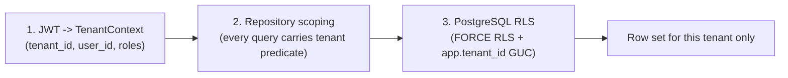

# ADR-0009: Row-level security for tenancy at three layers

- **Status:** Accepted
- **Date:** 2026-01-01
- **Deciders:** CourseLLM engineering
- **Supersedes:** —
- **Related:** ADR-0002, ADR-0004

## Context

The prototype had no tenant concept. Ownership was a `user_id` predicate applied by
hand in each query: `semantic_search.py` filters `Chunk.user_id == user_id`,
`keyword_search.py` filters `WHERE user_id = :user_id`, and `chunks` carries
`user_id` as a foreign key. A single forgotten predicate — in a new endpoint, a
background job, an admin view, or raw SQL — reads another user's data, and nothing
at the database level prevents it.

In the rebuild, a **tenant** is an institution or workspace and users belong to a
tenant. Tenancy must hold for relational reads, ANN retrieval, BM25 retrieval, and
graph traversal (ADR-0002), and for future services and ad-hoc queries this codebase
does not yet contain. Two properties make retrieval especially fragile:

1. **Post-filtering breaks ANN recall.** If tenant filtering is applied after an
   approximate nearest-neighbour scan, the scan returns the *global* top-K and then
   discards other tenants' rows. A tenant owning a small share of the corpus gets far
   fewer than K results — worst case zero — because the global neighbours belong to
   others; recall collapses silently while latency looks healthy.
2. **A pooled connection carries session state.** Session-level
   `SET app.tenant_id = ...` persists on the connection after it returns to the pool,
   so the next request checking it out inherits the previous tenant's context unless
   reset — an intermittent, load-dependent leak that is extremely hard to reproduce.

## Decision

Enforce tenancy at **three independent layers**, so any one failing does not produce
a leak:

1. **JWT-derived `TenantContext`.** `tenant_id` comes from the verified token, never
   from a request body, query parameter, or client-settable header. No endpoint
   accepts a tenant identifier.
2. **Mandatory repository scoping.** Every repository method takes a `TenantContext`
   and emits the tenant predicate itself. A base repository makes unscoped queries
   awkward, and review plus a lint rule reject direct session use in request paths.
3. **PostgreSQL RLS with `FORCE ROW LEVEL SECURITY`.** Every tenant-scoped table
   carries `tenant_id` and a policy keyed on `current_setting('app.tenant_id')`.
   `FORCE` makes the policy apply to the table owner too, so a careless migration
   connection does not bypass it. The application connects as a role that neither
   owns the tables nor has `BYPASSRLS`, and an unset GUC fails closed: no rows rather
   than everything.

The tenant setting is applied with **`SET LOCAL`** inside the request transaction
(`BEGIN; SET LOCAL app.tenant_id = '...'; ...; COMMIT;`), which is reverted
automatically at transaction end and removes the leak-on-checkout hazard.
Session-level `SET` is forbidden because it survives checkout and is incompatible
with PgBouncer transaction pooling; a pool `checkin` hook clears the setting as
defence in depth. A missing tenant context is an error the repository raises before
issuing SQL.

The repository emits an explicit `tenant_id = :tenant_id` predicate *in addition to*
RLS: an explicit predicate is what lets the planner use the tenant-first composite
indexes and push the filter into the ANN scan, and it keeps selectivity visible in
`EXPLAIN`. RLS is the backstop, not the primary mechanism for ANN correctness. For
selective filters, `hnsw.iterative_scan = strict_order` keeps the scan going until
`LIMIT` rows for that tenant are produced (ADR-0002).

## Consequences

### Positive

- A single missed predicate does not leak: RLS returns zero rows for the wrong
  tenant, so the failure mode is "no data", not "someone else's data".
- Tenancy is unspoofable at the API because there is no tenant input to spoof.
- RLS extends protection to code paths that do not exist yet — background jobs,
  analytics queries, psql sessions using the app role — which an application-only
  filter cannot.
- The explicit predicate plus RLS plus tenant-first indexes keeps ANN filtering both
  correct and index-friendly, and the pattern is auditable: one policy per table and
  a single context object.

### Negative

- **Policy evaluation costs and can confuse the planner.** Every row is checked
  against the policy, and a policy written naively can prevent index use where an
  explicit predicate would have used it — which is why the explicit predicate is
  retained rather than replaced.
- **Debugging zero-row results is harder** because RLS filters silently; tooling must
  surface the current tenant setting and provide a deliberate, audited admin path.
- **Operational discipline is required.** The app role must not own the tables and
  must not have `BYPASSRLS`; migrations run as a different role; a misconfigured
  deployment can disable the backstop with no code change.
- `SET LOCAL` requires a transaction, so any autocommit read must be wrapped
  explicitly; forgetting is a correctness bug, not a performance one. Session pooling
  must be avoided and PgBouncer must run in transaction mode.
- Local development and bootstrap need seed tooling that sets context explicitly, and
  RLS does not protect against a compromised application role.

### Neutral

- `tenant_id` remains an ordinary column and part of every important index; RLS does
  not replace indexing.
- The three layers are intentionally redundant, and each is tested independently.

## Alternatives considered

- **Application-only `user_id` filtering (prototype).** Simplest, and rejected: one
  missed predicate is a leak, with no protection for bare SQL.
- **Schema-per-tenant.** Strong isolation, but migrations fan out across schemas,
  connection routing becomes dynamic, and cross-tenant analytics are awkward.
  Rejected at this scale.
- **Database-per-tenant.** Strongest isolation, highest cost and complexity, and it
  makes aggregate reporting and shared catalogues hard. Rejected.
- **RLS alone, without an explicit repository predicate.** Correct for relational
  access but awkward for ANN, where the explicit predicate drives index use and
  iterative-scan behaviour, and it gives up a reviewable statement of tenancy.
- **An ORM global filter or event listener only.** Convenient, but raw SQL, bulk
  operations, and bulk DML can bypass ORM events, with no protection below the
  application. Rejected as the sole mechanism.

## How this is verified

- `apps/api/tests/integration/test_tenant_isolation.py` runs against an **adversarial corpus** in which the
  overwhelming majority of chunks belong to a decoy tenant, asserts ANN retrieval
  returns K rows for the requesting tenant, and asserts post-filtering would not. It
  also asserts a deliberately unscoped repository call still returns zero foreign rows
  under RLS.
- Tests connect as the **application role**, not the owner, so RLS is exercised; a
  separate test asserts the app role lacks `BYPASSRLS` and does not own the tables.
- A GUC-leakage test interleaves tenants over a deliberately small pool under
  concurrency and asserts no response contains another tenant's identifiers; a second
  test asserts a missing tenant context fails closed and never returns all rows.
- `EXPLAIN` assertions confirm the explicit tenant predicate reaches the index scan
  and the ANN path uses the tenant-first composite index. Per-layer overhead is
  measured against a seeded multi-tenant corpus; the measured latency is published
  with the load-test artefacts, and no overhead figure is asserted here.
