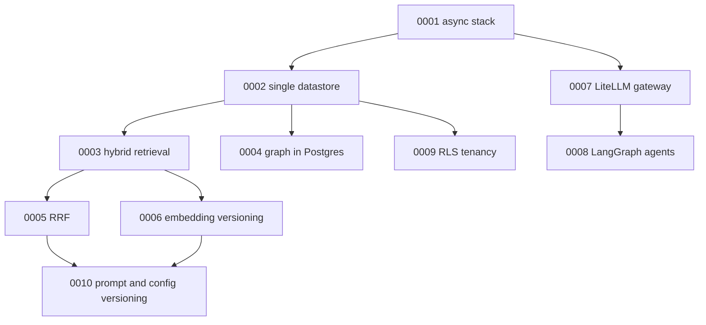

# Architecture Decision Records

Each ADR records a decision that is expensive to reverse, the alternatives that
were rejected, and how the decision is verified. They are written so that a
reviewer can disagree with a decision on its merits rather than having to
reverse-engineer the reasoning from the code.

Format: `Context → Decision → Consequences (positive / negative / neutral) →
Alternatives considered → How this is verified`.

| ADR | Decision | Status |
|-----|----------|--------|
| [0001](ADR-0001-fastapi-async-sqlalchemy.md) | FastAPI with async SQLAlchemy 2.0 and asyncpg | Accepted |
| [0002](ADR-0002-postgres-pgvector-single-datastore.md) | One PostgreSQL + pgvector datastore; no dedicated vector database | Accepted |
| [0003](ADR-0003-hybrid-retrieval-bm25-plus-vectors.md) | Hybrid retrieval: dense HNSW vectors plus explicit Okapi BM25 | Accepted |
| [0004](ADR-0004-knowledge-graph-in-postgres.md) | Knowledge graph in PostgreSQL via recursive CTEs; deliberately no graph database | Accepted |
| [0005](ADR-0005-reciprocal-rank-fusion.md) | Reciprocal Rank Fusion instead of a normalised weighted score sum | Accepted |
| [0006](ADR-0006-embedding-model-versioning.md) | Embeddings keyed by `(chunk_id, embedding_model, dim)` in a separate table | Accepted |
| [0007](ADR-0007-litellm-as-model-gateway.md) | LiteLLM as the single model gateway, with a declared degradation ladder | Accepted |
| [0008](ADR-0008-langgraph-for-agent-orchestration.md) | LangGraph: a bounded graph with agentic nodes, not an autonomous swarm | Accepted |
| [0009](ADR-0009-row-level-security-for-tenancy.md) | Three-layer tenancy including PostgreSQL Row-Level Security | Accepted |
| [0010](ADR-0010-prompt-versioning-and-config-hashing.md) | Versioned prompt files and a hashed retrieval-config version | Accepted |

## How these relate

## Conventions

- **One decision per record.** If a decision cannot be stated in one sentence, it
  is two decisions.
- **Negative consequences are mandatory.** An ADR with no downside is either
  trivial or dishonest.
- **Measurement-dependent claims point at `evals/`.** No ADR quotes a performance
  number that a committed run artefact did not produce.
- **Superseding, not editing.** A changed decision produces a new ADR that
  supersedes the old one; history is not rewritten.
